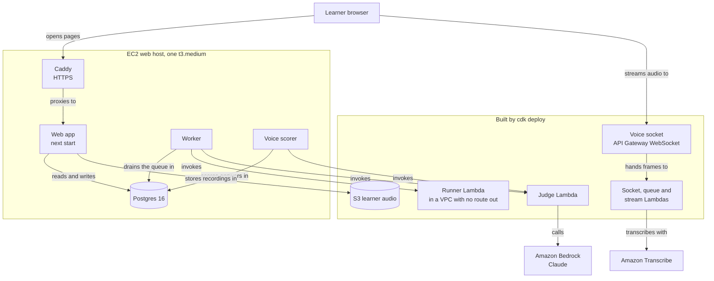

# Deploy FDE Prep to AWS

This takes you from an AWS account to a working FDE Prep beta at your own domain. Learners sign in with GitHub through an invite, their code is graded in AWS Lambda, and their spoken answers are transcribed by Amazon Transcribe. Each step shows where to click and what you should see when it worked.

It is written for one person doing the deploy alone, in one sitting of about three and a half hours. That figure is an estimate built from the step times below. Everything runs in `us-east-1`, US East (N. Virginia).



Learner code runs only in the runner Lambda, which sits in a VPC with no route to the internet and holds no AWS permission. The web host holds no model credential: the judge Lambda calls Bedrock, and the host only invokes it.

## Contents

| Step | What you finish with | Time, estimated |
|---|---|---|
| [0. Before you start](#0-before-you-start) | Everything you need on hand, and what it costs. | 10 minutes |
| [1. Lock the account](#1-lock-the-account) | Root protected by MFA and an admin login for the rest. | 15 minutes |
| [2. Turn on Claude in Bedrock](#2-turn-on-claude-in-bedrock) | A Claude call that answers from CloudShell. | 10 to 25 minutes |
| [3. Deploy the stack](#3-deploy-the-stack) | The Lambdas, the voice socket and the audio bucket, with their names. | 40 to 60 minutes |
| [4. Launch the web host](#4-launch-the-web-host) | A server with a fixed public address. | 20 minutes |
| [5. Domain and GitHub sign-in](#5-domain-and-github-sign-in) | Your domain pointing at the server, and a GitHub OAuth app. | 15 minutes |
| [6. Install and run](#6-install-and-run) | The site live over HTTPS. | 45 to 60 minutes |
| [7. Sign in and prove it](#7-sign-in-and-prove-it) | You signed in as admin, and every live connection tested once. | 20 minutes |
| [8. Keep it alive](#8-keep-it-alive) | A spending alert, daily backups, and how to update and roll back. | 20 minutes |

## 0. Before you start

### What you need

| Need | Why |
|---|---|
| An AWS account with a payment method that can buy from AWS Marketplace | Claude on Bedrock is billed through AWS Marketplace, and the first call subscribes the account. |
| A domain whose DNS you can edit, such as `prep.example.com` | Caddy needs a name to get an HTTPS certificate for. |
| Owner rights on a GitHub organisation, or your own GitHub account | The sign-in uses a GitHub OAuth app registered there. |
| `main` at or after pull request #45 | Before #45, `main` fails `next build` at `/voice/sessions/[id]`, so step 6 would stop there. |

Replace `prep.example.com`, `you@example.com`, `YOUR_GITHUB_LOGIN` and every value that starts with `PASTE_` as you go.

### Where you type commands

Every AWS command in steps 2, 3 and 8 runs in **AWS CloudShell**, a terminal inside the AWS console that is already signed in as you and comes with the AWS CLI, Node.js, npm, Git, Docker and the CDK. You install nothing on your laptop. Commands in step 6 run on the web host, in a browser terminal the EC2 console opens for you.

Two CloudShell limits shape step 3, both from the AWS CloudShell documentation read on 1 October 2026:

- A session ends after 20 to 30 minutes without keyboard or mouse input, and a running command does not count as input. While `cdk deploy` runs, press Enter in the CloudShell tab every ten minutes.
- The home folder holds 1 GB and keeps its files between sessions. The code and its packages take about 310 MB of it, measured from this repository's lockfiles.

[Appendix A](#appendix-a-deploying-from-a-laptop) covers deploying from a laptop instead.

### What it costs

Prices for `us-east-1`, on demand, read from the AWS pricing pages on 1 October 2026.

| Item | Price | Per month |
|---|---|---|
| Web host, t3.medium | $0.0416 an hour × 730 hours | $30.37 |
| Disk, 30 GB gp3 | $0.08 per GB-month × 30 | $2.40 |
| Public IPv4 address | $0.005 an hour × 730 hours | $3.65 |
| The voice signing secret | $0.40 per secret | $0.40 |
| Route 53 hosted zone, only if you use Route 53 | $0.50 per zone | $0.50 |
| **Before anyone uses it** | | **about $37** |

What use adds:

| Service | Price | What drives it |
|---|---|---|
| Amazon Transcribe streaming | $0.0001667 a second, about $0.01 a minute | Spoken answers. A two and a half minute answer costs about $0.025. |
| Amazon Bedrock, Claude | Check the [Bedrock pricing page](https://aws.amazon.com/bedrock/pricing/) before a cohort starts; it is not priced here. | Two model calls per scored voice answer, and the judge's calls on prompt and design problems. |
| Amazon Polly, neural voice | $16 per million characters | Pressure-mode follow-ups, synthesised once per question and cached. |
| API Gateway WebSocket | $1.00 per million messages, $0.25 per million connection minutes | One message per tenth of a second of audio. |
| Lambda, S3, SQS | Lambda $0.0000166667 per GB-second; S3 $0.023 per GB-month; SQS $0.40 per million requests after the first million | Small next to the rest at beta scale. Recordings are deleted after 30 days. |

As an example, and only an estimate: 30 testers each giving three spoken answers of two and a half minutes a day is 225 minutes, which is $2.25 a day or about $68 a month in transcription.

### One warning before you commit to this

This setup makes you the only operator. Postgres lives on the web host's own disk, step 8 takes one snapshot a day, and nobody else can restore it unless you give them access. A lost disk loses up to a day of learner work. Step 8.3 adds a second operator; treat it as part of the deploy.

## 1. Lock the account

### 1.1 Put MFA on the root user

AWS requires MFA on the root user within 35 days of its first sign-in, and recommends a passkey or security key.

1. Sign in at <https://console.aws.amazon.com/> as the root user, with the email address the account was opened with.
2. Click your account name at the top right, then **Security credentials**.
3. Under **Multi-factor authentication (MFA)**, click **Assign MFA device**, choose **Passkey or Security Key**, and follow the prompts.

### 1.2 Make the admin you will work as

Use the root user for nothing after this. If you already sign in as an administrator who is not the root user, skip to 1.3.

AWS's recommended way is IAM Identity Center. Turning it on creates an AWS Organization for the account, and if the account is spending AWS Free Tier credits, creating the Organization ends those credits at once (AWS IAM Identity Center documentation, read 1 October 2026). If that matters to you, create an IAM user with the `AdministratorAccess` policy and console access instead.

1. Open <https://console.aws.amazon.com/singlesignon>, click **Enable**, and confirm on the AWS Organizations page that follows.
2. Click **Users**, then **Add user**. Fill in a username, your email and your name, click **Next**, create a group called `admins` when asked, and finish with **Add user**.
3. Click **AWS accounts**, tick your account, and click **Assign users or groups**. Pick the `admins` group and click **Next**.
4. Click **Create permission set**, choose **Predefined permission set**, pick **AdministratorAccess**, and create it. Back on the assignment, refresh the list, select **AdministratorAccess**, click **Next**, then **Submit**.
5. Accept the invitation email, set a password and an MFA device, and sign in through the AWS access portal link in that email. Choose your account and **AdministratorAccess**.

### 1.3 Pick the region

Click the region name at the top right of the console and choose **US East (N. Virginia) us-east-1**. CloudShell, EC2 and Bedrock all follow the region chosen here.

## 2. Turn on Claude in Bedrock

AWS retired the old Model access page on 15 October 2025, and models are now available by default. Anthropic models still need a one-time use case form per account, and the first call starts an AWS Marketplace subscription that can take up to 15 minutes (Amazon Bedrock User Guide, model access page, read 1 October 2026).

1. Open <https://console.aws.amazon.com/bedrock/> with **US East (N. Virginia)** selected.
2. Open the **Model catalog**, filter by the provider **Anthropic**, and open **Claude Opus 5**.
3. If the page asks for use case details, fill them in. A GitHub link is accepted as the company website. Submit.
4. Open CloudShell from the terminal icon in the console's top bar, or by typing `CloudShell` into the search box. It opens in the region you chose.
5. Make the first call yourself:

```bash
aws bedrock-runtime converse --region us-east-1 \
  --model-id us.anthropic.claude-opus-5 \
  --messages '[{"role":"user","content":[{"text":"Reply with the word ready."}]}]' \
  --query 'output.message.content[0].text' --output text
```

It prints `ready`, or a sentence containing it.

You make this call rather than leaving it to the judge Lambda because the subscription needs AWS Marketplace permissions, which your admin login has and the judge's role does not. An `AccessDeniedException` in the first 15 minutes is the subscription still being set up: wait and run it again. If it persists, check the account's payment method under **Billing and Cost Management**.

`us.anthropic.claude-opus-5` is the stack's default and is listed on the Claude Opus 5 model card in the Bedrock documentation, read 1 October 2026. Claude Opus 5.5 is on Bedrock as `us.anthropic.claude-opus-5-5`; stay on Opus 5 until one judged submission has run on 5.5 with the judge's settings.

## 3. Deploy the stack

Everything in this step runs in CloudShell.

### 3.1 Check CloudShell can build the stack

```bash
uname -m
node --version
docker --version
```

| Line | Must print | If it does not |
|---|---|---|
| `uname -m` | `x86_64` | The two Lambda images are built for x86_64. On `aarch64`, deploy from a laptop with [Appendix A](#appendix-a-deploying-from-a-laptop). |
| `node --version` | `v20` or newer | The pinned `aws-cdk-lib` 2.269.0 requires Node 20 or newer. Deploy from a laptop with Node 22. |
| `docker --version` | `Docker version` and a number | Deploy from a laptop with Docker running. |

### 3.2 Get the code

```bash
cd ~
git clone https://github.com/fde-academy-lab/fdeprep.git
cd fdeprep
git log --oneline | grep -m1 '#45'
```

The last command prints the commit that merged pull request #45. If it prints nothing, `main` does not have the build fix yet; stop here.

### 3.3 Make the voice signing secret

The web application signs each voice session with this key and the socket checks the signature with the same key. Skip this part to deploy without the Voice Screen, and leave `VOICE_TOKEN_SECRET_ARN` out of 3.5.

```bash
openssl rand -base64 32 | tr -d '\n' > ~/voice-secret.txt
aws secretsmanager create-secret --region us-east-1 --name fdeprep/voice-token \
  --secret-string "file://$HOME/voice-secret.txt" --query ARN --output text
shred -u ~/voice-secret.txt
```

It prints one line starting `arn:aws:secretsmanager:us-east-1:`. Copy it for 3.5. Reading the value from a file keeps it out of your shell history, and `shred` removes the file; step 6 reads the value back from Secrets Manager when the web host needs it.

### 3.4 Install and bootstrap

```bash
cd ~/fdeprep/voice && npm ci --no-audit --no-fund
cd ~/fdeprep/infra && npm ci --no-audit --no-fund
export AWS_REGION=us-east-1
npx cdk bootstrap "aws://$(aws sts get-caller-identity --query Account --output text)/us-east-1"
```

The `voice/` install brings the bundler the CDK uses to package the voice Lambdas. Bootstrap runs once per account and region. It creates a CloudFormation stack called `CDKToolkit` holding an S3 bucket and an ECR repository for the deploy's files and images, and it ends by saying the environment is bootstrapped. Running it again is harmless.

### 3.5 Deploy

```bash
JUDGE_MODEL_ID=us.anthropic.claude-opus-5 \
ALARM_EMAIL=you@example.com \
VOICE_TOKEN_SECRET_ARN=PASTE_THE_ARN_FROM_3_3 \
npx cdk deploy
```

It builds the runner and judge images, pushes them, shows the IAM changes it is about to make, and asks `Do you wish to deploy these changes (y/n)?`. Type `y`. Press Enter in the tab every ten minutes until it finishes.

When it finishes it prints the stack's outputs. Print them again whenever you need them:

```bash
aws cloudformation describe-stacks --stack-name FdePrepStack --region us-east-1 \
  --query 'Stacks[0].Outputs[].[OutputKey,OutputValue]' --output table
```

| Output | Where it goes |
|---|---|
| `RunnerFunctionName` | `RUNNER_FUNCTION` in step 6.4 |
| `JudgeFunctionName` | `JUDGE_FUNCTION` in step 6.4 |
| `VoiceAudioBucketName` | `VOICE_AUDIO_BUCKET` in step 6.4 |
| `VoiceSocketUrl` | `VOICE_SOCKET_URL` in step 6.4 |
| `BoxInstanceProfileName` | The IAM instance profile in step 4.1 |

If the session ends during the deploy, open CloudShell again, `cd ~/fdeprep/infra`, set the same three variables and run `npx cdk deploy` again. Images already pushed are not built twice. If CloudFormation was already applying the stack, watch it finish under **CloudFormation**, **Stacks**, **FdePrepStack**, **Events** before you run it again.

Open the email AWS sends to `ALARM_EMAIL` and click **Confirm subscription**, or the three alarms reach nobody.

## 4. Launch the web host

### 4.1 Launch the instance

Open <https://console.aws.amazon.com/ec2/> with **US East (N. Virginia)** selected and click **Launch instance**. Fill in each section of the page:

| Section | Setting |
|---|---|
| Name and tags | `fdeprep-web` |
| Application and OS Images | **Ubuntu**, then **Ubuntu Server 24.04 LTS**, architecture **64-bit (x86)**. |
| Instance type | `t3.medium`, which has 4 GiB of memory. README Route B judges that `next build` starts failing near 2 GB. |
| Key pair (login) | **Create new key pair**, name `fdeprep`, type RSA, format `.pem`. Keep the downloaded file; it is how you reach the server from a laptop. |
| Network settings | Create a security group with three rules: SSH, port 22, from **My IP**; HTTP, port 80, from anywhere; HTTPS, port 443, from anywhere. Caddy needs 80 and 443 to get and serve its certificate. Step 4.2 adds one more SSH rule. |
| Configure storage | `30` GiB, `gp3`. |
| Advanced details | **IAM instance profile**: the `BoxInstanceProfileName` from 3.5. **Metadata version**: **V2 only (token required)**. |

Click **Launch instance**.

Set the metadata version here even though Ubuntu 24.04 asks for V2 itself: an account-wide default of "V1 or V2" overrides the image's own setting, and only the launch setting overrides both (Amazon EC2 User Guide, instance metadata options, read 1 October 2026).

The instance profile lets the host invoke the two Lambdas, keep learner audio in its bucket and call Polly. It has no model permission and no Secrets Manager permission.

### 4.2 Let the browser terminal in

The EC2 console's browser terminal, EC2 Instance Connect, connects from AWS's own addresses, and the **My IP** rule above refuses them. Ubuntu 24.04 ships the software it needs, so one more rule is all it takes. In CloudShell:

```bash
SG=$(aws ec2 describe-instances --region us-east-1 \
  --filters Name=tag:Name,Values=fdeprep-web Name=instance-state-name,Values=pending,running \
  --query 'Reservations[0].Instances[0].SecurityGroups[0].GroupId' --output text)
PL=$(aws ec2 describe-managed-prefix-lists --region us-east-1 \
  --filters Name=prefix-list-name,Values=com.amazonaws.us-east-1.ec2-instance-connect \
  --query 'PrefixLists[0].PrefixListId' --output text)
echo "$SG $PL"
aws ec2 authorize-security-group-ingress --region us-east-1 --group-id "$SG" \
  --ip-permissions "IpProtocol=tcp,FromPort=22,ToPort=22,PrefixListIds=[{PrefixListId=$PL}]"
```

`echo` prints a security group id starting `sg-` and a prefix list id starting `pl-`. The last command prints `"Return": true`. The prefix list is AWS's own list of Instance Connect addresses for `us-east-1`, so it stays current without you.

### 4.3 Give it a fixed address

An instance's public address changes when it stops and starts. An Elastic IP does not.

1. In the EC2 console, under **Network & Security**, click **Elastic IPs**, then **Allocate Elastic IP address**, and allocate from Amazon's pool.
2. Select the new address, click **Actions**, then **Associate Elastic IP address**. Choose **Instance**, pick `fdeprep-web`, and click **Associate**.

Write the address down. Step 5 points your domain at it.

## 5. Domain and GitHub sign-in

### 5.1 Point the domain at the server

If the domain's DNS is in Route 53:

1. Open <https://console.aws.amazon.com/route53/>, click **Hosted zones**, then your domain.
2. Click **Create record**. Record name `prep`, record type **A**, value the Elastic IP, TTL `300`. Click **Create records**.

Anywhere else, add the same A record in your registrar's DNS settings. Route 53 changes usually propagate within 60 seconds; an outside registrar can take longer. Check from CloudShell:

```bash
getent hosts prep.example.com
```

It prints the Elastic IP and the name.

### 5.2 Register the GitHub OAuth app

1. On GitHub, click your profile picture, **Your organizations**, then **Settings** beside the organisation. On your own account, use **Settings** from the profile menu instead.
2. Click **Developer settings**, **OAuth Apps**, then **New OAuth App**.
3. Application name `FDE Prep`. Homepage URL `https://prep.example.com`. Authorization callback URL `https://prep.example.com/api/auth/callback`. Leave **Enable Device Flow** off. Click **Register application**.
4. Copy the **Client ID**. Click **Generate a new client secret** and copy the secret now, because GitHub shows it once.

The beta turns the organisation check off in 6.4 and lets testers in by invite, so the app asks GitHub only for read access to the tester's profile, the `read:user` scope. Where it lives matters only if you turn the check back on: new organisations restrict third-party OAuth apps by default and exempt the ones they own (GitHub Docs, OAuth app access restrictions, read 1 October 2026).

## 6. Install and run

### 6.1 Open a terminal on the server

In the EC2 console, click **Instances**, select `fdeprep-web`, click **Connect**, choose **EC2 Instance Connect**, keep **Connect using a Public IP**, set the username to `ubuntu`, and click **Connect**. A terminal opens in a new tab. Every command until 6.6 runs there.

From a laptop instead: `ssh -i fdeprep.pem ubuntu@prep.example.com`.

### 6.2 Install the toolchain

```bash
sudo apt update
sudo apt install -y python3.12-venv postgresql-16 git
curl -fsSL https://deb.nodesource.com/setup_22.x -o nodesource_setup.sh
sudo -E bash nodesource_setup.sh
sudo apt install -y nodejs
node --version
```

`node --version` prints `v22` and a release number. The NodeSource lines follow its own instructions as of 1 October 2026, which download the setup script and then run it. If apt cannot find `python3.12-venv`, run `sudo add-apt-repository universe` and install again, because that package lives in Ubuntu's universe archive.

Then Caddy, with the commands from <https://caddyserver.com/docs/install>, read 1 October 2026, with `--yes` added to the last line:

```bash
sudo apt install --yes debian-keyring debian-archive-keyring apt-transport-https curl
curl -1sLf 'https://dl.cloudsmith.io/public/caddy/stable/gpg.key' | sudo gpg --dearmor -o /usr/share/keyrings/caddy-stable-archive-keyring.gpg
curl -1sLf 'https://dl.cloudsmith.io/public/caddy/stable/debian.deb.txt' | sudo tee /etc/apt/sources.list.d/caddy-stable.list
sudo chmod o+r /usr/share/keyrings/caddy-stable-archive-keyring.gpg
sudo chmod o+r /etc/apt/sources.list.d/caddy-stable.list
sudo apt update
sudo apt install --yes caddy
```

Installing the package starts Caddy as a service called `caddy`.

### 6.3 The code, the database and the build

```bash
cd ~
git clone https://github.com/fde-academy-lab/fdeprep.git
cd fdeprep
python3.12 -m venv .venv
.venv/bin/pip install -r requirements-dev.txt
.venv/bin/python scripts/fetch_embedding_model.py
sudo -u postgres createuser ubuntu
sudo -u postgres createdb -O ubuntu fdeprep
export DATABASE_URL="postgres://ubuntu@/fdeprep?host=/var/run/postgresql"
cd web
npm ci
npm run migrate
npm run import:content
npm run build
```

`import:content` prints `published 92 problems and 12 voice questions.` and `npm run build` ends with a table of routes. The embedding model is 46 MB, checked against a SHA-256 before it is written; the worker refuses to start without it. Python stays on the host for that model, which reads written answers and never runs learner code.

`DATABASE_URL` uses Postgres's local socket because Ubuntu's Postgres refuses a network connection without a password, and the database role owns its database without being a superuser.

### 6.4 The settings file

Back in CloudShell, print the voice signing key so you can paste it:

```bash
aws secretsmanager get-secret-value --region us-east-1 --secret-id fdeprep/voice-token \
  --query SecretString --output text
```

On the server:

```bash
sudo mkdir -p /etc/fdeprep
sudo tee /etc/fdeprep/env > /dev/null <<SETTINGS
NODE_ENV=production
APP_URL=https://prep.example.com
DATABASE_URL=postgres://ubuntu@/fdeprep?host=/var/run/postgresql
AUTH_SECRET=$(openssl rand -base64 32)
GITHUB_CLIENT_ID=PASTE_CLIENT_ID
GITHUB_CLIENT_SECRET=PASTE_CLIENT_SECRET
GITHUB_ORG_CHECK=off
AWS_REGION=us-east-1
RUNNER_FUNCTION=PASTE_RunnerFunctionName
JUDGE_FUNCTION=PASTE_JudgeFunctionName
VOICE_AUDIO_BUCKET=PASTE_VoiceAudioBucketName
VOICE_SOCKET_URL=PASTE_VoiceSocketUrl
VOICE_TOKEN_SECRET=PASTE_THE_VOICE_KEY
SETTINGS
sudo chmod 600 /etc/fdeprep/env
sudo nano /etc/fdeprep/env
```

Replace every `PASTE_` value and the domain in the editor, then save with Ctrl+O, Enter and Ctrl+X.

| Setting | Why it is there |
|---|---|
| `APP_URL` | Behind Caddy the app sees itself at `localhost:3000`. Every redirect and the GitHub callback are built from this instead. |
| `GITHUB_ORG_CHECK=off` | Testers are outside the organisation, so an invite is what lets them in. |
| `RUNNER_FUNCTION`, `JUDGE_FUNCTION` | The worker sends learner code and model calls to the Lambdas. A production worker without `RUNNER_FUNCTION` refuses to start. |
| `AWS_REGION` | The audio, speech and Lambda clients read it. |
| `VOICE_TOKEN_SECRET` | The same key the socket checks. A mismatch refuses every voice session. |

### 6.5 Three services

```bash
unit() {
  sudo tee /etc/systemd/system/fdeprep-$1.service > /dev/null <<UNIT
[Unit]
Description=FDE Prep $1
After=network-online.target postgresql.service
Wants=network-online.target

[Service]
User=ubuntu
WorkingDirectory=/home/ubuntu/fdeprep/web
EnvironmentFile=/etc/fdeprep/env
ExecStart=$2
Restart=always
RestartSec=5

[Install]
WantedBy=multi-user.target
UNIT
}
unit web "$(command -v npx) next start -H 127.0.0.1 -p 3000"
unit worker "$(command -v npm) run worker"
unit scorer "$(command -v npm) run scorevoice"
sudo systemctl daemon-reload
sudo systemctl enable --now fdeprep-web fdeprep-worker fdeprep-scorer
journalctl -u fdeprep-worker -n 5 --no-pager
```

The worker's log includes `learner code runs in the Lambda` followed by the runner's name. Without voice, leave out the `scorer` line and its service.

### 6.6 HTTPS

```bash
sudo tee /etc/caddy/Caddyfile > /dev/null <<'CADDY'
prep.example.com {
  reverse_proxy 127.0.0.1:3000
}
CADDY
sudo systemctl reload caddy
curl -sI https://prep.example.com | head -1
```

Replace the domain before you run it. The last line prints `HTTP/2 307`, which is the app sending a visitor with no session to the sign-in page. Caddy gets the certificate by itself once the A record points here and ports 80 and 443 are open, from Let's Encrypt and from ZeroSSL if Let's Encrypt fails (Caddy documentation, read 1 October 2026).

## 7. Sign in and prove it

### 7.1 The first admin

Nobody gets in without an invite, and invites are made on an admin screen, so the first one comes from the server:

```bash
cd ~/fdeprep/web
export DATABASE_URL="postgres://ubuntu@/fdeprep?host=/var/run/postgresql" APP_URL=https://prep.example.com
npm run invite -- --login YOUR_GITHUB_LOGIN
```

It creates the cohort `pilot-1` if it does not exist and prints a link that works once, for that GitHub login, as admin. Open it, click **Continue with GitHub**, and you land signed in. Invite testers from `/admin/roster`, under **Invites**: each link is shown once, works once, can name a GitHub login, and can be withdrawn until it is used.

### 7.2 Test each live connection once

| Do this | It proves | Success looks like |
|---|---|---|
| Submit an Easy code problem. | The worker reaches the runner Lambda and learner code runs there. | A verdict within about a minute. |
| Submit a design problem. | The judge Lambda reaches Bedrock. | A band and a judge's sentence, not `error`. |
| On `/voice`, accept consent, answer one question in guided mode for 40 seconds with a real microphone, and press **Stop and debrief**. | The socket, Transcribe, storage and the scorer work together. | "Answer recorded", then a scored debrief with your recording within a minute. |
| Type an answer to another question with **Type the answer instead**. | Scoring works without the socket. | A scored debrief marked typed. |

Logs to watch while you test:

```bash
journalctl -u fdeprep-worker -f
journalctl -u fdeprep-scorer -f
```

The Lambdas' logs, from CloudShell:

```bash
aws logs tail "/aws/lambda/PASTE_RunnerFunctionName" --region us-east-1 --follow
aws logs tail "/aws/lambda/PASTE_JudgeFunctionName" --region us-east-1 --follow
```

## 8. Keep it alive

### 8.1 A spending alert

Claude's charges appear under the model provider through AWS Marketplace rather than under Amazon Bedrock (Claude Opus 5 model card, read 1 October 2026), so a budget filtered on the Bedrock service would miss them.

1. Open <https://console.aws.amazon.com/cost-management/> and click **Budgets**, then **Create budget**.
2. Choose **Customize (advanced)** and **Cost budget**, then **Next**.
3. Name it `fdeprep-models`, period **Monthly**, **Recurring budget**, budgeting method **Fixed**, and enter the amount you are willing to spend.
4. Under **Budget scope**, add a filter for **Billing entity** set to **AWS Marketplace**, then **Next**.
5. Add an alert threshold of `50` percent of the budgeted amount on **Actual** cost with your email, and a second one at `80`. Click **Next**, **Next**, then **Create budget**.

Each recipient confirms their address from an email before alerts reach them. A second budget on the whole account catches everything else.

### 8.2 Daily backups

Tag the server's disk from CloudShell:

```bash
VOL=$(aws ec2 describe-instances --region us-east-1 --filters Name=tag:Name,Values=fdeprep-web \
  --query 'Reservations[0].Instances[0].BlockDeviceMappings[0].Ebs.VolumeId' --output text)
aws ec2 create-tags --region us-east-1 --resources "$VOL" --tags Key=backup,Value=daily
```

Then in the EC2 console:

1. Under **Elastic Block Store**, click **Lifecycle Manager**, then **Create lifecycle policy**, choose **EBS snapshot policy**, and click **Next**.
2. Target resource types **Volume**; target resource tags `backup` = `daily`. Add a description, keep the **Default role**, set the policy status to **Enable**, and click **Next**.
3. Set the frequency to **Daily**, choose a start time in UTC when nobody is practising, set retention to keep the last `14` snapshots, then **Review policy** and **Create policy**.

The first snapshot runs within an hour of the start time. Tags are case-sensitive.

#### Restore drill: a snapshot into a scratch database

Run this once before the cohort starts, and again after any change to how Postgres is installed. It copies the newest snapshot to a new volume, mounts the copy beside the live disk, starts a second Postgres on it at port 5433 and compares its row counts with the live database. The site keeps running throughout, and the live database is only read. Note the time when you start step 1.

1. Find the newest finished snapshot of the server's disk. In CloudShell:

   ```bash
   read -r IID AZ VOL <<< "$(aws ec2 describe-instances --region us-east-1 \
     --filters Name=tag:Name,Values=fdeprep-web Name=instance-state-name,Values=running \
     --query 'Reservations[0].Instances[0].[InstanceId,Placement.AvailabilityZone,BlockDeviceMappings[0].Ebs.VolumeId]' \
     --output text)"
   read -r TAKEN SNAP <<< "$(aws ec2 describe-snapshots --region us-east-1 --owner-ids self \
     --filters Name=volume-id,Values="$VOL" Name=status,Values=completed \
     --query 'Snapshots[].[StartTime,SnapshotId]' --output text | sort | tail -n 1)"
   echo "$SNAP taken $TAKEN"
   ```

   `echo` prints a snapshot ID starting `snap-` and the time the snapshot was taken, in UTC. The copy holds the database as it stood at that time. If it prints only `taken`, no snapshot has finished yet. The list goes through `sort` because with `--output text` the CLI runs `--query` once per page of results.

   In the console instead: click **Snapshots**, choose **Owned by me**, filter on the server disk's volume ID from the instance's **Storage** tab, and take the newest snapshot whose status is `completed`.

2. Make the copy in the server's Availability Zone and attach it to the server:

   ```bash
   NEW=$(aws ec2 create-volume --region us-east-1 --availability-zone "$AZ" \
     --snapshot-id "$SNAP" --volume-type gp3 \
     --tag-specifications 'ResourceType=volume,Tags=[{Key=Name,Value=fdeprep-restore-drill}]' \
     --query VolumeId --output text)
   aws ec2 wait volume-available --region us-east-1 --volume-ids "$NEW"
   aws ec2 attach-volume --region us-east-1 --volume-id "$NEW" --instance-id "$IID" --device /dev/sdf
   aws ec2 wait volume-in-use --region us-east-1 --volume-ids "$NEW"
   echo "$NEW"
   ```

   `echo` prints the copy's volume ID, starting `vol-`. Without `--volume-type` the CLI makes a `gp2` volume; the console defaults to `gp3`.

   In the console instead: click **Volumes**, then **Create volume**. Keep **Volume type** `gp3`, set **Size** to the server's disk size (`30` unless you have grown it), choose the server's zone under **Availability Zone**, pick the snapshot under **Snapshot ID**, click **Add tag** with key `Name` and value `fdeprep-restore-drill`, and click **Create volume**. When its state reads **Available**, select it, click **Actions**, then **Attach volume**, choose `fdeprep-web` under **Instance**, take the first name under **Recommended for data volumes** as the **Device name**, and click **Attach volume**.

3. Mount the copy. On the server, in the browser terminal from 6.1:

   ```bash
   lsblk -o NAME,SIZE,FSTYPE,LABEL,SERIAL,MOUNTPOINT
   sudo mkdir -p /mnt/restore
   sudo mount /dev/nvme1n1p1 /mnt/restore
   sudo ls /mnt/restore/var/lib/postgresql/16/main
   ```

   `lsblk` shows the live disk as `nvme0n1`, with its first partition mounted at `/`, and the copy as a second disk whose `SERIAL` is its volume ID without the hyphen. On a t3.medium the copy is usually `nvme1n1`, and its largest partition, usually `nvme1n1p1`, holds the root file system; use the names `lsblk` prints if they differ. The last command lists `PG_VERSION`, `base` and `pg_wal` among others.

   Do not restart the server until step 6 has detached the copy. The copy carries the same disk labels as the live disk, so a restart while it is attached can boot the server from the copy.

4. Start a second Postgres on the copy, on port 5433 and with no network listener:

   ```bash
   DATA=/mnt/restore/var/lib/postgresql/16/main
   sudo -u postgres rm -f "$DATA/postmaster.pid"
   sudo -u postgres cp /mnt/restore/etc/postgresql/16/main/pg_hba.conf \
     /mnt/restore/etc/postgresql/16/main/pg_ident.conf "$DATA/"
   sudo -u postgres tee "$DATA/postgresql.conf" > /dev/null <<'CONF'
   port = 5433
   listen_addresses = ''
   unix_socket_directories = '/tmp'
   CONF
   sudo -u postgres /usr/lib/postgresql/16/bin/pg_ctl -D "$DATA" -l /tmp/restore-drill.log start
   ```

   It ends with `server started`. The snapshot caught Postgres running, so the copy holds the live server's lock file, `postmaster.pid`. Postgres uses that file to keep a second server out of a data directory, so the first command removes it from the copy. Ubuntu keeps Postgres's settings in `/etc/postgresql/16/main`, and Postgres started this way looks for them in the data directory, so the next two commands give the copy its own access rules and a settings file that moves it to port 5433. The log in `/tmp/restore-drill.log` shows the copy recovering as if from a crash, which is how Postgres treats a snapshot of a running server.

5. Compare the copy with the live database, table by table:

   ```bash
   cat > /tmp/counts.sql <<'SQL'
   select format('select %L, count(*) from public.%I', tablename, tablename)
     from pg_tables where schemaname = 'public' order by tablename
   \gexec
   SQL
   psql "postgres://ubuntu@/fdeprep?host=/tmp&port=5433" -qAt -f /tmp/counts.sql > /tmp/restored.txt
   psql "postgres://ubuntu@/fdeprep?host=/var/run/postgresql" -qAt -f /tmp/counts.sql > /tmp/live.txt
   diff /tmp/restored.txt /tmp/live.txt
   psql "postgres://ubuntu@/fdeprep?host=/tmp&port=5433" -qAt -c "select max(queued_at) from submission"
   ```

   Each file has one line per table, such as `submission|212`. `diff` prints the tables whose count changed after the snapshot, with the copy's line after `<` and the live line after `>`. Outside `npm run db:seed -- --replace`, nothing deletes from `submission` or `evaluation`, so the copy's counts for those two sit at or below the live ones. The last command prints the time of the newest submission in the copy, which comes before the snapshot time from step 1. The drill passes when every table appears in both files and both checks hold. Note the time: the minutes since step 1 are the restore time.

6. Put everything back. On the server:

   ```bash
   sudo -u postgres /usr/lib/postgresql/16/bin/pg_ctl -D /mnt/restore/var/lib/postgresql/16/main stop
   sudo umount /mnt/restore
   ```

   Then in CloudShell:

   ```bash
   NEW=$(aws ec2 describe-volumes --region us-east-1 \
     --filters Name=tag:Name,Values=fdeprep-restore-drill --query 'Volumes[0].VolumeId' --output text)
   aws ec2 detach-volume --region us-east-1 --volume-id "$NEW"
   aws ec2 wait volume-available --region us-east-1 --volume-ids "$NEW"
   aws ec2 delete-volume --region us-east-1 --volume-id "$NEW"
   ```

   In the console instead: click **Volumes**, select `fdeprep-restore-drill`, click **Actions**, **Detach volume**, then **Detach**. When it reads **Available**, click **Actions**, **Delete volume**, type `delete` and click **Delete**. Delete the copy the same day: it holds the whole server, the settings in `/etc/fdeprep/env` included, and it costs as much as the live disk while it exists.

Write the restore time, the snapshot's age and the date in README section 4.

#### When the live database is lost

Put the whole server back to a snapshot with EC2's root volume replacement. The instance keeps its ID, its addresses and its instance profile, and restarts on a new root volume made from the snapshot. Everything written after the snapshot is lost, up to a day of learner work.

1. In the EC2 console, click **Instances**, select `fdeprep-web`, then **Actions**, **Monitor and troubleshoot**, **Replace root volume**. The instance has to be running.
2. For **Restore**, choose **Snapshot** and pick the snapshot, found as in step 1 of the drill. Leave **Delete replaced root volume** unticked, so the old disk stays until the restored site works.
3. Click **Create replacement task**. The server restarts by itself, and the task's progress is on the instance's **Storage** tab, under **Recent root volume replacement tasks**.

The CloudShell equivalent, with `IID` and `SNAP` from step 1 of the drill:

```bash
aws ec2 create-replace-root-volume-task --region us-east-1 --instance-id "$IID" --snapshot-id "$SNAP"
```

When the task reads `succeeded`, run the tagging command at the top of this section again: the restored disk is a new volume, and the daily policy snapshots only a volume tagged `backup=daily`. Sign in and repeat the first two rows of 7.2. If `main` moved on since the snapshot, update the server as in 8.4. Once the site works, delete the old disk from **Volumes**, because it still carries the `backup=daily` tag.

### 8.3 A second operator

Give one more person an admin login with step 1.2 and a copy of this file. Until then you are the only person who can restore the database, patch the server or roll back a bad deploy.

### 8.4 Updating

When `runner/`, `judge/`, `voice/` or `infra/` changed, redeploy the stack from CloudShell:

```bash
cd ~/fdeprep && git pull
cd voice && npm ci --no-audit --no-fund
cd ../infra && npm ci --no-audit --no-fund
JUDGE_MODEL_ID=us.anthropic.claude-opus-5 ALARM_EMAIL=you@example.com \
VOICE_TOKEN_SECRET_ARN=PASTE_THE_ARN npx cdk deploy
```

Then on the server:

```bash
cd ~/fdeprep
git pull
.venv/bin/pip install -r requirements-dev.txt
export DATABASE_URL="postgres://ubuntu@/fdeprep?host=/var/run/postgresql"
cd web
npm ci
npm run migrate
npm run import:content
npm run build
sudo systemctl restart fdeprep-web fdeprep-worker fdeprep-scorer
```

Do not load `/etc/fdeprep/env` into that shell. Its `NODE_ENV=production` makes `npm ci` skip the development packages, and the worker runs on two of them, `tsx` and `typescript`.

### 8.5 Rolling back

On the server:

```bash
cd ~/fdeprep
git checkout PASTE_LAST_GOOD_COMMIT
cd web
npm ci
npm run build
sudo systemctl restart fdeprep-web fdeprep-worker fdeprep-scorer
```

Leave out `migrate` and `import:content`. Every migration stays backward compatible for one release, so the previous commit runs against the current schema, and older content is best not re-imported over newer. For the Lambdas, check out the same commit in CloudShell and run `npx cdk deploy` from `infra/` with the same three variables. Run `git checkout main` in both places before the next update, or `git pull` refuses.

### 8.6 When something breaks

| Symptom | Where to look |
|---|---|
| `npm run build` stops at `/voice/sessions/[id]` with `The "path" argument must be of type string`. | `main` is older than pull request #45. Pull again. |
| A submission sits in `queued`. | `journalctl -u fdeprep-worker -n 50`. The worker is stopped, or it cannot invoke the runner. |
| Every design submission returns `error`. | The judge Lambda's log. Bedrock access from step 2 is missing, or the subscription is still being set up. |
| Voice sessions are refused with "That session token is not signed by this application". | `VOICE_TOKEN_SECRET` on the server differs from the secret in Secrets Manager. |
| A page shows "This page did not load" with a reference number. | `journalctl -u fdeprep-web --no-pager \| grep -B25 REFERENCE` prints the error above it. |
| The browser terminal will not connect. | Step 4.2, and that the instance still has its Elastic IP. |

README section 5.2 has the full table.

## Appendix A: deploying from a laptop

You need the AWS CLI 2.32.0 or newer, Node.js 22 and Docker running, plus Git.

Sign the CLI in. With an IAM Identity Center login from step 1.2:

```bash
aws configure sso
aws sso login --profile PASTE_PROFILE_NAME
export AWS_PROFILE=PASTE_PROFILE_NAME
```

With an IAM user, `aws login` is AWS's recommended way as of CLI 2.32.0, and the user needs the `SignInLocalDevelopmentAccess` managed policy:

```bash
aws login --profile fdeprep
export AWS_PROFILE=fdeprep
```

Either way, `aws sts get-caller-identity` prints your account number. Then run steps 3.2 to 3.5 in your terminal exactly as written. An Apple Silicon Mac builds the x86_64 images under emulation, which is slower and otherwise the same.

## Appendix B: sources and dates

Every AWS, GitHub, Caddy and NodeSource detail above was read on 1 October 2026 from these pages:

- AWS CloudShell: [limits](https://docs.aws.amazon.com/cloudshell/latest/userguide/limits.html), [compute environment](https://docs.aws.amazon.com/cloudshell/latest/userguide/vm-specs.html), [Docker with the CDK](https://docs.aws.amazon.com/cloudshell/latest/userguide/tutorial-docker-cdk-deploy.html).
- Account setup: [root user MFA](https://docs.aws.amazon.com/IAM/latest/UserGuide/enable-mfa-for-root.html), [enabling IAM Identity Center](https://docs.aws.amazon.com/singlesignon/latest/userguide/enable-identity-center.html), [CLI authentication](https://docs.aws.amazon.com/cli/latest/userguide/cli-chap-authentication.html), [aws login](https://docs.aws.amazon.com/cli/latest/userguide/cli-configure-sign-in.html).
- Bedrock: [model access](https://docs.aws.amazon.com/bedrock/latest/userguide/model-access.html), [Claude Opus 5 model card](https://docs.aws.amazon.com/bedrock/latest/userguide/model-card-anthropic-claude-opus-5.html), [inference profile permissions](https://docs.aws.amazon.com/bedrock/latest/userguide/inference-profiles-prereq.html).
- CDK: [bootstrapping](https://docs.aws.amazon.com/cdk/v2/guide/bootstrapping-env.html), [versioning](https://docs.aws.amazon.com/cdk/v2/guide/versioning.html), [assets](https://docs.aws.amazon.com/cdk/v2/guide/assets.html).
- EC2: [launch wizard parameters](https://docs.aws.amazon.com/AWSEC2/latest/UserGuide/ec2-instance-launch-parameters.html), [instance metadata options](https://docs.aws.amazon.com/AWSEC2/latest/UserGuide/configuring-instance-metadata-options.html), [Instance Connect prerequisites](https://docs.aws.amazon.com/AWSEC2/latest/UserGuide/ec2-instance-connect-prerequisites.html), [Elastic IPs](https://docs.aws.amazon.com/AWSEC2/latest/UserGuide/working-with-eips.html), [Data Lifecycle Manager](https://docs.aws.amazon.com/ebs/latest/userguide/snapshot-ami-policy.html).
- Route 53: [creating records](https://docs.aws.amazon.com/Route53/latest/DeveloperGuide/resource-record-sets-creating.html). Budgets: [creating a cost budget](https://docs.aws.amazon.com/cost-management/latest/userguide/create-cost-budget.html), [filters](https://docs.aws.amazon.com/cost-management/latest/userguide/budgets-create-filters.html).
- GitHub: [creating an OAuth app](https://docs.github.com/en/apps/oauth-apps/building-oauth-apps/creating-an-oauth-app), [OAuth app access restrictions](https://docs.github.com/en/organizations/managing-oauth-access-to-your-organizations-data/about-oauth-app-access-restrictions).
- [Caddy install](https://caddyserver.com/docs/install) and [automatic HTTPS](https://caddyserver.com/docs/automatic-https). [NodeSource distributions](https://github.com/nodesource/distributions/blob/master/DEV_README.md).
- Prices: [EC2](https://aws.amazon.com/ec2/pricing/on-demand/), [EBS](https://aws.amazon.com/ebs/pricing/), [VPC public IPv4](https://aws.amazon.com/vpc/pricing/), [Transcribe](https://aws.amazon.com/transcribe/pricing/), [Polly](https://aws.amazon.com/polly/pricing/), [API Gateway](https://aws.amazon.com/api-gateway/pricing/), [Lambda](https://aws.amazon.com/lambda/pricing/), [S3](https://aws.amazon.com/s3/pricing/), [SQS](https://aws.amazon.com/sqs/pricing/), [Secrets Manager](https://aws.amazon.com/secrets-manager/pricing/), [Route 53](https://aws.amazon.com/route53/pricing/).

The restore steps in 8.2 were read on 8 October 2026, with the CLI reference at version 2.37.11, from these pages:

- EBS: [create a volume](https://docs.aws.amazon.com/ebs/latest/userguide/ebs-creating-volume.html), [replace a volume using a snapshot](https://docs.aws.amazon.com/ebs/latest/userguide/ebs-restoring-volume.html), [attach a volume](https://docs.aws.amazon.com/ebs/latest/userguide/ebs-attaching-volume.html), [make a volume available for use](https://docs.aws.amazon.com/ebs/latest/userguide/ebs-using-volumes.html), [map volumes to NVMe device names](https://docs.aws.amazon.com/ebs/latest/userguide/identify-nvme-ebs-device.html), [view snapshot information](https://docs.aws.amazon.com/ebs/latest/userguide/ebs-describing-snapshots.html), [detach a volume](https://docs.aws.amazon.com/ebs/latest/userguide/ebs-detaching-volume.html), [delete a volume](https://docs.aws.amazon.com/ebs/latest/userguide/ebs-deleting-volume.html).
- EC2: [booting from the wrong volume](https://docs.aws.amazon.com/AWSEC2/latest/UserGuide/instance-booting-from-wrong-volume.html), [replacing a root volume](https://docs.aws.amazon.com/AWSEC2/latest/UserGuide/replace-root.html).
- CLI: [describe-snapshots](https://docs.aws.amazon.com/cli/latest/reference/ec2/describe-snapshots.html), [create-volume](https://docs.aws.amazon.com/cli/latest/reference/ec2/create-volume.html), [wait volume-available](https://docs.aws.amazon.com/cli/latest/reference/ec2/wait/volume-available.html), [wait volume-in-use](https://docs.aws.amazon.com/cli/latest/reference/ec2/wait/volume-in-use.html), [filtering output](https://docs.aws.amazon.com/cli/latest/userguide/cli-usage-filter.html).
- PostgreSQL 16: [file system level backup](https://www.postgresql.org/docs/16/backup-file.html), [file locations](https://www.postgresql.org/docs/16/runtime-config-file-locations.html), [starting the server](https://www.postgresql.org/docs/16/server-start.html). Ubuntu: [install and configure PostgreSQL](https://ubuntu.com/server/docs/how-to/databases/install-postgresql/).

From this repository: the pinned `aws-cdk-lib` 2.269.0 declares Node 20 or newer; the voice Lambdas bundled locally with esbuild 0.25.12 in a test synth; the 310 MB is `voice/node_modules` and `infra/node_modules` plus the code.

This route has not yet run end to end against a real account. The stack synthesises, its tests pass and the voice Lambdas bundle, and step 7.2 exists to catch what a first live run finds. The restore drill in 8.2 has not run either: story S11.4 runs it on the first deployment and records how long it took.
