# FDE Prep

FDE Prep is a practice and assessment platform for people training to be forward deployed engineers who build AI agents: FDE Academy cohorts first, and anyone preparing for an agent engineering screen. A learner writes agent code, repairs system prompts, argues designs in writing and answers interview questions out loud, and every answer is graded the same way each time, so the readiness number a placement team reads means what it says.

Stage: beta candidate. Pull request #46 merged on 9 October 2026 (India time, as every date in this repository) with interview mode, nine interviewers and ten problems, and pull request #47, in review the same day, adds the first cohort's tooling on top of it: one writer of every grade, cohort analytics, the report card and a regrade for when a judge prompt changes. The platform runs end to end on a laptop and has not been deployed anywhere yet; the beta launch on AWS waits on an AWS account.

| | |
|---|---|
| Built | 14 September to 9 October 2026, in 46 merged pull requests with the 47th in review, and 139 commits in this page's history. A fact from git, measured on 9 October 2026. |
| Size | 40,331 lines of TypeScript in `web/` outside its tests, 1,802 in `voice/` and 1,231 in `infra/`; 5,461 lines of Python in `runner/`, `judge/` and `embed/`; 93,880 lines of problem YAML and 2,505 of voice questions and interviewers. A fact, counted with `wc -l` on 9 October 2026. |
| Tests | 3,169 passed across four suites on 9 October 2026: 1,130 web, 1,974 Python with 69 more skipped where a model or a credential is absent, 28 voice and 37 infrastructure. |
| Content | 173 problems in 14 chapters, of which 150 sit on the 30-day path and 23 are drills, 14 voice questions and 9 interviewers. Each one validates in CI, and every problem was solved by its author before it shipped. A fact from `npm run import:content` on 9 October 2026. |
| State | Runs on a laptop with `docker compose up`, or with Node, Python and PostgreSQL. Deployable to AWS by following [DEPLOY.md](DEPLOY.md). |
| Record | [docs/project](docs/project/README.md) holds the delivery history, the roadmap with estimates, the risks and the decisions. |

## Contents

1. [How to use it](#how-to-use-it)
2. [Who it is for](#who-it-is-for)
3. [Key features](#key-features)
4. [Modes](#modes)
5. [Stages of development](#stages-of-development)
6. [Spec at a glance](#spec-at-a-glance)
7. [Architecture](#architecture)
8. [Requirements](#requirements)
9. [Running it on your machine](#running-it-on-your-machine)
10. [Deploying it](#deploying-it)
11. [Maintaining it](#maintaining-it)
12. [Fixing it when it breaks](#fixing-it-when-it-breaks)
13. [Known limits](#known-limits)
14. [Quality](#quality)
15. [Project record](#project-record)
16. [Where everything lives](#where-everything-lives)

## How to use it

Eight screens, in the order a learner meets them. The pictures come from `scripts/readme_screens.js`, which signs in as a seeded learner and captures each screen at 1,180 pixels wide, the narrowest width the product supports, so a later capture matches these. The numbers in each picture are the numbers in the text under it.

### 1. Open Home and take the next action

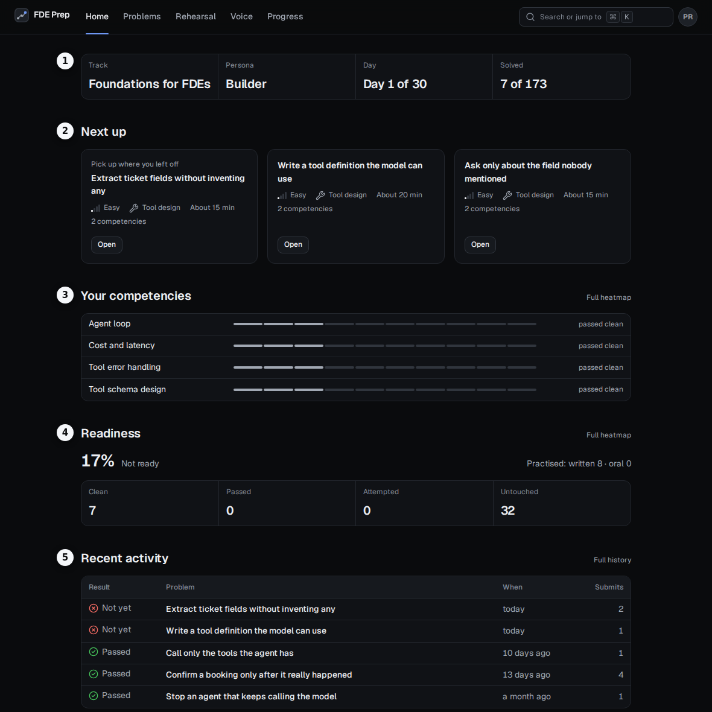

Home opens on where you stand and one thing to do next. The strip (1) shows your track, your persona, the day you have reached on the 30-day storyline and how many problems you have solved. Next up (2) holds the three problems next on your path, with the one you left unfinished first. Your competencies (3) shows your two strongest and your two weakest. Readiness (4) is the number placement reads, with how many written and oral problems you have practised beside it, so a learner who is screen ready on written problems alone can see it, and its four counts under it. Recent activity (5) lists your last five finished attempts.

### 2. Find a problem on the chapter map

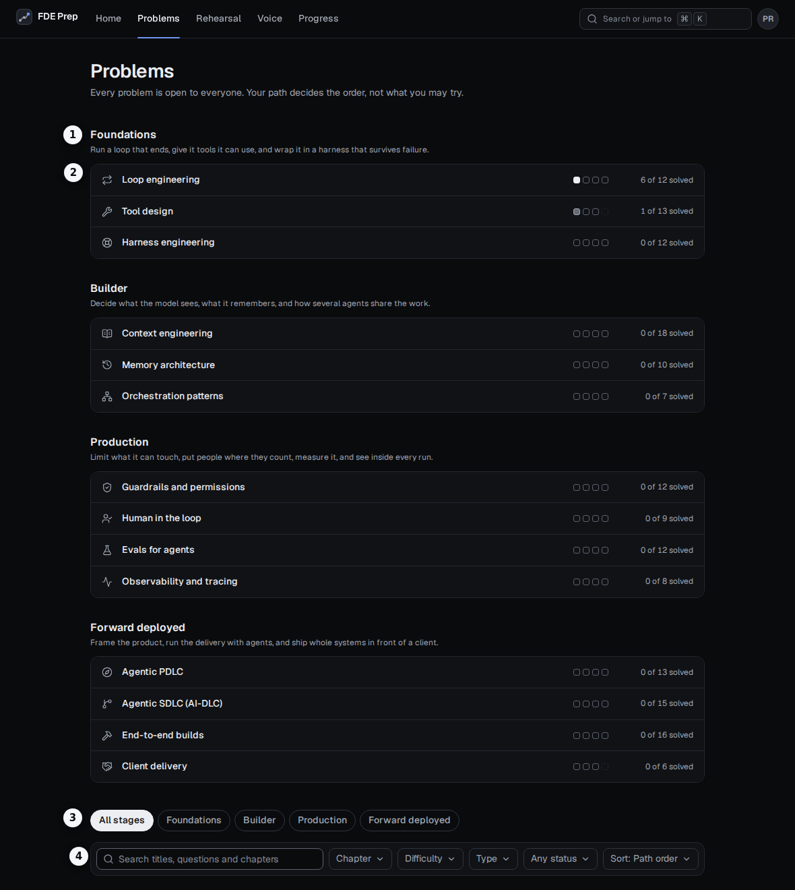

Problems opens on the chapter map until you filter, search or sort. The four stages (1) run from Foundations to Forward deployed. Each row (2) is a chapter, with one square per tier and how much of it you have solved. The stage filters (3) and the search and filter bar (4) turn the map into a list, where every problem shows the question it answers under its title. Every problem is open to everyone, and your path decides the order.

### 3. Solve a code problem

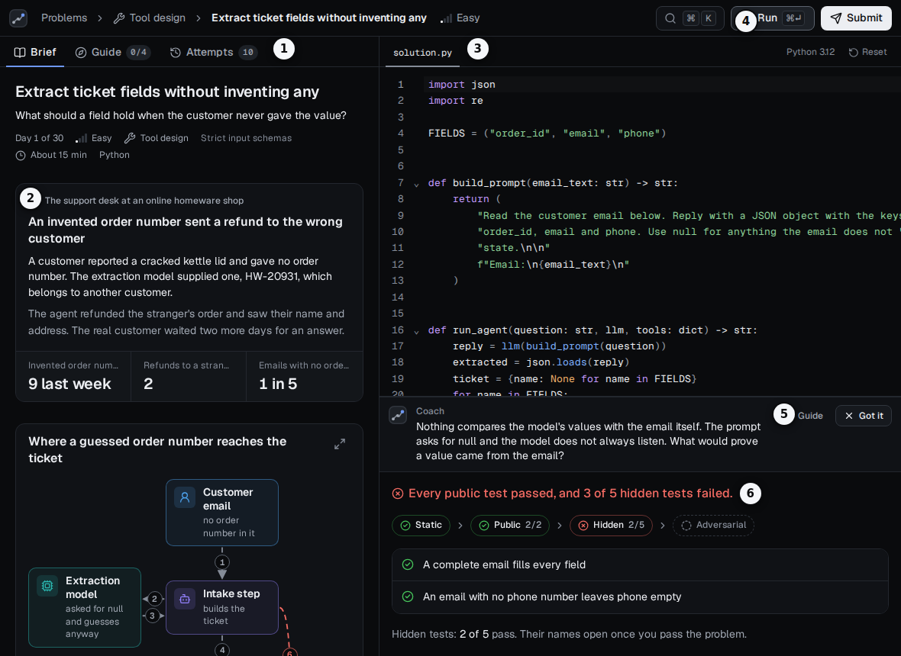

The left pane has three tabs (1): the brief, the guide with the approach map and the hints, and your attempts. The situation card (2) says who was hurt and what it cost before the brief states the task. Your solution (3) is a CodeMirror editor with no model behind it. Run (4) grades the public cases and Submit grades the whole battery. The coach (5) reads your code and says one sentence an author wrote. The result (6) names every public case, reports the hidden cases as a count and shows the gates in order. The picture shows a solution that copies every value the model returns onto the ticket: both public cases pass and three of five hidden cases fail, which is the lesson this problem exists to teach.

### 4. Pick a question and an interviewer

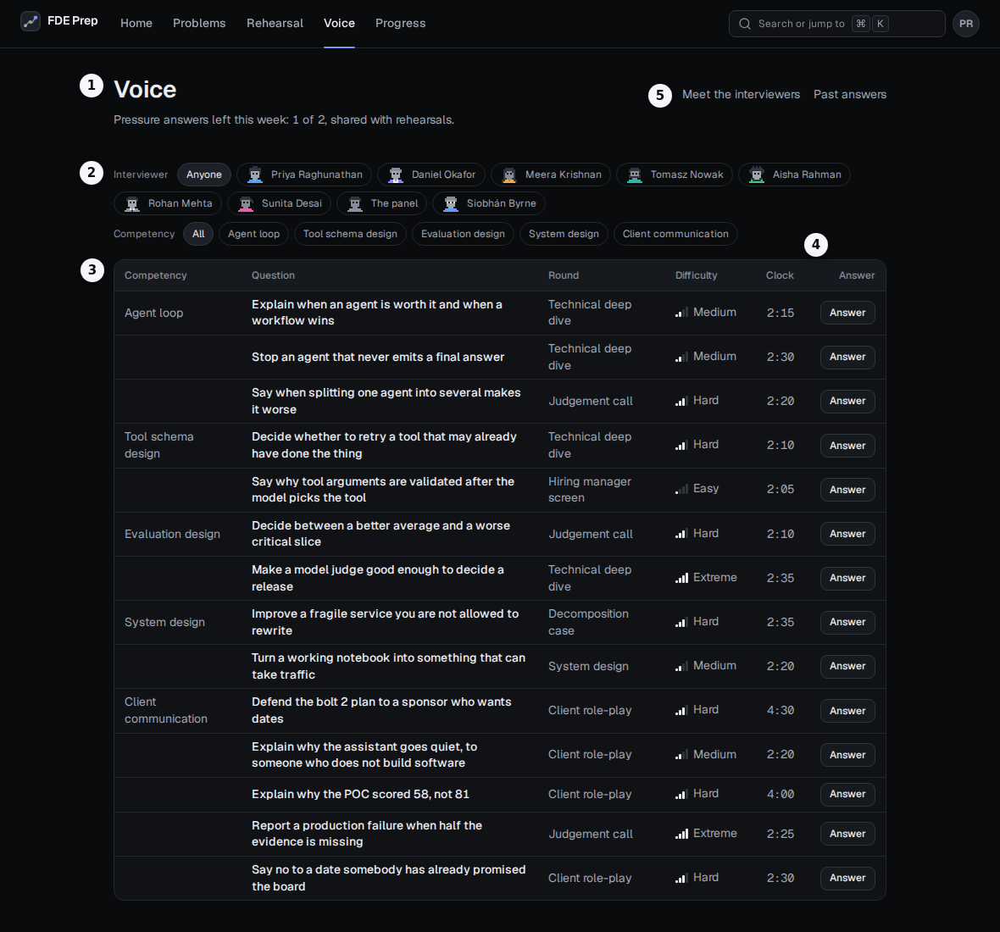

Voice is one table (3) of every published question, with the round of the interview loop it comes from, its difficulty and its clock. The filters (2) narrow it to one interviewer or one competency. Answer (4) opens the lobby for that question. Meet the interviewers (5) is the page that says who the nine are, what each listens for and which questions each asks.

### 5. Read the lobby, then answer

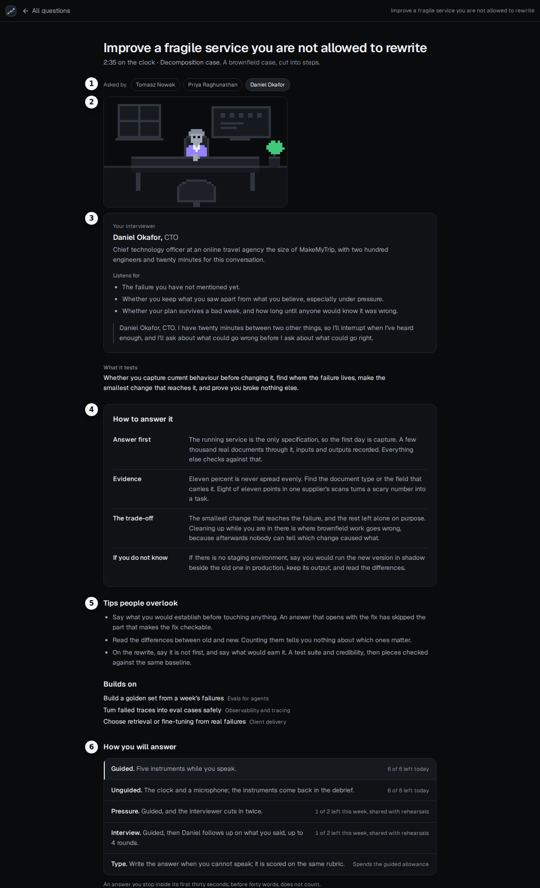

The lobby opens on the question's clock and the round it comes from. Asked by (1) picks one of the question's interviewers, and the room (2) seats them. The interviewer card (3) says who they are, what they listen for and how they open. How to answer it (4) is the framework card written for this question: answer first, evidence with a number, the trade-off to name and what to say when you do not know. Tips people overlook (5) and the problems the question builds on follow. How you will answer (6) lists guided, unguided, pressure, interview and typed, each with the allowance it spends; in interview mode the interviewer follows up on what you said, four rounds on this question and never more than five.

### 6. Read a debrief

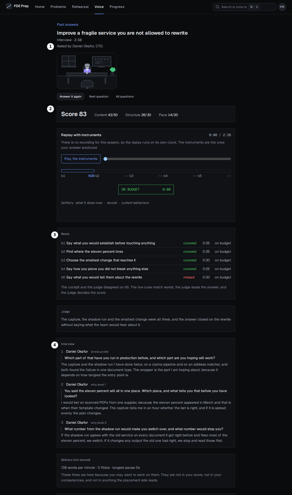

A debrief says who asked (1), then the score and its three axes (2): content from the rubric judge, structure and pace from the main answer's timeline. The replay runs the cockpit's five instruments over the answer. The beats (3) show which ones the judge found covered, the time each took and whether it stayed on budget. After an interview, the Interview panel (4) lists each round: who asked, whether it was a stress probe or a level of why, the question and what you replied. The judge's sentence, any territory not entered, the delivery numbers marked as not scored, the transcript and the recording sit around them.

### 7. Check your readiness

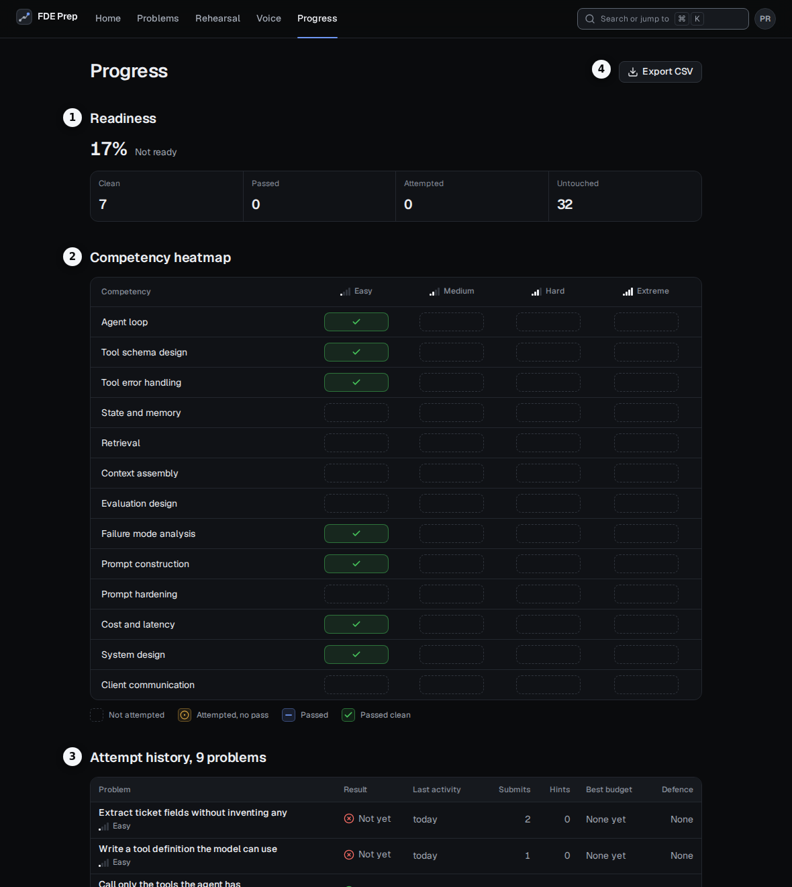

Progress opens on the readiness line (1), the same object Home draws from the same query, with the written and oral problems practised beside the band. The heatmap (2) is thirteen competencies by four tiers, and only a clean pass on a submit, with no hints and inside the call budget, counts toward readiness; a Run that passes, a live run or a defence earns attempted at most. The attempt history (3) lists every problem with its submits, its hints and its best budget. Export CSV (4) is the file a cohort tracker reads.

### 8. Watch the cohort

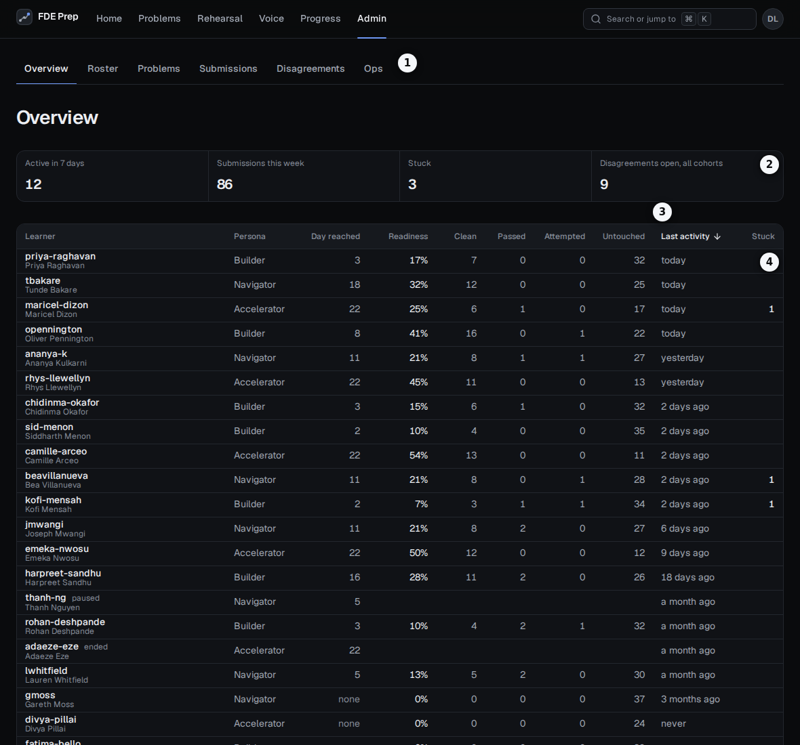

Faculty and admins open Admin on the Overview, with the other sections as tabs (1): Cohort, Roster, Problems, Submissions, Disagreements, Calibration, Panel and Ops. Four numbers (2) summarise the week, and Export CSV beside the title downloads the cohort standing, with the date and the row count on its first line. One row per learner follows, sortable by activity, readiness or stuck count from the column headers (3), and a row (4) opens that learner's page with the same heatmap, every attempt with its trace, every past answer, and the report cards issued for them, with the button that issues one.

## Who it is for

| Who | What they do with it |
|---|---|
| Learners in an FDE Academy cohort | They work the 30-day path, rehearse under screen conditions, answer questions out loud to an interviewer who follows up, and read their own readiness. |
| Faculty | They read any learner's submissions and traces, and every evaluation an answer has had with the judge prompt that graded it; they work the queue of answers the panel argued over, correct a grade, watch the cohort on the Overview, read who is stuck and which competency the cohort has not passed, read the calibration report before the next cohort, and issue a report card. |
| Placement teams | They read readiness with its four counts and the interview rounds practised beside it, the attempt history and the cohort standing as CSV, and a report card that faculty issue: a dated snapshot with a SHA-256 that proves it has not changed, downloaded as Markdown. |
| Operators | They publish content, run the worker and the voice scorer, watch the queue on Ops and the panel's health, pause grading, requeue a waiting submission, regrade after a judge prompt changes, and deploy from [DEPLOY.md](DEPLOY.md). |
| Management | They read [docs/project](docs/project/README.md) for what was built, when, how big it was and what comes next. |
| Anyone outside FDE Academy preparing for a forward deployed or agent engineering role | They run it on a laptop with `AUTH_DEV_LEARNER=1` and work the same 173 problems, 14 questions and nine interviewers. The sign-in wall is the only thing they skip. |

## Key features

| Feature | What you get | Where it lives |
|---|---|---|
| Deterministic grading against a scripted model | The same submission always gets the same verdict, grading spends no model tokens, and an author scripts the exact failure every learner meets. | `runner/harness`, `runner/battery`; [docs/03](docs/03-RUNNER-AND-GRADING.md) |
| The scaffold ladder and the coach | Six layers of support switched by difficulty, hints that cost what the tier says, a step checklist that turns green one step at a time, and a coach that reads your code. | `web/lib/policy`, `web/components/workspace`; [docs/00](docs/00-PRD.md) section 3.2 |
| Hidden and adversarial batteries | Ten hostile fixtures, from a tool that lies to a budget squeeze, each with its own assertion and an annotation shown after the attempt. | `runner/harness`; [docs/03](docs/03-RUNNER-AND-GRADING.md) section 3 |
| Trace replay | Every model call, tool call and observation in order, with flags such as a repeated identical tool call. | `/traces/[id]`, `web/lib/trace`; [docs/03](docs/03-RUNNER-AND-GRADING.md) section 6 |
| Prompt surgery | Static rules with zero model calls, then probes run twice each for agreement, then the rubric judge. | `web/lib/gate`, `judge/`; [docs/03](docs/03-RUNNER-AND-GRADING.md) section 4.2 |
| Design arguments and the defence | A written answer graded against three exemplars, and on Hard and Extreme a 120-word defence of the design after a pass. | `judge/prompts`, `web/app/(focus)/problems/[slug]`; [docs/03](docs/03-RUNNER-AND-GRADING.md) sections 4.3 and 4.4 |
| The judge | One Lambda for every model call: prompt probes, the rubric judge, the voice beats and, since pull request #46, the follow-up and resume-claims events of interview mode, each call bounded and its token usage recorded. Every prompt is filled in one pass, so a learner's literal `{{NONCE}}` can no longer close the data delimiter. | `judge/`, `judge/prompts/`; [docs/03](docs/03-RUNNER-AND-GRADING.md) section 4, [docs/07](docs/07-VOICE-SCREEN.md) section 5a |
| The evaluation panel | Three evaluators and one voice: deterministic checks and heuristics, a band from the nearest graded answers with no model call, and the judge's findings. Disagreement is reported and never averaged. Every evaluation names the judge prompt that graded it, the judge worker re-runs a partial evaluation for free, three a tick, and `npm run regrade` grades earlier submissions again when a prompt changes, moving a band and never a verdict. | `web/lib/eval`, `npm run regrade`; [docs/10](docs/10-EVALUATION-PANEL.md) sections 9 and 10 |
| One writer of every grade | `web/lib/eval/` is the only writer of `evaluation`, `evaluation_review` and `competency_score`. The result writer and the voice scorer keep their own grade columns and are named for it, a test reads every file under `web/lib`, `web/app` and `web/scripts` and fails on any other writer, and only a submit or a rehearsal submit can earn a passed or clean cell. | `web/lib/eval/competency.ts`, `web/tests/writer-boundary.test.ts`, migration 026; [docs/10](docs/10-EVALUATION-PANEL.md) section 13 |
| Faculty review and override | A queue of the answers the panel argued over, a disposition with a note, a correction that moves the verdict, the score and the heatmap and tells the learner, and every evaluation a submission has had, newest first, with its prompt and what each panelist said. | `/admin/disagreements`, `/admin/submissions/[id]`; [docs/10](docs/10-EVALUATION-PANEL.md) sections 7 and 10 |
| The Voice Screen | Answer a spoken interview question in guided, unguided, pressure or interview mode, asked by one of nine interviewers or a panel of three. In interview mode the interviewer follows up on what you said for up to five rounds, and can ask about a resume you paste. Consent and a microphone check come first, the cockpit holds five instruments, and a typed answer is there when the microphone is not. | `/voice/session`, `web/app/(focus)/voice`, `voice/`; [docs/07](docs/07-VOICE-SCREEN.md) |
| The interviewers | Read who the nine interviewers are, what each listens for and which questions each asks. | `/voice/interviewers`; [docs/07](docs/07-VOICE-SCREEN.md) section 2a |
| The voice debrief | Read a voice debrief with beat timings, pace, filler counts, a rubric score and, after an interview, who asked each follow-up and what you replied. | `/voice/sessions/[id]`; [docs/07](docs/07-VOICE-SCREEN.md) section 6 |
| Rehearsal | A timed sitting under screen conditions, two a week, with a report. | `/rehearsal`; [docs/00](docs/00-PRD.md) section 7.4 |
| Progress and readiness | A heatmap of thirteen competencies by four tiers, a readiness percentage with its four counts and three bands, the written and oral problems practised beside it, and a CSV export. | `web/lib/progress`; [docs/12](docs/12-PROGRESS-AND-READINESS.md) |
| Cohort analytics | The stuck list by learner and problem, the competency gaps with the lowest pass rate named in a sentence, interview coverage by round, a calibration report that names the problem, the signal, the number, the sample and what to check first, panel health with the partial rate and the re-evaluation backlog, and the cohort standing as a dated CSV. Every number is read from what `eval/` wrote, and the module computes no grade. | `web/lib/analytics`, `/admin/cohort`, `/admin/calibration`, `/admin/panel`; [docs/11](docs/11-ANALYTICS-AND-REPORT-CARD.md) sections 4 to 7 |
| The report card | A dated snapshot of one learner for a placement team, issued by faculty from the learner's page, stored as canonical JSON with its SHA-256, refused any update by the database, and downloaded as Markdown with the date, the hash and the snapshot on it, so anyone holding the card can check it. | `web/lib/analytics/report-card.ts`, migration 024; [docs/11](docs/11-ANALYTICS-AND-REPORT-CARD.md) section 3 |
| Admin and operations | A roster with CSV persona upload and one-time invites, submissions with every trace and every evaluation, the Cohort, Calibration and Panel screens, Ops with queue depth, today's interview rounds with their 95th percentile gap and fallback share, a degraded-mode switch, requeue and counter clears, each writing an audit row. | `/admin/*`; [docs/01](docs/01-WIREFRAMES.md) S10, [docs/05](docs/05-DEPLOY-AND-OPS.md) section 7 |
| Content as code | Problems, questions and interviewers are YAML in Git, validated in CI, published by one command and versioned, so a submission always points at the version it ran against. A C3 or C4 design problem lists the constraints its answer has to engage with, and the validator refuses one without. The 173 problems cover the loop, tools, the harness, context, memory, orchestration, guardrails, human in the loop, evals, observability, the agentic PDLC and SDLC, end-to-end builds and client delivery. The ten newest add a peer handoff with Command, a critic loop that keeps the best draft, a map-reduce with Send, an A2A task handoff, episodic and procedural memory, rerank depth, a bounded graph walk, n8n against a graph or plain code, and a model change inside a sealed network. | `problems/`, `voice-questions/`, `voice-interviewers/`; [docs/04](docs/04-PROBLEM-AUTHORING.md) |
| A delivery record | Every stage and story in one file that CI checks, rendered to pages for management and synced to a GitHub Project. | `docs/project/backlog.yaml`, `tools/project_sync.py` |

## Modes

### Difficulty

Difficulty decides how much support a learner gets. It never decides which problems are visible. The table is `web/lib/policy/tiers.ts`, the only place the tiers are described, and [docs/00](docs/00-PRD.md) section 3.2 is its specification.

| Tier | Layers on | Hints | What you see of the tests | Submits a day | Also |
|---|---|---|---|---|---|
| Easy | Brief, contract, starter code, steps, hints | Free | Public names and assertions, the hidden count and the acceptance rate | Unlimited | The coach speaks as soon as your code shows the mistake, and the traps show from the start. |
| Medium | The same five | After one failed run | Public names, the hidden count and the acceptance rate | 10 | The same coach and traps as Easy. |
| Hard | Brief, contract, starter code, hints | After one failed run | The hidden count only | 5 | A defence is required after a pass, a score above 70 needs the adversarial battery, the coach's code nudges wait for one failed run, and the traps show once the attempt closes. |
| Extreme | Brief, contract, starter code, hints | After two failed runs and a 200-character attempt note | Nothing | 1 | Timed, your own tests before Submit opens, a confirmation before the one submit, the adversarial battery always runs, an identical resubmission is refused by hash, and the defence is required. |
| Screen conditions | The brief alone, with a blank editor | None | Nothing | One per problem, in two rehearsals a week | What Extreme meant before 29 September 2026, kept whole for the rehearsal: no coach, no traps, and your own tests first. |

### Voice

| Mode | What changes | Allowance |
|---|---|---|
| Guided | The cockpit: a beat track, a pace band, the territory of the current beat, a microphone level and one nudge at a time. No transcript renders while you speak. | 6 a day |
| Unguided | The question, the clock, the microphone level and a stop button. The debrief replays your answer with the instruments you did not have. | 6 a day |
| Pressure | Guided, plus an authored follow-up spoken by Amazon Polly at a beat boundary, two at most, with the main clock paused while you answer it. Offered only where the question has follow-ups. | 2 a week, shared with rehearsals |
| Interview | Guided, then the interviewer follows up out loud on what you said, up to five rounds, each reply on a sixty-second clock. The server plans every round from the interviewer's cadence, a why ladder (specify, evidence, mechanism, alternative, limit) with stress probes and resume questions, the judge words it under a four-second deadline, and the question's authored follow-ups ask instead when the judge is late or refused. A pasted resume becomes at most twelve claims for the session, and its text is never written. | 2 a week, shared with rehearsals |
| Typed | A text box on its own page, for a learner whose microphone or connection fails or who cannot speak where they are. Scored on content and structure, with no pace. Pressure and interview are refused and offered as guided. | The allowance of its mode |
| Timed practice | What the Voice page offers when the socket is not configured: the clock and the beats by their budgets. It records nothing and spends nothing. | None |

### Everything else that changes behaviour

| Mode | What it is |
|---|---|
| Live run | [docs/00](docs/00-PRD.md) section 4 gives each learner ten runs a day against a real model through Bedrock, with a trace and never a verdict. The step protocol and its tables are built and tested in `web/lib/live`, and no screen offers it yet. |
| Drills | A problem marked drill sits off the 30-day path in its chapter, labelled Drill, and Home's next action reaches it only after every unsolved problem on the path. 23 of the 173 problems are drills. |
| Degraded mode | A switch on Ops that disables Submit and leaves Run working, so grading can stop without anyone losing an attempt. |
| Development against production | `AUTH_DEV_LEARNER=1` signs you in as one development admin and is refused whenever `GITHUB_CLIENT_ID` is set or `NODE_ENV` is production. With `RUNNER_FUNCTION` unset the worker runs learner code as a subprocess on its own host, which a production worker refuses unless `RUNNER_LOCAL_OK=1` says you meant it. `VOICE_STT=scripted` drives the cockpit with no AWS credential, and `EVAL_DEGRADED_PANELISTS=pretrained` starts the worker without the embedding model. |
| The organisation wall, or invites | By default a learner must be a member of the GitHub organisation and on a roster. `GITHUB_ORG_CHECK=off` replaces membership with one-time invites, which is how a beta admits testers from outside. GitHub stays the only identity either way. |
| Local against AWS | Docker Compose or four terminals on a laptop; Vercel with managed Postgres; one EC2 box; or the beta on AWS with the two Lambdas, which [DEPLOY.md](DEPLOY.md) walks through click by click. |

## Stages of development

The build ran as ten stages from the specification to the beta candidate, then seven more after it, with the beta launch waiting on an AWS account. A stage is what an enterprise team would call an epic. Dates are facts from git, in India time, and points are estimates on a relative scale that [docs/project/estimation.md](docs/project/estimation.md) explains.

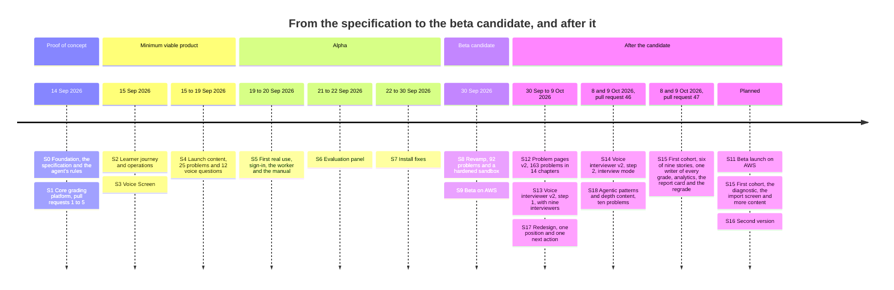
```mermaid
timeline
  title From the specification to the beta candidate, and after it
  section Proof of concept
    14 Sep 2026 : S0 Foundation, the specification and the agent's rules
                : S1 Core grading platform, pull requests 1 to 5
  section Minimum viable product
    15 Sep 2026 : S2 Learner journey and operations
                : S3 Voice Screen
    15 to 19 Sep 2026 : S4 Launch content, 25 problems and 12 voice questions
  section Alpha
    19 to 20 Sep 2026 : S5 First real use, sign-in, the worker and the manual
    21 to 22 Sep 2026 : S6 Evaluation panel
    22 to 30 Sep 2026 : S7 Install fixes
  section Beta candidate
    30 Sep 2026 : S8 Revamp, 92 problems and a hardened sandbox
                : S9 Beta on AWS
  section After the candidate
    30 Sep to 9 Oct 2026 : S12 Problem pages v2, 163 problems in 14 chapters
                         : S13 Voice interviewer v2, step 1, with nine interviewers
                         : S17 Redesign, one position and one next action
    8 and 9 Oct 2026, pull request 46 : S14 Voice interviewer v2, step 2, interview mode
                                      : S18 Agentic patterns and depth content, ten problems
    8 and 9 Oct 2026, pull request 47 : S15 First cohort, six of nine stories, one writer of every grade, analytics, the report card and the regrade
    Planned : S11 Beta launch on AWS
            : S15 First cohort, the diagnostic, the import screen and more content
            : S16 Second version
```

| Build | Stages | Dates | Pull requests | What it proved | Points |
|---|---|---|---|---|---|
| Proof of concept | S0 Foundation, S1 Core grading platform | 14 September 2026 | Direct commits, then #1 to #5 | Learner code can be graded deterministically against a scripted model, inside a sandbox that holds nothing worth stealing. Ten documents were written before any code, and the first bug was found by reading a vendor's documentation against them. | 81 |
| Minimum viable product | S2 Learner journey and operations, S3 Voice Screen, S4 Launch content | 15 to 19 September 2026 | #6 to #16 | A learner can practise, rehearse and speak an answer, and a placement team can read the result. 25 problems and 12 voice questions shipped, and timing real speech cut every voice budget by a third. | 80 |
| Alpha | S5 First real use, S6 Evaluation panel, S7 Install fixes | 19 to 30 September 2026 | #17 to #37 | The first people to run it found what the tests could not, including that there was no sign-in at all behind 396 passing tests, and each fault got fixed with a test that would have caught it. The panel of three evaluators and the faculty override landed. | 82 |
| Beta candidate | S8 Revamp, S9 Beta on AWS | 30 September 2026 | #38 to #40 | 92 problems, a coached workspace, a sandbox that no longer holds the scripted model or any credential, direct Lambda invocation, invite-only sign-in and a stack that deploys from a clean AWS account. | 117 |

### After the candidate

| Stage | Dates | Pull requests | What it delivered |
|---|---|---|---|
| S10 Delivery board | 30 September to 1 October 2026 | #41 | The backlog as a file that CI checks, and the pages under `docs/project`. The sync to the GitHub Project is in progress and waits on a repository token. |
| S12 Problem pages v2 | 30 September to 9 October 2026 | #42, #43 and #45 | The catalogue grew from 92 to 163 problems in 14 chapters, told as a learner's first 30 days, with tools, worked examples, traps and the interview angle on every problem, LangGraph and LangChain inside the sandbox, and two multi-stage simulations of a funded agent project. 22 stories, all done. |
| S13 Voice interviewer v2, step 1 | 30 September to 9 October 2026 | #44, #45 and #46 | The question picker, Next question, typed answers, caps that bind, eight voice defects fixed and the depth panel in the debrief, then in #46 the nine interviewers with their voices and probes, the question bank rewritten around six rounds of the interview loop, and a framework card and tips on every question. |
| S17 Redesign, one position and one next action | 8 and 9 October 2026 | #45 | A seed that fills a database through `eval/`, readiness read everywhere from one query, one name per place, Home and Problems opening on one position and one next action, and the admin Overview. |
| S14 Voice interviewer v2, step 2 | 8 and 9 October 2026 | #46 | Interview mode: follow-up rounds planned on the server and worded by the judge under a four-second deadline with the authored bank as the fallback, a pasted resume turned into claims and never written, a panel of three that takes turns, the pixel interview room in the lobby and the debrief, and docs/07 and the consent screen amended. Pricing and timing ten real sessions (S14.5) waits for the first deploy. |
| S18 Agentic patterns and depth content | 8 and 9 October 2026 | #46 | Ten problems the catalogue was missing: a peer handoff with Command, a critic loop that keeps the best draft, a map-reduce with Send, an A2A task handoff, episodic and procedural memory, rerank depth, a bounded graph walk, n8n against a graph or plain code, and a model change inside a sealed network. Nine are drills. |
| S15 First cohort | 8 and 9 October 2026, with three stories still planned | #47 | One writer of every grade, with a test that reads the application for any other and a reader role behind it; cohort analytics, with the stuck list, the competency gaps, interview coverage, the calibration report, panel health and the cohort standing CSV; the report card as a dated, hashed snapshot; the judge prompt on every evaluation, `npm run regrade`, a judge worker that pays off partial evaluations, and the panelist 3 fix, since it read a score field the judge never writes and had sent every real design, prompt and defence evaluation to partial; constraint lists on all 28 C3 and C4 design problems, so `names_no_constraint` fires; and the readiness signal, built with the redesign, recorded as delivered. The diagnostic that sets personas (S15.1), an import screen that works on a deployment (S15.4) and content aimed at what the cohort fails (S15.9) stay planned. |
| S11 Beta launch | Forecast 1 to 9 October 2026, waiting on an AWS account | [DEPLOY.md](DEPLOY.md) landed in #45 | Deploy route C, prove each of the four live integrations once, run the restore drill written in DEPLOY.md 8.2, brief a second operator, set the budget alert on the Marketplace billing entity and run the burst test. |
| S16 Second version | Planned | None yet | A browser problem family, a placement export, several cohorts at once, peer review and a mobile reading view. |

[docs/project/delivery-history.md](docs/project/delivery-history.md) has every story in every stage with the pull request that delivered it, and [docs/project/roadmap.md](docs/project/roadmap.md) has the planned stages with their estimates and RICE scores.

### What stays unbuilt

A roadmap that only grows is a roadmap nobody trusts, so these are decisions too, recorded in [docs/project/decisions.md](docs/project/decisions.md).

| Not building | Because |
|---|---|
| Free and paid tiers | Every problem is visible to every enrolled learner, and a tier adds a reason to argue about access instead of about answers. |
| A discussion forum | GitHub is already the delivery platform and already has one. |
| Live model grading as the default path | It gives verdicts nobody can reproduce, appeals nobody can answer and a bill that grows with practice. The capped live run exists for exploration and gives no verdict. |
| A mobile workspace | A three-pane editor on a phone is a worse version of what already works on a laptop. Below 768 pixels the workspace becomes three tabs, and nothing else is designed for a phone. |

## Spec at a glance

The specification lives in `docs/` and is authoritative. When this page and a document disagree, the document wins.

| Document | What it decides | Read it when |
|---|---|---|
| [docs/00 Product requirements](docs/00-PRD.md) | Users and access, the problem object, the scaffold ladder, caps, the scripted model, the adversarial battery, rehearsal, progress and the acceptance list for v1. | Always, in the first session of any phase. |
| [docs/01 Wireframes](docs/01-WIREFRAMES.md) | Ten screens as region maps with their behaviour, the admin Overview and the analytics screens as amended, and the visual direction. | Building any screen. |
| [docs/02 Data model](docs/02-DATA-MODEL.md) | Every table, the rate limit policy rows, the competency states and which kinds earn them, the evaluation record, report cards, the reader role and retention. | Touching the schema or a query. |
| [docs/03 Runner and grading](docs/03-RUNNER-AND-GRADING.md) | The execution model, the mock LLM contract, the fixture library, the gates per artefact, the result contract, the trace format, security, failure handling, the outbox, the lease and the step protocol. | Anything in `runner/` or `judge/`, and before touching grading anywhere. |
| [docs/04 Problem authoring](docs/04-PROBLEM-AUTHORING.md) | The validator rules, the YAML schema, the kit on every problem, the constraints list on a C3 or C4 design problem, three worked problems and the authoring checklist. | Anything that reads or validates problem YAML. |
| [docs/05 Deployment and operations](docs/05-DEPLOY-AND-OPS.md) | The architecture as amended for the beta, the environments, the CDK stack, the cost shape, the three alarms, the runbook with the regrade and the restore, and the cost runbook for interview mode. | Anything in `infra/` or `.github/workflows/`. |
| [docs/06 Build plan](docs/06-BUILD-PLAN.md) | Phases 0 to 8 with acceptance criteria, the standing rules and what to cut first. | The start of every phase. |
| [docs/07 Voice Screen](docs/07-VOICE-SCREEN.md) | The question object and its loop fields, the nine interviewers, the cockpit, the four modes with interview mode's rounds, scoring, the fairness rule, the technical design, the schema, privacy, caps and acceptance. | Anything in the voice module. |
| [docs/08 Design system](docs/08-DESIGN-SYSTEM.md) | Type, colour, icons, motion, density, components and the accessibility floor. | Any styling, type, colour, icon or motion decision. |
| [docs/09 Source pack reconciliation](docs/09-SOURCE-PACK-RECONCILIATION.md) | What an earlier build pack by a different model got right, what was corrected and why. | Before trusting anything in `docs/source-pack/`. |
| [docs/10 Evaluation panel](docs/10-EVALUATION-PANEL.md) | Complexity against difficulty, the three panelists, the consolidator, bands, degradation and the drain that pays for it, the evaluation record with the prompt that graded it, the regrade, the relevance gate and the module boundary with its two named writers. | Anything in `eval/`, and before changing how any answer is graded. |
| [docs/11 Analytics and the report card](docs/11-ANALYTICS-AND-REPORT-CARD.md) | Cohort views, problem calibration, panel health, the report card and exports, each amended on 8 October 2026 to what was built. The PDF export waits on a dependency proposal. | Anything in `analytics/`, cohort views, the report card or an export. |
| [docs/12 Progress and readiness](docs/12-PROGRESS-AND-READINESS.md) | The competency state machine, the readiness signal with its counts and bands, interview coverage, partial evaluations and the module boundary. | Anything in `progress/`, the heatmap or the readiness signal. |

## Architecture

### The one decision everything else follows from

Agent problems are graded against a scripted model, never a live one. A learner writes `run_agent(question, llm, tools)`, and at grading time `llm` is a proxy to a lookup table in the runner that matches the prompt against authored rules, returns a pre-written reply and records every call in a trace. Four consequences shape every other decision in this repository.

| Consequence | What it buys |
|---|---|
| The same submission always produces the same verdict. | There are no appeals about randomness, and a learner who resubmits identical code cannot get a different mark. |
| Grading costs no model tokens. | Two hundred learners can practise all night without anybody watching a bill. |
| Learner code never reaches a model endpoint. | Token spend is bounded by construction rather than by a quota someone has to watch. |
| A problem author writes the model's failures. | A tool that returns HTTP 200 with an error in its body is a fixture, and every learner meets that exact failure. |

### Context

The people and the outside systems around the product.

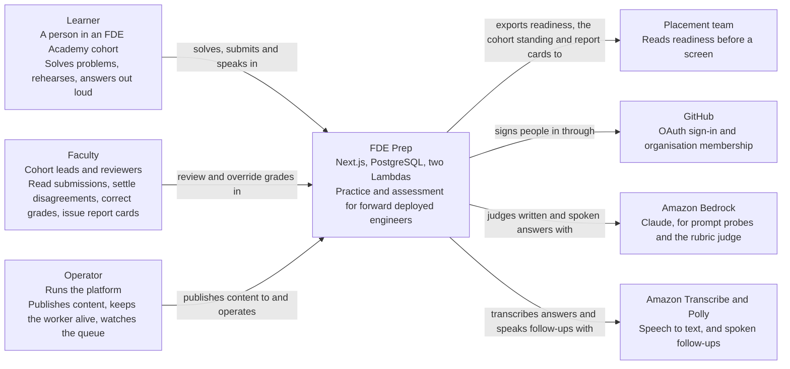
```mermaid
flowchart LR
  learner["Learner<br/>A person in an FDE Academy cohort<br/>Solves problems, rehearses, answers out loud"]
  faculty["Faculty<br/>Cohort leads and reviewers<br/>Read submissions, settle disagreements, correct grades, issue report cards"]
  operator["Operator<br/>Runs the platform<br/>Publishes content, keeps the worker alive, watches the queue"]
  placement["Placement team<br/>Reads readiness before a screen"]
  fdeprep["FDE Prep<br/>Next.js, PostgreSQL, two Lambdas<br/>Practice and assessment for forward deployed engineers"]
  github["GitHub<br/>OAuth sign-in and organisation membership"]
  bedrock["Amazon Bedrock<br/>Claude, for prompt probes and the rubric judge"]
  speech["Amazon Transcribe and Polly<br/>Speech to text, and spoken follow-ups"]
  learner -->|"solves, submits and speaks in"| fdeprep
  faculty -->|"review and override grades in"| fdeprep
  operator -->|"publishes content to and operates"| fdeprep
  fdeprep -->|"exports readiness, the cohort standing and report cards to"| placement
  fdeprep -->|"signs people in through"| github
  fdeprep -->|"judges written and spoken answers with"| bedrock
  fdeprep -->|"transcribes answers and speaks follow-ups with"| speech
```

### Containers

Each deployable unit, its technology and what talks to what. The web application and its two Node processes share one host and one database; the two Lambdas, the voice socket and the audio bucket are built by `cdk deploy`.

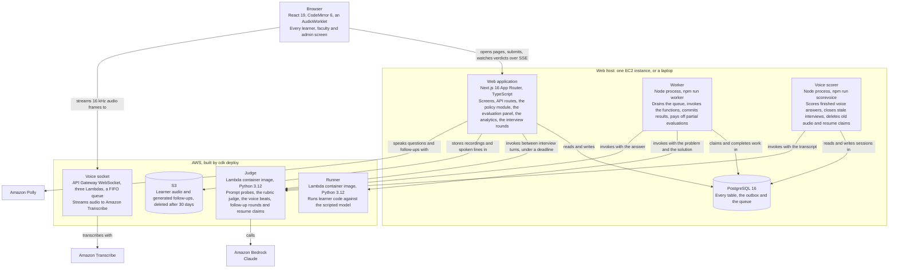
```mermaid
flowchart TB
  browser["Browser<br/>React 19, CodeMirror 6, an AudioWorklet<br/>Every learner, faculty and admin screen"]
  subgraph host["Web host: one EC2 instance, or a laptop"]
    web["Web application<br/>Next.js 16 App Router, TypeScript<br/>Screens, API routes, the policy module, the evaluation panel, the analytics, the interview rounds"]
    worker["Worker<br/>Node process, npm run worker<br/>Drains the queue, invokes the functions, commits results, pays off partial evaluations"]
    scorer["Voice scorer<br/>Node process, npm run scorevoice<br/>Scores finished voice answers, closes stale interviews, deletes old audio and resume claims"]
    db[("PostgreSQL 16<br/>Every table, the outbox and the queue")]
  end
  subgraph aws["AWS, built by cdk deploy"]
    runner["Runner<br/>Lambda container image, Python 3.12<br/>Runs learner code against the scripted model"]
    judge["Judge<br/>Lambda container image, Python 3.12<br/>Prompt probes, the rubric judge, the voice beats, follow-up rounds and resume claims"]
    socket["Voice socket<br/>API Gateway WebSocket, three Lambdas, a FIFO queue<br/>Streams audio to Amazon Transcribe"]
    audio[("S3<br/>Learner audio and generated follow-ups, deleted after 30 days")]
  end
  bedrock["Amazon Bedrock<br/>Claude"]
  transcribe["Amazon Transcribe"]
  polly["Amazon Polly"]
  browser -->|"opens pages, submits, watches verdicts over SSE"| web
  browser -->|"streams 16 kHz audio frames to"| socket
  web -->|"reads and writes"| db
  worker -->|"claims and completes work in"| db
  scorer -->|"reads and writes sessions in"| db
  worker -->|"invokes with the problem and the solution"| runner
  worker -->|"invokes with the answer"| judge
  scorer -->|"invokes with the transcript"| judge
  web -->|"invokes between interview turns, under a deadline"| judge
  judge -->|"calls"| bedrock
  socket -->|"transcribes with"| transcribe
  web -->|"stores recordings and spoken lines in"| audio
  web -->|"speaks questions and follow-ups with"| polly
```

### Components of grading

The inside of the one path a reader most needs to understand: what happens between Submit and a verdict. The worker runs these stages in a loop, in this order, once a second.

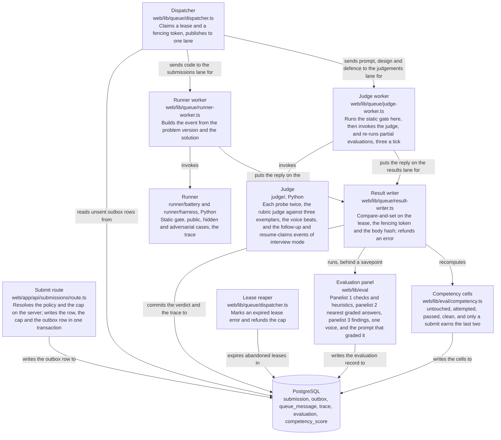
```mermaid
flowchart TB
  route["Submit route<br/>web/app/api/submissions/route.ts<br/>Resolves the policy and the cap on the server; writes the row, the cap and the outbox row in one transaction"]
  dispatcher["Dispatcher<br/>web/lib/queue/dispatcher.ts<br/>Claims a lease and a fencing token, publishes to one lane"]
  runnerw["Runner worker<br/>web/lib/queue/runner-worker.ts<br/>Builds the event from the problem version and the solution"]
  judgew["Judge worker<br/>web/lib/queue/judge-worker.ts<br/>Runs the static gate here, then invokes the judge, and re-runs partial evaluations, three a tick"]
  runner["Runner<br/>runner/battery and runner/harness, Python<br/>Static gate, public, hidden and adversarial cases, the trace"]
  judge["Judge<br/>judge/, Python<br/>Each probe twice, the rubric judge against three exemplars, the voice beats, and the follow-up and resume-claims events of interview mode"]
  writer["Result writer<br/>web/lib/queue/result-writer.ts<br/>Compare-and-set on the lease, the fencing token and the body hash; refunds an error"]
  panel["Evaluation panel<br/>web/lib/eval<br/>Panelist 1 checks and heuristics, panelist 2 nearest graded answers, panelist 3 findings, one voice, and the prompt that graded it"]
  competency["Competency cells<br/>web/lib/eval/competency.ts<br/>untouched, attempted, passed, clean, and only a submit earns the last two"]
  reaper["Lease reaper<br/>web/lib/queue/dispatcher.ts<br/>Marks an expired lease error and refunds the cap"]
  tables[("PostgreSQL<br/>submission, outbox, queue_message, trace, evaluation, competency_score")]
  route -->|"writes the outbox row to"| tables
  dispatcher -->|"reads unsent outbox rows from"| tables
  dispatcher -->|"sends code to the submissions lane for"| runnerw
  dispatcher -->|"sends prompt, design and defence to the judgements lane for"| judgew
  runnerw -->|"invokes"| runner
  judgew -->|"invokes"| judge
  runnerw -->|"puts the reply on the results lane for"| writer
  judgew -->|"puts the reply on the results lane for"| writer
  writer -->|"commits the verdict and the trace to"| tables
  writer -->|"runs, behind a savepoint"| panel
  writer -->|"recomputes"| competency
  panel -->|"writes the evaluation record to"| tables
  competency -->|"writes the cells to"| tables
  reaper -->|"expires abandoned leases in"| tables
```

### Deployment

Where each container runs on AWS and the network boundaries between them, from `infra/lib/fdeprep-stack.ts`, `infra/lib/voice-socket.ts` and [DEPLOY.md](DEPLOY.md). The runner's VPC has no NAT gateway, no internet gateway and no endpoint, so learner code inside it reaches nothing at all.

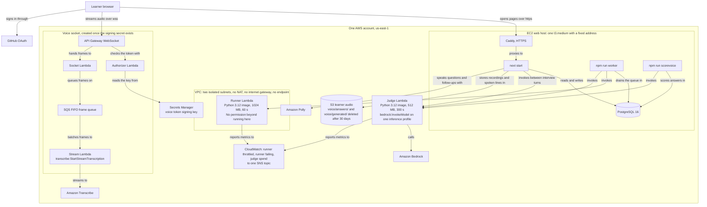
```mermaid
flowchart TB
  browser["Learner browser"]
  github["GitHub OAuth"]
  subgraph account["One AWS account, us-east-1"]
    subgraph host["EC2 web host: one t3.medium with a fixed address"]
      caddy["Caddy, HTTPS"]
      web["next start"]
      worker["npm run worker"]
      scorer["npm run scorevoice"]
      pg[("PostgreSQL 16")]
    end
    subgraph vpc["VPC: two isolated subnets, no NAT, no internet gateway, no endpoint"]
      runner["Runner Lambda<br/>Python 3.12 image, 1024 MB, 60 s<br/>No permission beyond running here"]
    end
    judge["Judge Lambda<br/>Python 3.12 image, 512 MB, 300 s<br/>bedrock:InvokeModel on one inference profile"]
    subgraph voice["Voice socket, created once the signing secret exists"]
      apigw["API Gateway WebSocket"]
      authorizer["Authorizer Lambda"]
      sockfn["Socket Lambda"]
      fifo["SQS FIFO frame queue"]
      streamfn["Stream Lambda<br/>transcribe:StartStreamTranscription"]
    end
    bucket[("S3 learner audio<br/>voice/answers/ and voice/generated/ deleted after 30 days")]
    secret["Secrets Manager<br/>voice token signing key"]
    alarms["CloudWatch: runner throttled, runner failing, judge spend<br/>to one SNS topic"]
    bedrock["Amazon Bedrock"]
    transcribe["Amazon Transcribe"]
    polly["Amazon Polly"]
  end
  browser -->|"opens pages over https"| caddy
  browser -->|"streams audio over wss"| apigw
  browser -->|"signs in through"| github
  caddy -->|"proxies to"| web
  web -->|"reads and writes"| pg
  worker -->|"drains the queue in"| pg
  scorer -->|"scores answers in"| pg
  worker -->|"invokes"| runner
  worker -->|"invokes"| judge
  scorer -->|"invokes"| judge
  web -->|"invokes between interview turns"| judge
  judge -->|"calls"| bedrock
  apigw -->|"checks the token with"| authorizer
  authorizer -->|"reads the key from"| secret
  apigw -->|"hands frames to"| sockfn
  sockfn -->|"queues frames on"| fifo
  fifo -->|"batches frames to"| streamfn
  streamfn -->|"streams to"| transcribe
  web -->|"stores recordings and spoken lines in"| bucket
  web -->|"speaks questions and follow-ups with"| polly
  runner -->|"reports metrics to"| alarms
  judge -->|"reports metrics to"| alarms
```

### Trust boundaries

The boundaries from `.claude/rules/01-trust-boundaries.md`. Weakening one is a change to the security model and is said out loud in a pull request.

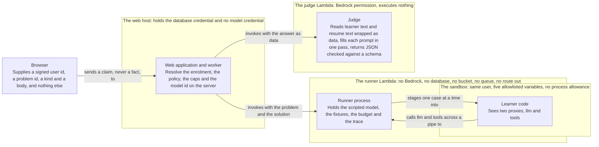
```mermaid
flowchart LR
  browser["Browser<br/>Supplies a signed user id, a problem id, a kind and a body, and nothing else"]
  subgraph host["The web host: holds the database credential and no model credential"]
    web["Web application and worker<br/>Resolve the enrolment, the policy, the caps and the model id on the server"]
  end
  subgraph runnerb["The runner Lambda: no Bedrock, no database, no bucket, no queue, no route out"]
    harness["Runner process<br/>Holds the scripted model, the fixtures, the budget and the trace"]
    subgraph sandbox["The sandbox: same user, five allowlisted variables, no process allowance"]
      code["Learner code<br/>Sees two proxies, llm and tools"]
    end
  end
  subgraph judgeb["The judge Lambda: Bedrock permission, executes nothing"]
    judge["Judge<br/>Reads learner text and resume text wrapped as data, fills each prompt in one pass, returns JSON checked against a schema"]
  end
  browser -->|"sends a claim, never a fact, to"| web
  web -->|"invokes with the problem and the solution"| harness
  harness -->|"stages one case at a time into"| code
  code -->|"calls llm and tools across a pipe to"| harness
  web -->|"invokes with the answer as data"| judge
```

| Boundary | What it keeps out |
|---|---|
| The two Lambdas never merge. | The runner executes learner code and holds no Bedrock permission, no database credential, no bucket and no queue. The judge calls models and never executes learner code. A task that seems to need learner code to call a model uses the step protocol in [docs/03](docs/03-RUNNER-AND-GRADING.md) section 9.4 instead. |
| Hidden means unpublished, not unreadable. | Learner code can read anything staged into its own process, so one case is staged at a time and an expected output is never staged beside an input. Comparison happens in the runner, outside the sandbox. |
| The harness lives in the runner, and the sandbox holds proxies. | The scripted model, the fixtures, the budget and the trace never exist in the sandbox's process, so nothing in reach turns a problem into a lookup or writes a tool call that never happened. The sandbox starts with an allowlisted environment and no process allowance, and the runner marks itself not dumpable. |
| Never trust learner-reported anything. | A pass count, a timing or a summary printed by learner code is a string. The runner judges correctness against values it generated itself. |
| Client input is never authoritative. | A sandbox id, an execution role, a model id, a storage path, a difficulty and a cap allowance are all resolved on the server from the enrolment and the problem version. A read-only editor range is an affordance, and the real check runs on the server. |
| An error verdict never consumes an allowance. | Infrastructure failures are the platform's problem, and a test proves it. |
| Prompt injection reaches the judge as data. | Learner text is wrapped in delimiters and labelled as data, and judge output is parsed as JSON against a schema. A design answer asking for full marks scores on content. Since pull request #46 every judge prompt is filled in one pass, so a learner's literal `{{NONCE}}` can no longer close the data delimiter, and a pasted resume becomes at most twelve claims whose text is never written to a table, a file or a log. |

### A code submission, from the click to the verdict

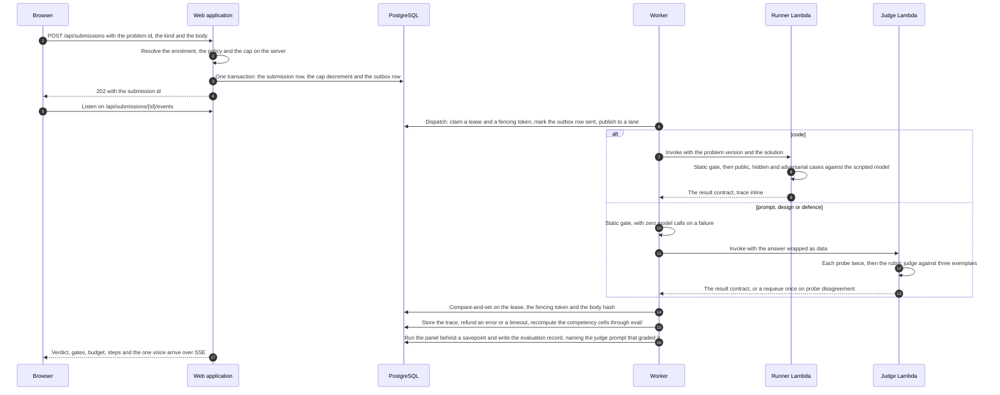
```mermaid
sequenceDiagram
  autonumber
  participant B as Browser
  participant W as Web application
  participant DB as PostgreSQL
  participant K as Worker
  participant R as Runner Lambda
  participant J as Judge Lambda
  B->>W: POST /api/submissions with the problem id, the kind and the body
  W->>W: Resolve the enrolment, the policy and the cap on the server
  W->>DB: One transaction: the submission row, the cap decrement and the outbox row
  W-->>B: 202 with the submission id
  B->>W: Listen on /api/submissions/{id}/events
  K->>DB: Dispatch: claim a lease and a fencing token, mark the outbox row sent, publish to a lane
  alt code
    K->>R: Invoke with the problem version and the solution
    R->>R: Static gate, then public, hidden and adversarial cases against the scripted model
    R-->>K: The result contract, trace inline
  else prompt, design or defence
    K->>K: Static gate, with zero model calls on a failure
    K->>J: Invoke with the answer wrapped as data
    J->>J: Each probe twice, then the rubric judge against three exemplars
    J-->>K: The result contract, or a requeue once on probe disagreement
  end
  K->>DB: Compare-and-set on the lease, the fencing token and the body hash
  K->>DB: Store the trace, refund an error or a timeout, recompute the competency cells through eval/
  K->>DB: Run the panel behind a savepoint and write the evaluation record, naming the judge prompt that graded it
  W-->>B: Verdict, gates, budget, steps and the one voice arrive over SSE
```

The outbox row is written in the same transaction as the submission and the cap, so a submission can never exist without its message. The compare-and-set is what stops a late or duplicated runner overwriting a fresh result. A trace is capped at 256 KB and a synchronous Lambda reply may carry 6 MB, so the result always fits in the reply and the runner needs no bucket. An evaluation is never edited: when a panelist could not run, the judge worker re-runs the partial evaluation for free, three a tick and oldest first, and `npm run regrade` appends a new row under a new judge prompt the same way. Neither moves the verdict, because only deterministic checks produce one.

### A voice answer, from Start to the debrief

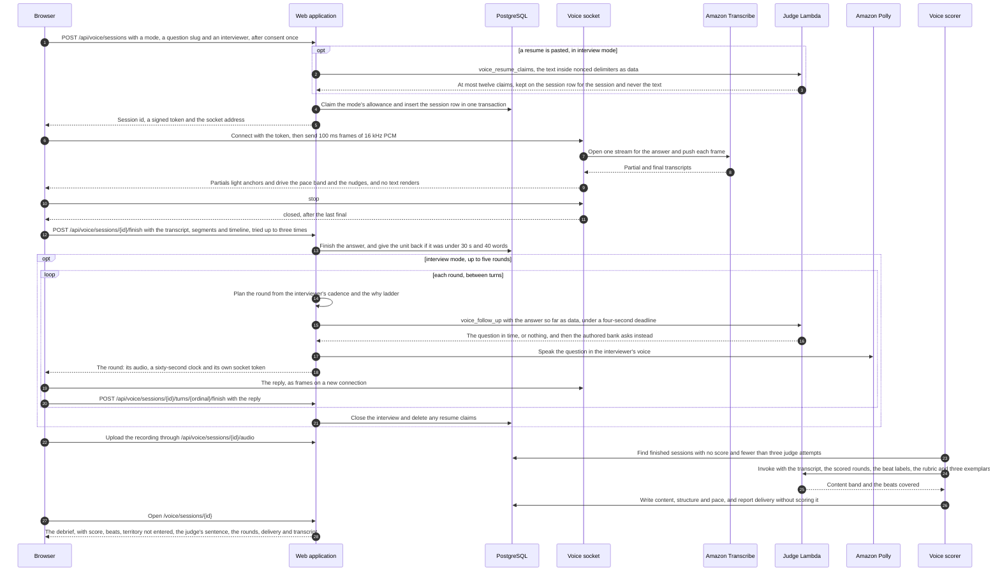
```mermaid
sequenceDiagram
  autonumber
  participant B as Browser
  participant W as Web application
  participant DB as PostgreSQL
  participant S as Voice socket
  participant T as Amazon Transcribe
  participant J as Judge Lambda
  participant P as Amazon Polly
  participant C as Voice scorer
  B->>W: POST /api/voice/sessions with a mode, a question slug and an interviewer, after consent once
  opt a resume is pasted, in interview mode
    W->>J: voice_resume_claims, the text inside nonced delimiters as data
    J-->>W: At most twelve claims, kept on the session row for the session and never the text
  end
  W->>DB: Claim the mode's allowance and insert the session row in one transaction
  W-->>B: Session id, a signed token and the socket address
  B->>S: Connect with the token, then send 100 ms frames of 16 kHz PCM
  S->>T: Open one stream for the answer and push each frame
  T-->>S: Partial and final transcripts
  S-->>B: Partials light anchors and drive the pace band and the nudges, and no text renders
  B->>S: stop
  S-->>B: closed, after the last final
  B->>W: POST /api/voice/sessions/{id}/finish with the transcript, segments and timeline, tried up to three times
  W->>DB: Finish the answer, and give the unit back if it was under 30 s and 40 words
  opt interview mode, up to five rounds
    loop each round, between turns
      W->>W: Plan the round from the interviewer's cadence and the why ladder
      W->>J: voice_follow_up with the answer so far as data, under a four-second deadline
      J-->>W: The question in time, or nothing, and then the authored bank asks instead
      W->>P: Speak the question in the interviewer's voice
      W-->>B: The round: its audio, a sixty-second clock and its own socket token
      B->>S: The reply, as frames on a new connection
      B->>W: POST /api/voice/sessions/{id}/turns/{ordinal}/finish with the reply
    end
    W->>DB: Close the interview and delete any resume claims
  end
  B->>W: Upload the recording through /api/voice/sessions/{id}/audio
  C->>DB: Find finished sessions with no score and fewer than three judge attempts
  C->>J: Invoke with the transcript, the scored rounds, the beat labels, the rubric and three exemplars
  J-->>C: Content band and the beats covered
  C->>DB: Write content, structure and pace, and report delivery without scoring it
  B->>W: Open /voice/sessions/{id}
  W-->>B: The debrief, with score, beats, territory not entered, the judge's sentence, the rounds, delivery and transcript
```

No model call happens while the learner is speaking, in the main answer or in a reply. The live cues are string matches against beat anchors on partial transcripts. The judge words a follow-up between turns, under a four-second deadline with the authored bank behind it, and scores once, afterwards, on the final transcript and the rounds.

### The life of a submission

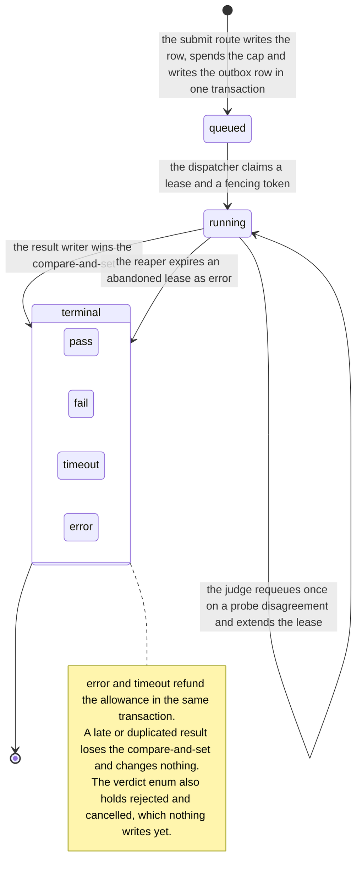
```mermaid
stateDiagram-v2
  [*] --> queued: the submit route writes the row, spends the cap and writes the outbox row in one transaction
  queued --> running: the dispatcher claims a lease and a fencing token
  running --> running: the judge requeues once on a probe disagreement and extends the lease
  running --> terminal: the result writer wins the compare-and-set
  running --> terminal: the reaper expires an abandoned lease as error
  state terminal {
    direction LR
    pass
    fail
    timeout
    error
  }
  terminal --> [*]
  note right of terminal
    error and timeout refund the allowance in the same transaction.
    A late or duplicated result loses the compare-and-set and changes nothing.
    The verdict enum also holds rejected and cancelled, which nothing writes yet.
  end note
```

### The life of a voice session

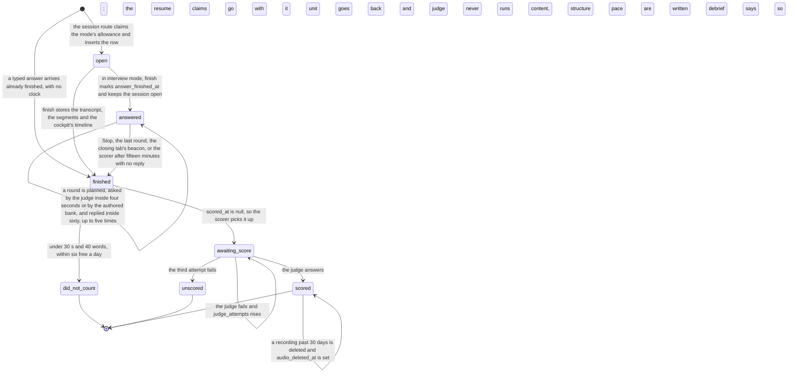
```mermaid
stateDiagram-v2
  [*] --> open: the session route claims the mode's allowance and inserts the row
  [*] --> finished: a typed answer arrives already finished, with no clock
  open --> finished: finish stores the transcript, the segments and the cockpit's timeline
  open --> answered: in interview mode, finish marks answer_finished_at and keeps the session open
  answered --> answered: a round is planned, asked by the judge inside four seconds or by the authored bank, and replied inside sixty, up to five times
  answered --> finished: Stop, the last round, the closing tab's beacon, or the scorer after fifteen minutes with no reply; the resume claims go with it
  finished --> did_not_count: under 30 s and 40 words, within six free a day; the unit goes back and the judge never runs
  finished --> awaiting_score: scored_at is null, so the scorer picks it up
  awaiting_score --> scored: the judge answers; content, structure and pace are written
  awaiting_score --> awaiting_score: the judge fails and judge_attempts rises
  awaiting_score --> unscored: the third attempt fails; the unit goes back and the debrief says so
  scored --> scored: a recording past 30 days is deleted and audio_deleted_at is set
  did_not_count --> [*]
  unscored --> [*]
  scored --> [*]
```

### The core tables

From `web/migrations/`, 26 files. Enum types are named as the migrations name them. The practice side first.

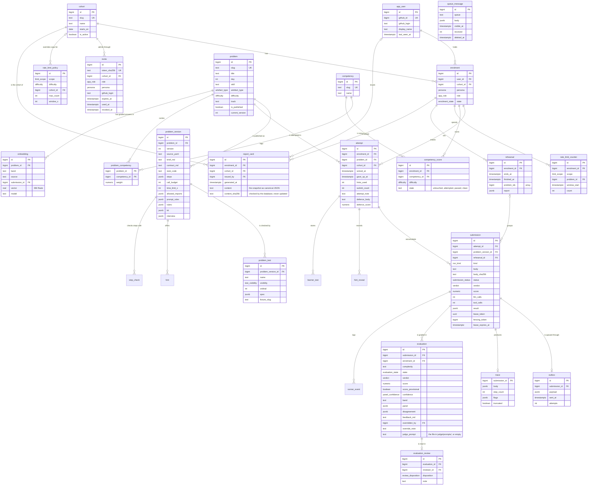
```mermaid
erDiagram
  app_user ||--o{ enrolment : "holds"
  cohort ||--o{ enrolment : "has"
  cohort ||--o{ invite : "admits through"
  cohort |o--o{ rate_limit_policy : "overrides caps for"
  enrolment ||--o{ attempt : "makes"
  enrolment ||--o{ competency_score : "earns"
  enrolment ||--o{ rate_limit_counter : "spends"
  enrolment ||--o{ rehearsal : "sits"
  problem ||--o{ problem_version : "is published as"
  problem ||--o{ attempt : "is attempted in"
  problem ||--o{ problem_competency : "carries"
  competency ||--o{ problem_competency : "tags"
  competency ||--o{ competency_score : "is scored as"
  problem ||--o{ embedding : "has graded answers in"
  problem_version ||--o{ problem_test : "is checked by"
  problem_version ||--o{ hint : "offers"
  problem_version ||--o{ step_check : "checks steps with"
  attempt ||--o{ submission : "accumulates"
  attempt ||--o{ hint_reveal : "records"
  attempt ||--o{ learner_test : "stores"
  rehearsal |o--o{ submission : "groups"
  submission ||--o| outbox : "is queued through"
  submission ||--o| trace : "produces"
  submission ||--o{ evaluation : "is graded in"
  submission ||--o{ runner_event : "logs"
  evaluation ||--o| evaluation_review : "is read in"
  enrolment ||--o{ report_card : "is issued"
  cohort ||--o{ report_card : "is the cohort of"
  app_user |o--o{ report_card : "issues"

  app_user {
    bigint id PK
    bigint github_id UK
    text github_login
    text display_name
    timestamptz last_seen_at
  }
  cohort {
    bigint id PK
    text slug UK
    text name
    date starts_on
    boolean is_active
  }
  enrolment {
    bigint id PK
    bigint user_id FK
    bigint cohort_id FK
    persona persona
    app_role role
    enrolment_state state
  }
  invite {
    bigint id PK
    text token_sha256 UK
    bigint cohort_id FK
    app_role role
    persona persona
    text github_login
    timestamptz expires_at
    timestamptz used_at
    timestamptz revoked_at
  }
  problem {
    bigint id PK
    text slug UK
    text title
    int day
    text skill
    artefact_type artefact_type
    difficulty difficulty
    text track
    boolean is_published
    int current_version
  }
  problem_version {
    bigint id PK
    bigint problem_id FK
    int version
    text source_yaml
    text brief_md
    text contract_md
    text stub_code
    jsonb steps
    int call_budget
    int time_limit_s
    jsonb allowed_imports
    jsonb prompt_rules
    jsonb rubric
    jsonb kit
    jsonb interview
  }
  problem_test {
    bigint id PK
    bigint problem_version_id FK
    text name
    test_visibility visibility
    int ordinal
    jsonb spec
    text fixture_slug
  }
  attempt {
    bigint id PK
    bigint enrolment_id FK
    bigint problem_id FK
    bigint cohort_id FK
    timestamptz solved_at
    timestamptz gave_up_at
    int hints_used
    int submit_count
    text attempt_note
    text defence_body
    numeric defence_score
  }
  submission {
    bigint id PK
    bigint attempt_id FK
    bigint problem_version_id FK
    bigint rehearsal_id FK
    run_kind kind
    text body
    text body_sha256
    submission_status status
    verdict verdict
    numeric score
    int llm_calls
    int tool_calls
    jsonb result
    uuid lease_token
    bigint fencing_token
    timestamptz lease_expires_at
  }
  outbox {
    bigint id PK
    bigint submission_id FK
    jsonb payload
    timestamptz sent_at
    int attempts
  }
  queue_message {
    bigint id PK
    text queue
    jsonb body
    timestamptz visible_at
    int received
    timestamptz deleted_at
  }
  trace {
    bigint submission_id PK
    jsonb body
    int step_count
    jsonb flags
    boolean truncated
  }
  evaluation {
    bigint id PK
    bigint submission_id FK
    bigint enrolment_id FK
    text complexity
    evaluation_state state
    verdict verdict
    numeric score
    boolean score_provisional
    panel_confidence confidence
    text band
    jsonb panel
    jsonb disagreement
    text feedback_md
    bigint overridden_by FK
    text override_note
    text judge_prompt "the file in judge/prompts/, or empty"
  }
  report_card {
    bigint id PK
    bigint enrolment_id FK
    bigint cohort_id FK
    bigint issued_by FK
    timestamptz generated_at
    text content "the snapshot as canonical JSON"
    text content_sha256 "checked by the database, never updated"
  }
  evaluation_review {
    bigint id PK
    bigint evaluation_id FK
    bigint reviewer_id FK
    review_disposition disposition
    text note
  }
  embedding {
    bigint id PK
    bigint problem_id FK
    text band
    text source
    bigint submission_id FK
    real vector "384 floats"
    text model
  }
  competency {
    bigint id PK
    text slug UK
    text name
  }
  problem_competency {
    bigint problem_id PK
    bigint competency_id PK
    numeric weight
  }
  competency_score {
    bigint id PK
    bigint enrolment_id FK
    bigint competency_id FK
    difficulty difficulty
    text state "untouched, attempted, passed, clean"
  }
  rate_limit_policy {
    bigint id PK
    limit_scope scope
    difficulty difficulty
    bigint cohort_id FK
    int max_count
    int window_s
  }
  rate_limit_counter {
    bigint id PK
    bigint enrolment_id FK
    limit_scope scope
    bigint problem_id FK
    timestamptz window_start
    int count
  }
  rehearsal {
    bigint id PK
    bigint enrolment_id FK
    timestamptz ends_at
    timestamptz finished_at
    bigint problem_ids "array"
    jsonb report
  }
```

The voice side shares `enrolment` and nothing else with the tables above.

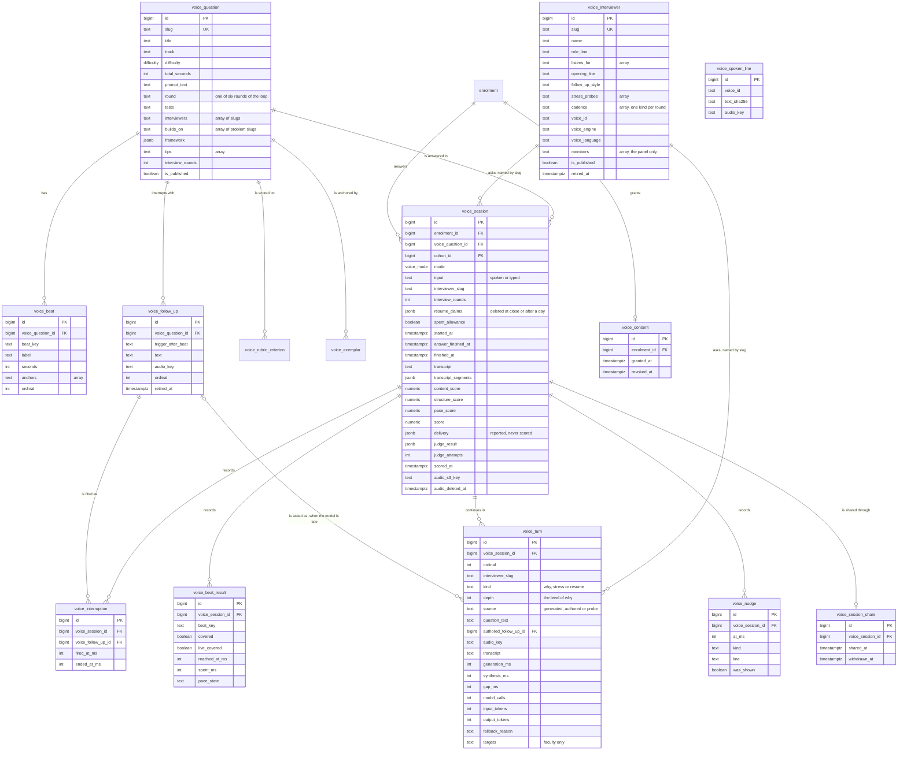
```mermaid
erDiagram
  voice_question ||--o{ voice_beat : "has"
  voice_question ||--o{ voice_follow_up : "interrupts with"
  voice_question ||--o{ voice_rubric_criterion : "is scored on"
  voice_question ||--o{ voice_exemplar : "is anchored by"
  voice_question ||--o{ voice_session : "is answered in"
  voice_interviewer ||--o{ voice_session : "asks, named by slug"
  voice_interviewer ||--o{ voice_turn : "asks, named by slug"
  enrolment ||--o{ voice_session : "answers"
  enrolment ||--o| voice_consent : "grants"
  voice_session ||--o{ voice_turn : "continues in"
  voice_session ||--o{ voice_beat_result : "records"
  voice_session ||--o{ voice_nudge : "records"
  voice_session ||--o{ voice_interruption : "records"
  voice_follow_up ||--o{ voice_interruption : "is fired as"
  voice_follow_up |o--o{ voice_turn : "is asked as, when the model is late"
  voice_session ||--o| voice_session_share : "is shared through"

  voice_question {
    bigint id PK
    text slug UK
    text title
    text track
    difficulty difficulty
    int total_seconds
    text prompt_text
    text round "one of six rounds of the loop"
    text tests
    text interviewers "array of slugs"
    text builds_on "array of problem slugs"
    jsonb framework
    text tips "array"
    int interview_rounds
    boolean is_published
  }
  voice_interviewer {
    bigint id PK
    text slug UK
    text name
    text role_line
    text listens_for "array"
    text opening_line
    text follow_up_style
    text stress_probes "array"
    text cadence "array, one kind per round"
    text voice_id
    text voice_engine
    text voice_language
    text members "array, the panel only"
    boolean is_published
    timestamptz retired_at
  }
  voice_beat {
    bigint id PK
    bigint voice_question_id FK
    text beat_key
    text label
    int seconds
    text anchors "array"
    int ordinal
  }
  voice_follow_up {
    bigint id PK
    bigint voice_question_id FK
    text trigger_after_beat
    text text
    text audio_key
    int ordinal
    timestamptz retired_at
  }
  voice_session {
    bigint id PK
    bigint enrolment_id FK
    bigint voice_question_id FK
    bigint cohort_id FK
    voice_mode mode
    text input "spoken or typed"
    text interviewer_slug
    int interview_rounds
    jsonb resume_claims "deleted at close or after a day"
    boolean spent_allowance
    timestamptz started_at
    timestamptz answer_finished_at
    timestamptz finished_at
    text transcript
    jsonb transcript_segments
    numeric content_score
    numeric structure_score
    numeric pace_score
    numeric score
    jsonb delivery "reported, never scored"
    jsonb judge_result
    int judge_attempts
    timestamptz scored_at
    text audio_s3_key
    timestamptz audio_deleted_at
  }
  voice_turn {
    bigint id PK
    bigint voice_session_id FK
    int ordinal
    text interviewer_slug
    text kind "why, stress or resume"
    int depth "the level of why"
    text source "generated, authored or probe"
    text question_text
    bigint authored_follow_up_id FK
    text audio_key
    text transcript
    int generation_ms
    int synthesis_ms
    int gap_ms
    int model_calls
    int input_tokens
    int output_tokens
    text fallback_reason
    text targets "faculty only"
  }
  voice_spoken_line {
    bigint id PK
    text voice_id
    text text_sha256
    text audio_key
  }
  voice_beat_result {
    bigint id PK
    bigint voice_session_id FK
    text beat_key
    boolean covered
    boolean live_covered
    int reached_at_ms
    int spent_ms
    text pace_state
  }
  voice_nudge {
    bigint id PK
    bigint voice_session_id FK
    int at_ms
    text kind
    text line
    boolean was_shown
  }
  voice_interruption {
    bigint id PK
    bigint voice_session_id FK
    bigint voice_follow_up_id FK
    int fired_at_ms
    int ended_at_ms
  }
  voice_consent {
    bigint id PK
    bigint enrolment_id FK
    timestamptz granted_at
    timestamptz revoked_at
  }
  voice_session_share {
    bigint id PK
    bigint voice_session_id FK
    timestamptz shared_at
    timestamptz withdrawn_at
  }
```

`audit_log`, `runner_event`, `platform_setting`, `track`, `track_item`, `live_run`, `live_run_event`, `persona_change` and `hint` complete the schema and carry no surprise.

## Requirements

Every row has an identifier a test, a pull request or a document can cite, and names the document that states it.

### Functional requirements

| ID | Requirement | Stated in | State |
|---|---|---|---|
| FR1 | Sign in with GitHub. A learner needs organisation membership and an active enrolment, or a one-time invite when the organisation check is off. Roles are learner, faculty and admin. | [docs/00](docs/00-PRD.md) section 2 | Built |
| FR2 | Three written artefact types, code, prompt and design, and spoken voice questions. | [docs/00](docs/00-PRD.md) section 3.1, [docs/07](docs/07-VOICE-SCREEN.md) | Built |
| FR3 | Six scaffold layers switched by difficulty, with every hint reveal recorded and shown to faculty. | [docs/00](docs/00-PRD.md) section 3.2 | Built |
| FR4 | Run grades the public cases, Submit grades the public, hidden and adversarial batteries, and a live run makes a trace and never a verdict. | [docs/00](docs/00-PRD.md) section 4 | Run and Submit are built. The live run's step protocol is built and no screen offers it. |
| FR5 | Code is graded against a scripted model that never touches a network, so the same submission gives byte-identical results. | [docs/03](docs/03-RUNNER-AND-GRADING.md) sections 2 and 5 | Built |
| FR6 | An adversarial library of ten fixtures, each with an assertion and an annotation revealed after the attempt. | [docs/03](docs/03-RUNNER-AND-GRADING.md) section 3 | Built |
| FR7 | A replayable trace with automatic flags, capped at 256 KB. | [docs/03](docs/03-RUNNER-AND-GRADING.md) section 6 | Built |
| FR8 | Budget scoring on every run, and a 120-word defence on Hard and Extreme code problems after a pass. | [docs/00](docs/00-PRD.md) sections 7.1 and 7.3 | Built |
| FR9 | Rehearsal under screen conditions, two a week, with a report. | [docs/00](docs/00-PRD.md) section 7.4 | Built |
| FR10 | Prompt surgery: static rules with zero model calls, probes run twice for agreement, then the rubric judge. | [docs/03](docs/03-RUNNER-AND-GRADING.md) section 4.2 | Built |
| FR11 | A panel of three evaluators with one consolidated voice, disagreement reported and never averaged, a faculty queue, and an override that moves the grade and tells the learner. | [docs/10](docs/10-EVALUATION-PANEL.md) | Built |
| FR12 | A competency heatmap with four one-way states, where only a submit or a rehearsal submit earns passed or clean, a readiness signal with four counts and three bands, interview coverage beside it, and a CSV export. | [docs/02](docs/02-DATA-MODEL.md) section 7, [docs/12](docs/12-PROGRESS-AND-READINESS.md) | Built |
| FR13 | The Voice Screen: consent, a microphone check, guided, unguided, pressure and interview modes, nine interviewers and a panel, follow-up rounds with the authored bank as the fallback, a pasted resume as claims for the session only, typed answers, a question picker, a debrief, instrument replay, and audio deleted after 30 days. | [docs/07](docs/07-VOICE-SCREEN.md) | Built |
| FR14 | Admin: a roster with CSV persona upload and invites, submissions with every trace and every evaluation, Ops with queue depth and a degraded switch, requeue and counter clears with an audit row, disagreements, the cohort Overview, and the Cohort, Calibration and Panel screens. | [docs/01](docs/01-WIREFRAMES.md) S10, [docs/05](docs/05-DEPLOY-AND-OPS.md) section 7 | Built, except that the import screen reads from disk and cannot run on a deployment |
| FR15 | Content is YAML in Git, validated in CI, published by a command, and versioned so a submission points at the version it ran against. | [docs/04](docs/04-PROBLEM-AUTHORING.md), [docs/02](docs/02-DATA-MODEL.md) section 2 | Built |
| FR16 | Every cap is a row in `rate_limit_policy` on a rolling window, editable without a deploy. | [docs/00](docs/00-PRD.md) section 4, [docs/02](docs/02-DATA-MODEL.md) section 6 | Built |
| FR17 | The catalogue is fourteen chapters in four stages, told as a learner's first 30 days, with drills off the path. | [docs/04](docs/04-PROBLEM-AUTHORING.md) section 1 | Built |
| FR18 | Cohort analytics, the stuck list, problem calibration, panel health and a dated, hashed report card. | [docs/11](docs/11-ANALYTICS-AND-REPORT-CARD.md) | Built. The report card downloads as Markdown, and the PDF waits on a dependency proposal. |
| FR19 | A baseline diagnostic sets each learner's persona. | [docs/00](docs/00-PRD.md) section 2 | Specified, not built. An admin sets personas by hand or by CSV. |
| FR20 | Every evaluation records the judge prompt that graded it, a partial evaluation is re-run for free, and a judge prompt change can regrade earlier submissions without moving a verdict or spending an allowance. | [docs/10](docs/10-EVALUATION-PANEL.md) sections 9 and 10, [docs/05](docs/05-DEPLOY-AND-OPS.md) section 7 | Built |

### Non-functional requirements

| ID | Requirement and target | Stated in | Verified by |
|---|---|---|---|
| NFR1 | Determinism: the same body and problem version produce byte-identical public, hidden and adversarial results, and each probe is run twice and must agree. | [docs/03](docs/03-RUNNER-AND-GRADING.md) sections 2.3 and 4.2 | `tests/test_determinism.py` and `tests/test_judge_probes.py` |
| NFR2 | Latency: Run returns public results in under five seconds at the 95th percentile with ten concurrent users. | [docs/00](docs/00-PRD.md) section 11, [docs/06](docs/06-BUILD-PLAN.md) phase 2 | Nothing yet. The target has no measurement behind it, because the platform has not run on a deployment. |
| NFR3 | Scale: one cohort of 150 to 200 learners with a peak near 30 concurrent submissions, and a burst of 200 concurrent submits all accepted or correctly refused by cap with no counter drift. | [docs/05](docs/05-DEPLOY-AND-OPS.md) section 1, [docs/06](docs/06-BUILD-PLAN.md) phase 3 | `npm run burst`, which has run locally only. The peak is a projection, and S11.7 runs the burst against a deployment. |
| NFR4 | Availability: no release gate and no scheduled window, with every cap on a rolling window so no time zone is disadvantaged. | [docs/00](docs/00-PRD.md) section 4 | The cap tests under `web/tests`, and the design of `rate_limit_counter` |
| NFR5 | Cost: grading spends no model tokens, and token spend is bounded by the caps, with a budget alarm at 50 and 80 percent before the first learner signs in. | [docs/05](docs/05-DEPLOY-AND-OPS.md) section 5 | `tests/test_process_boundary.py` and `tests/test_isolation.py` prove learner code reaches no model. The alarm is launch task S11.6. |
| NFR6 | Security: learner code runs in a Lambda with no route out and no credential, as a sandbox process with an allowlisted environment and no process allowance, behind a static gate, and learner text reaches the judge as data. | [docs/03](docs/03-RUNNER-AND-GRADING.md) section 7 | `tests/test_static_gate.py`, `tests/test_isolation.py`, `tests/test_judge_injection.py`, and `infra/test`, which asserts the runner's role holds no Bedrock, bucket or queue grant |
| NFR7 | Fairness: an error verdict never consumes an allowance, a panelist that cannot run never lowers a score, a re-run and a regrade spend nothing and move no verdict, and voice delivery is never scored. | `CLAUDE.md`, [docs/10](docs/10-EVALUATION-PANEL.md) sections 9 and 10, [docs/07](docs/07-VOICE-SCREEN.md) section 6 | `web/tests/pipeline.test.ts`, `web/tests/panel.test.ts`, `web/tests/fairness.test.ts`, `web/tests/reevaluation-drain.test.ts` and `web/tests/regrade.test.ts` |
| NFR8 | Privacy: consent before the first recording, audio deleted after 30 days by the bucket's own rule, faculty hear audio only when the learner shares it, and a pasted resume's text is never written to a table, a file or a log. | [docs/07](docs/07-VOICE-SCREEN.md) section 9 | `infra/test`, the voice tests under `web/tests`, which hold the two copies of the 30-day figure together, and `web/tests/voice-resume.test.ts`, which plants a sentinel in a resume and finds it nowhere |
| NFR9 | Rollback: every migration stays backward compatible for one release, and every result records the runner image tag that graded it. | `CLAUDE.md`, [docs/05](docs/05-DEPLOY-AND-OPS.md) section 7 | Review, and the `runner.image_tag` field of the result contract |
| NFR10 | Observability: three alarms and no more, runner throttled, runner failing and judge spend, routed to one topic. | [docs/05](docs/05-DEPLOY-AND-OPS.md) section 6 | `infra/test` |
| NFR11 | Accessibility: every control reachable by keyboard, 4.5 to 1 text contrast, no information carried by colour alone, and reduced motion respected. | [docs/08](docs/08-DESIGN-SYSTEM.md) section 8 | By hand. No automated check exists yet. |
| NFR12 | Bounds: a 10-second wall clock per case, a 60-second Lambda timeout, source under 64 KB, output under 32 KB per test, and a trace under 256 KB. | [docs/03](docs/03-RUNNER-AND-GRADING.md) sections 1, 4.1 and 6 | `tests/test_timeout_and_trace.py` and `tests/test_static_gate.py` |
| NFR13 | Panelist 2 latency: 70 ms at the 95th percentile for a complete 700-word answer on one core. | [docs/10](docs/10-EVALUATION-PANEL.md) section 5 | `scripts/bench_embeddings.py`, measured on 30 September 2026 |
| NFR14 | Interview latency: six seconds at the 95th percentile from a reply ending to the next question being sent, of which four for the model, with the authored bank asking when the model is late. | [docs/07](docs/07-VOICE-SCREEN.md) section 5a, [docs/05](docs/05-DEPLOY-AND-OPS.md) section 7 | `npm run voice:cost` on the first deployed sessions, which is S14.5 and has not run; `web/tests/voice-interview.test.ts` proves five rounds still ask five questions with the judge failing on every call |

### Constraints

| ID | Constraint | Stated in |
|---|---|---|
| C1 | Two languages: TypeScript for the web application, the voice package and the infrastructure, and Python 3.12 for the runner, the judge and the encoder. | `CLAUDE.md`, [docs/06](docs/06-BUILD-PLAN.md) |
| C2 | PostgreSQL 16, AWS Lambda container images, S3, Amazon Bedrock, Transcribe and Polly, and GitHub as the only identity. | [docs/00](docs/00-PRD.md) section 10, [docs/05](docs/05-DEPLOY-AND-OPS.md) section 2 |
| C3 | Nothing in the repository deploys itself. A person runs `cdk deploy` and every server step. | `CLAUDE.md`, [docs/05](docs/05-DEPLOY-AND-OPS.md) section 4 |
| C4 | The two Lambdas never merge: the runner has no model and no database, and the judge executes nothing. | `.claude/rules/01-trust-boundaries.md` |
| C5 | Judge prompts are versioned files in `judge/prompts/`, never database rows. | `CLAUDE.md` |
| C6 | Problem YAML is validated in CI, not at import, and every new assertion type ships with a fixture, a unit test and a validator entry. | `CLAUDE.md`, [docs/04](docs/04-PROBLEM-AUTHORING.md) |
| C7 | `eval/` is the only writer of a grade, a band or a competency state. `progress/` and `analytics/` read, and the one row `analytics/` appends is a report card. Two writers outside `eval/` are named for the grade column each keeps, `writeResult` and `scoreVoiceOnce`, `web/tests/writer-boundary.test.ts` fails on any other, and migration 026 adds `fdeprep_reader`, a role with no write grant that nothing runs under yet. | [docs/10](docs/10-EVALUATION-PANEL.md) section 13 |
| C8 | Complexity, C1 to C4, and difficulty, Easy to Extreme, are separate axes, and no component reads difficulty directly. An ESLint rule enforces the second half. | [docs/10](docs/10-EVALUATION-PANEL.md) section 3, `CLAUDE.md` |
| C9 | No transcript renders while a learner speaks, and the cockpit holds five instruments at most. | [docs/07](docs/07-VOICE-SCREEN.md) section 3 |
| C10 | Desktop first: a 12-column grid at 1,440 pixels, 1,180 pixels minimum, and no mobile workspace in v1. | [docs/01](docs/01-WIREFRAMES.md), [docs/00](docs/00-PRD.md) non-goals |
| C11 | An original visual identity: no copied markup, stylesheet, component code or problem text. | [docs/08](docs/08-DESIGN-SYSTEM.md) section 1, `CLAUDE.md` |
| C12 | Bedrock requests send thinking disabled beside temperature 0, because the two cannot be combined, and a model that cannot turn thinking off is refused at start. Checked against the Converse API reference on 14 September 2026. | [docs/03](docs/03-RUNNER-AND-GRADING.md) section 4.2 |
| C13 | API Gateway WebSocket quotas: a 600-second idle timeout, a 7,200-second connection, 32 KB frames and 128 KB messages, none adjustable. Checked on 15 September 2026. | `infra/lib/voice-socket.ts` |
| C14 | A follow-up is never generated while the learner speaks. It is asked between turns, which is why interview mode is a mode of its own and pressure mode keeps its authored interruptions. | [docs/project/decisions.md](docs/project/decisions.md) D12, [docs/07](docs/07-VOICE-SCREEN.md) section 5a |

### Assumptions

| ID | Assumption | If it is wrong | Stated in |
|---|---|---|---|
| A1 | Every learner and tester has a GitHub account. | Sign-in needs a second identity provider, which the invite flow does not have. | [docs/project/raid-log.md](docs/project/raid-log.md) |
| A2 | A beta cohort is a few dozen learners, which the Postgres queue carries without a message broker. | A queue goes back between the worker and the functions, as [docs/05](docs/05-DEPLOY-AND-OPS.md) first described. | [docs/project/raid-log.md](docs/project/raid-log.md) |
| A3 | A full cohort is about 180 learners, with a peak near 30 concurrent submissions in the hour after a session. | The capacity figures and the burst target change with it. | [docs/05](docs/05-DEPLOY-AND-OPS.md) section 1 |
| A4 | The AWS account can call Claude on Bedrock in its region after the one-time form and the Marketplace subscription. | The judge cannot grade prompt, design or voice answers, and the platform runs code problems only. | [DEPLOY.md](DEPLOY.md) step 2 |
| A5 | Learners practise on laptops. | A mobile reading view moves up the roadmap. | [docs/project/raid-log.md](docs/project/raid-log.md) |
| A6 | Every learner has a coding assistant, so the design compensates with hostile fixtures, the defence step and the trace rather than policing. | Nothing breaks. The defence step is extra work for an honest learner. | [docs/00](docs/00-PRD.md) sections 7.3 and 10 |
| A7 | Speech runs near 138 words a minute, measured by reading exemplars aloud, and a typed answer is capped at 180. | Beat budgets are wrong in one direction and every voice question needs re-timing. | [docs/project/delivery-history.md](docs/project/delivery-history.md) S4, [docs/07](docs/07-VOICE-SCREEN.md) section 4 |
| A8 | Panelist 2's band agrees with a human grader often enough to hold the lower band on a disagreement. | Faculty overrides record every case, and `/admin/panel` and the calibration report show how often the two judges disagree. Nothing yet counts how often a person overrules the held band. | [docs/10](docs/10-EVALUATION-PANEL.md) section 7, [docs/11](docs/11-ANALYTICS-AND-REPORT-CARD.md) sections 5 and 6 |
| A9 | The deployed judge answers a follow-up inside four seconds often enough that the authored bank is the exception. | The fallback share rises, learners hear the bank more than the model, and the judge needs provisioned concurrency, which is billed by the hour. | [docs/05](docs/05-DEPLOY-AND-OPS.md) section 7 |

## Running it on your machine

Twenty minutes from clone to a working product, with no cloud account and no credit card. [SETUP.md](SETUP.md) has every field value for the cloud build environment, and this section is the laptop.

### One command, with Docker

Docker with its Compose plugin is the only requirement. Docker Desktop ships both; Homebrew's `docker` package is the command-line tool alone, and the platform notes below say what to add.

```bash
git clone https://github.com/fde-academy-lab/fdeprep.git
cd fdeprep
docker compose up
```

In a clone you already have, run `git checkout main` and `git pull` instead of the first two lines, and `docker compose up --build` so a changed image is rebuilt.

Open <http://localhost:3000>. Four services come up in order: Postgres, then a one-shot `init` that installs dependencies, migrates, imports the content and fetches panelist 2's embedding model, then the web application and the worker. Expect `published 173 problems, 9 interviewers and 14 voice questions.` in the `init` log on a first run.

The model fetch is the one step allowed to fail. On a laptop with no network the stack still comes up, because the worker carries `EVAL_DEGRADED_PANELISTS=pretrained` and starts without panelist 2, saying so in its log.

You are signed in as a development learner with admin rights, because the stack sets `AUTH_DEV_LEARNER=1`. That switch is refused when `NODE_ENV` is production and refused when `GITHUB_CLIENT_ID` is set, so it cannot follow you into a deployment. This route is for seeing the product and demonstrating it, never for putting in front of learners.

| Command | What it does |
|---|---|
| `docker compose up` | Starts everything. The first run takes a few minutes while dependencies install. |
| `docker compose down` | Stops everything and keeps the database. |
| `docker compose down -v` | Stops everything and deletes the database, so the next `up` starts clean. |
| `docker compose logs -f worker` | Watches grading. If a submission never resolves, look here first. |

The repository is bind-mounted, so an edit on your machine is live in the container. `node_modules` and `.venv` live in named volumes, because a dependency tree built on macOS fails the moment it is mounted into Linux.

### Six commands, without Docker

| Requirement | Version | Check with |
|---|---|---|
| Node.js | 22 or newer | `node --version` |
| Python | 3.12 | `python3 --version` |
| PostgreSQL | 16 | `psql --version` |
| Git | Any recent version | `git --version` |

In a clone you already have, replace the first two lines with `cd fdeprep`, `git checkout main` and `git pull`.

```bash
git clone https://github.com/fde-academy-lab/fdeprep.git
cd fdeprep

# 1. Python: the runner, the judge and panelist 2's runtime (about 150 MB)
python3.12 -m venv .venv && source .venv/bin/activate
pip install -r requirements-dev.txt

# 2. Node, for the web application
cd web && npm ci

# 3. A database
createdb fdeprep
export DATABASE_URL="postgres://localhost/fdeprep"

# 4. Schema
npm run migrate

# 5. Content: 173 problems, 9 interviewers and 14 voice questions
npm run import:content

# 6. The application
AUTH_DEV_LEARNER=1 npm run dev
```

Open <http://localhost:3000>. Step 5 prints `published 173 problems, 9 interviewers and 14 voice questions.`

`npm run dev` is slower than the deployed site by design. It compiles each screen the first time you open it and runs React's development build, which measured 3.6 to 6.4 MB of script per page against about 0.5 MB in a production build on 30 September 2026. Judge speed on a production build, `npm run build` then `npm start`, which needs the GitHub sign-in from the deploy section because `AUTH_DEV_LEARNER` refuses to run in production.

```bash
# 7. Panelist 2's embedding model, 46 MB, verified by checksum
python scripts/fetch_embedding_model.py
```

The worker refuses to start without the model when the published catalogue requires panelist 2, which this one does. It says so at boot, names how many published problems require it, and prints both ways out: the fetch command above, or `EVAL_DEGRADED_PANELISTS=pretrained`, which starts anyway, prints what you gave up and grades those problems at `medium` confidence rather than `high`. The code problems grade in full either way. A host with the model and without the runtime reads `dependency_missing` instead, and its fix line is a pip install. Both lines name the interpreter the worker spawns, which is `RUNNER_PYTHON`, then `.venv/bin/python`, then `python3`, so run the line as printed rather than relying on an activated virtualenv.

`requirements-dev.txt` installs that runtime through `requirements-embed.txt`. onnxruntime 1.30.0 publishes Python 3.12 wheels for Apple Silicon on macOS 14 or newer, Linux x86_64 and aarch64, and Windows, and nothing else, so on an Intel Mac or an older macOS the install stops at onnxruntime. There, delete the `-r requirements-embed.txt` line from your local copy of `requirements-dev.txt`, install, and start the worker with `EVAL_DEGRADED_PANELISTS=pretrained`.

The script pins a model revision and verifies a SHA-256 before it writes, so a model that changed underneath you is a failure rather than a silent change to every band the panel assigns.

### The second terminal, which is not optional

Nothing grades until a worker drains the queue. A submission with no worker sits in `queued` forever, and the learner watches a spinner.

```bash
cd web && DATABASE_URL="postgres://localhost/fdeprep" npm run worker
```

One process runs the whole pipeline: it dispatches queued submissions, runs the battery as a Python subprocess, calls the judge, writes results, and reaps expired leases. Pass `--once` for a single pass, which is what CI uses. With `NODE_ENV` unset the worker runs the battery on your machine as a subprocess and says so when it starts.

### Data to look at

```bash
cd web && DATABASE_URL="postgres://localhost/fdeprep" npm run db:seed
```

The seed fills a fresh database with forty people in two cohorts and ninety days of submissions, voice answers, rehearsals, invites, reviews and audit rows, every grade written by `eval/` through the same path a learner's own work takes. It takes about two minutes, refuses to run twice unless you pass `--replace`, and refuses in production unless you pass `--yes`. It prints the readiness of three named learners and one login per archetype to open. The screenshots at the top of this page were taken against it, with one interview session added through the product's own session functions and a stubbed judge, the way the seed scores every answer.

### The Voice Screen, which needs a third and a fourth terminal

The voice socket is API Gateway in the cloud and a plain `ws` server on a developer machine. Both run the same session code.

```bash
# terminal 3: the socket
cd voice && VOICE_STT=scripted VOICE_TOKEN_SECRET=pick-anything npm run dev

# terminal 4: scoring, which fills in the debrief
cd web && npm run scorevoice
```

Then restart the web application with the socket wired in:

```bash
cd web
VOICE_TOKEN_SECRET=pick-anything VOICE_SOCKET_URL=ws://localhost:8787 \
  AUTH_DEV_LEARNER=1 npm run dev
```

Accept at `/voice/consent`, pick a question on `/voice`, and answer.

`VOICE_STT=scripted` produces placeholder words driven by how loud you are, which makes the whole pipeline visible with no AWS credential. The two `VOICE_TOKEN_SECRET` values have to match, because one end signs the session token and the other verifies it. Leave `VOICE_STT` out and the socket uses Amazon Transcribe; on a machine with no AWS credentials each Start then ends at once with "The transcriber failed", and terminal 3 prints `Could not load credentials from any providers`.

Scoring calls the judge, and the judge calls Claude on Amazon Bedrock. Terminal 4 as written has no model, so every answer still saves and its debrief still replays, and after three tries, about fifteen seconds, the debrief says the judge could not score it and gives the allowance back. Terminal 4 prints `JUDGE_MODEL_ID is not set` on each try. To score for real, sign the AWS CLI in (`aws login` needs CLI 2.32.0 or newer), make sure the account can call Claude ([DEPLOY.md](DEPLOY.md) step 2), and start the scorer with the model named:

```bash
cd web && JUDGE_MODEL_ID=us.anthropic.claude-opus-5 AWS_REGION=us-east-1 npm run scorevoice
```

Each scored answer is two model calls on that account. A typed answer needs neither the socket nor a microphone and is scored the same way. The voice scorer also closes an interview left open for fifteen minutes and deletes resume claims a day old, so it runs wherever interview mode is used.

### Demonstrating it to a room

A five-minute path that shows the product's argument rather than its screens.

| Step | Screen | The point to make out loud |
|---|---|---|
| 1 | `/problems`, open an Easy code problem | The ladder is visible: the situation, the brief, the contract, starter code, a step checklist, free hints and a coach. |
| 2 | Write a deliberately wrong loop and press Run | The public cases are named, the failing one says what it expected, and the coach names the line to look at. |
| 3 | Press Submit | Hidden and adversarial cases run. An adversarial fixture is reported by name with the assertion that failed and never with its script. |
| 4 | Open the Trace tab | Here is what the agent called, in order, with the call budget. This is the thing a tech screen asks about and a pass or fail cannot show. |
| 5 | Open an Extreme problem | The signature and its contract, a countdown, one submit a day, and a panel demanding your own tests before Submit opens. |
| 6 | `/voice`, answer one question in guided mode for thirty seconds and stop | The beat track moved, no transcript appeared, and the debrief has beat timings, pace and filler counts. |
| 7 | `/progress` | Four cell states, and only the fourth counts. This is the number placement gets, and a report card is its dated copy. |

### Run the tests

```bash
createdb fdeprep_test
export TEST_DATABASE_URL="postgres://localhost/fdeprep_test"
cd web   && npm test                        # 1,130 tests
cd ../   && .venv/bin/python -m pytest -q   # 1,974 tests, 69 skip, see below
cd voice && npm test                        # 28 tests
cd ../infra && npm test                     # 37 tests
```

The web suite truncates every table in the database it runs against. It uses `TEST_DATABASE_URL` when that is set, and it refuses any database whose name does not end in `_test`, so `fdeprep` and everything in it survive a test run.

The Bedrock tests skip unless `JUDGE_LIVE=1`, because each run spends money, and the MiniLM tests skip until `scripts/fetch_embedding_model.py` has put the weights on disk. Three permission tests skip when the suite runs as root, as it does in a cloud session, because root reads a locked file anyway; CI runs them as a normal user. A skipped test says what it could not check; a test that quietly passes without the thing it claims to test does not.

### Platform notes

On a Mac, zsh is the default shell, and it passes a trailing `# comment` to the command as extra arguments unless `interactivecomments` is set. Most command blocks on this page carry one, so the first two lines below turn that on for this shell and every later one. Homebrew comes first if you do not have it: `/bin/bash -c "$(curl -fsSL https://raw.githubusercontent.com/Homebrew/install/HEAD/install.sh)"`, then the three lines it prints under "Next steps". `node@22` and `postgresql@16` are keg-only because they are versioned formulae, so their tools stay off your PATH until you add them, and `createdb` fails with `command not found` until you do:

```bash
setopt interactivecomments
echo 'setopt interactivecomments' >> ~/.zshrc
brew install node@22 python@3.12 postgresql@16
brew services start postgresql@16          # starts it now and at every login
echo "export PATH=\"$(brew --prefix node@22)/bin:$(brew --prefix postgresql@16)/bin:\$PATH\"" >> ~/.zshrc
source ~/.zshrc
pg_isready                                  # accepting connections
```

The install runs `initdb` as you, so your macOS user is the database superuser and `postgres://localhost/fdeprep` needs no username or password. Checked against the Homebrew formulae on 30 September 2026: `node@22` at 22.23.3 and `postgresql@16` at 16.15, both keg-only, and `python@3.12` at 3.12.14, which is not keg-only and installs `python3.12` on the Homebrew path.

On Ubuntu, the apt Postgres accepts your login over its socket and refuses a password-less network connection, and node-postgres reads `postgres://localhost/...` and `postgres:///...` as network connections. Create a role for yourself with `sudo -u postgres createuser -s "$USER"`, then use `DATABASE_URL="postgres://$USER@/fdeprep?host=/var/run/postgresql"` wherever this page says `postgres://localhost/fdeprep`. Both behaviours were reproduced against PostgreSQL 16 with Ubuntu's default `pg_hba.conf` on 30 September 2026.

For the Docker route, when `docker compose` is missing, either install Docker Desktop (`brew install --cask docker-desktop`, after `brew uninstall docker` so only one `docker` command exists; free for businesses under 250 employees and under $10 million in revenue, and for personal and education use, per Docker's licence page on 30 September 2026), or keep the command-line tool and add the open source pieces:

```bash
brew install colima docker-compose
mkdir -p ~/.docker
python3.12 - <<'PY'
import json, os, subprocess
path = os.path.expanduser("~/.docker/config.json")
config = json.load(open(path)) if os.path.exists(path) else {}
plugins = subprocess.run(["brew", "--prefix"], capture_output=True, text=True).stdout.strip() + "/lib/docker/cli-plugins"
dirs = config.setdefault("cliPluginsExtraDirs", [])
if plugins not in dirs:
    dirs.append(plugins)
json.dump(config, open(path, "w"), indent=2)
PY
colima start --cpu 4 --memory 4
docker compose version
```

The Python lines add the plugin folder Homebrew's `docker-compose` caveat asks for, and keep anything already in `~/.docker/config.json`.

## Deploying it

Nothing in this repository deploys itself. No agent, no script and no CI job runs `cdk deploy`, `aws lambda update-function-code` or `vercel deploy`. A person runs every deploy, and that is a standing rule in `CLAUDE.md`.

There is no Vercel lock-in anywhere in the codebase: no `@vercel/*` package, no `VERCEL_*` variable, no platform-specific API. A production build serves under plain `next start`, so any box that runs Node can host it.

| | Route A: Vercel and managed Postgres | Route B: one AWS box | Route C: the beta on AWS |
|---|---|---|---|
| What you sign up for | Vercel Pro and a Neon or Supabase project. | Nothing. It all sits in an AWS account you already have. | Nothing beyond AWS, a domain and a GitHub OAuth application. |
| Where learner code runs | On the worker's host, until you add the runner Lambda from route C. | On the box, beside the database. | In the runner Lambda, in a VPC with no route out. |
| Who patches the server | Nobody for the web tier; you for the worker's host. | You do. | You do, for the web host only. |
| Rollback | One click in the Vercel dashboard. | `git checkout` the previous commit and rebuild. | The same on the web host, and `cdk deploy` from the previous commit for the Lambdas. |
| Suits | A cohort, once the worker's host runs the Lambdas. | Your own testing, a demo to a company, a pilot with people you know by name. | A beta with students, and the cohort after it. |

Route B has a security limit that decides it for students, and its last part says what that limit is. Route C removes it.

### Route A: Vercel and managed Postgres

Vercel's Hobby plan cannot host this. Its fair use guidelines restrict Hobby teams to non-commercial personal use, and define commercial usage as any deployment used for the financial gain of anyone involved in producing it, a paid consultant writing the code included. A practice platform for a paid academy's students is commercial under that definition whether or not the platform itself charges anybody. Vercel Pro is the plan this needs, listed at $20 a month for the team with developer seats at $20 each and unlimited viewer seats. Verified against <https://vercel.com/pricing> and <https://vercel.com/docs/limits/fair-use-guidelines> on 19 September 2026; re-check both before committing budget.

| Piece | Service | Beta cost | Needed for |
|---|---|---|---|
| Web application | Vercel Pro | $20 a month for the team. | Everything. |
| Database | Neon or Supabase, managed PostgreSQL 16 | Neon's Free plan gives 0.5 GB of storage and 100 compute-unit hours per project a month and is positioned for prototypes; nothing in its terms forbids commercial use. Start there and watch storage. | Everything. |
| Worker | Any box that can run Node, including a small VM or your own laptop for a first beta. | Cents, or nothing. | Grading. Without it no submission ever resolves. |
| Runner and judge Lambdas | AWS | Near zero at this volume, since Lambda has no idle cost. | Deterministic grading at scale, and the rubric judge. |
| Bedrock | AWS | Token spend on prompt, design and voice grading only. Code problems cost nothing. | The rubric judge. |
| Voice socket, Transcribe, Polly, S3 | AWS | Per minute on Transcribe, per character on Polly. | The Voice Screen with a real microphone. |

Neon's free computes scale to zero after five minutes of inactivity, so the first learner of the morning waits through a cold start. That is an acceptable beta trade and a bad cohort-day trade. Without AWS, learner code runs on the worker's host, because the worker executes the battery as a local Python subprocess whenever `RUNNER_FUNCTION` is unset. That suits people you trust; for students, deploy the Lambdas from route C and set `RUNNER_FUNCTION`.

1. The database. Create a project at <https://neon.com> or <https://supabase.com> in the region closest to your learners, and keep its connection string somewhere safe. It is a credential and never goes in the repository.
2. The GitHub OAuth application. At <https://github.com/settings/developers>, New OAuth App, with the application name FDE Prep, the homepage URL you will get from Vercel in step 3, and the callback `https://your-app.vercel.app/api/auth/callback`. The callback has to match exactly, including the scheme and any port; a mismatch is the most common sign-in failure. Generate a client secret and copy both values.
3. Vercel. Put the team on Pro first, then import `fde-academy-lab/fdeprep` at <https://vercel.com/new> with the root directory set to `web`, because the repository root is not a Next.js project. Set `DATABASE_URL`, `AUTH_SECRET` (`openssl rand -base64 32`; changing it signs everybody out), `GITHUB_CLIENT_ID`, `GITHUB_CLIENT_SECRET` and, if yours differs from `FDE-Academy-Hub`, `GITHUB_ORG`. Deploy, then copy the URL back into the OAuth application. Do not set `AUTH_DEV_LEARNER` here; it is refused in production anyway.
4. Schema and content, from your machine against the production database, because nothing in the deployed application can do this by design: `cd web`, `export DATABASE_URL="<the production connection string>"`, `npm run migrate`, `npm run import:content`. Re-run the import after every content change; it updates in place and duplicates nothing.
5. The worker: `cd web && NODE_ENV=production DATABASE_URL="<production>" RUNNER_LOCAL_OK=1 npm run worker`. A production worker refuses to run learner code on its own host unless `RUNNER_LOCAL_OK=1` says you meant it. With the Lambdas from route C deployed, drop that and set `RUNNER_FUNCTION`, `JUDGE_FUNCTION` and `AWS_REGION` instead, with credentials on this host that the stack's `BoxPolicy` allows. A `systemd` service or a `tmux` session on a small VM is enough for a first beta. Run `python scripts/fetch_embedding_model.py` on the same host so written answers are banded against the nearest graded answers.
6. The roster, before students arrive. Invite every learner to the GitHub organisation, create the cohort row and an active enrolment per learner, set each persona with the CSV upload on `/admin/roster`, and sign in as a learner yourself to open one problem at each difficulty.
7. AWS, when you want the judge and the Voice Screen. Deploy the stack as [DEPLOY.md](DEPLOY.md) steps 2 and 3 describe, give the worker's host credentials the stack's `BoxPolicy` allows, set `RUNNER_FUNCTION`, `JUDGE_FUNCTION` and `AWS_REGION` from the stack's outputs, set `JUDGE_MODEL_ID` on the stack to an inference profile id such as `us.anthropic.claude-opus-5` (a bare model id is refused at start with an error that says why), and for voice set `VOICE_SOCKET_URL` to the `VoiceSocketUrl` output and `VOICE_TOKEN_SECRET` to the value in the secret the stack reads. Then spend one attempt on each live integration yourself before a learner does.
8. The two things people skip: a second person with console access, the runbook in [docs/05](docs/05-DEPLOY-AND-OPS.md) section 7 and one practice drill, which takes an afternoon, and an AWS Budgets alert at 50 and 80 percent filtered on the AWS Marketplace billing entity, which takes ten minutes. The model provider bills through AWS Marketplace, so a budget on the Amazon Bedrock service misses its charges. Also restore the database to a new branch once and verify against a known submission id.

Four worker variables tune panelist 2 and all have working defaults: `RUNNER_PYTHON` (the interpreter the worker spawns, `.venv/bin/python` then `python3`), `FDEPREP_EMBED_MODEL_DIR` (`.models/minilm`), `EMBED_TIMEOUT_MS` (`20000`, so a hung encoder becomes an unavailable panelist rather than a stuck queue) and `EVAL_DEGRADED_PANELISTS` (unset; a name that is not a panelist is rejected rather than ignored).

### Route B: one AWS box

Everything on a single EC2 instance: the web application, the database, the worker and the grader, with nothing outside your own AWS account. Your browser reaches the application through an SSH tunnel, so there is no public port, no DNS record and no certificate to manage.

| Setting | Value | Why |
|---|---|---|
| AMI | Ubuntu 24.04 LTS | It ships Python 3.12 and PostgreSQL 16. |
| Type | t3.medium | `next build` is the memory-hungry step. This is a judgement rather than a measurement: 2 GB is where Next builds start failing, so if you want t3.small, add 2 GB of swap before you build. |
| Disk | 20 GB gp3 | Dependencies, the build and Postgres. |
| Security group | SSH from your own address, and nothing else open. | You reach the application through the tunnel. |

```bash
sudo apt update
sudo apt install -y python3.12-venv postgresql-16 git
curl -fsSL https://deb.nodesource.com/setup_22.x | sudo -E bash -
sudo apt install -y nodejs

git clone https://github.com/fde-academy-lab/fdeprep.git && cd fdeprep
python3.12 -m venv .venv && ./.venv/bin/pip install -r requirements-dev.txt

sudo -u postgres createuser ubuntu && sudo -u postgres createdb -O ubuntu fdeprep
export DATABASE_URL="postgres://ubuntu@/fdeprep?host=/var/run/postgresql"

cd web && npm ci
npm run migrate
npm run import:content
NODE_ENV=production npx next build
```

Node comes from NodeSource, documented at <https://github.com/nodesource/distributions>.

`AUTH_DEV_LEARNER=1` behaves differently depending on how you start the server, and the difference is deliberate: `npm run dev` honours it, and `next start` with `NODE_ENV=production` refuses it and answers `/problems` with a 307 to `/signin`. On a box, use real GitHub OAuth. The tunnel makes this simple, because your browser reaches the application at `http://localhost:3000`, so the OAuth callback is `http://localhost:3000/api/auth/callback` and GitHub accepts it with no DNS and no certificate. Register the application at <https://github.com/settings/developers>, then on the instance:

```bash
export NODE_ENV=production
export AUTH_SECRET="$(openssl rand -base64 32)"
export GITHUB_CLIENT_ID=...  GITHUB_CLIENT_SECRET=...  GITHUB_ORG=your-org
export RUNNER_LOCAL_OK=1

npx next start        # terminal one
npm run worker        # terminal two, or nothing ever grades
```

`RUNNER_LOCAL_OK=1` is you saying, on purpose, that learner code may run on this box. From your laptop, `ssh -L 3000:localhost:3000 ubuntu@<instance-ip>`, then open <http://localhost:3000>. Once it works, put both processes under `systemd` so they survive a reboot.

For prompt and design problems, attach an instance role carrying `bedrock:InvokeModel`, then set `JUDGE_MODEL_ID` to an inference profile id such as `us.anthropic.claude-opus-5` and `JUDGE_REGION` to your region. Three prerequisites catch people out, all from the [Bedrock model access documentation](https://docs.aws.amazon.com/bedrock/latest/userguide/model-access.html) read on 19 September 2026: Anthropic models need a first-time use form submitted once per account, the account needs a valid payment method for AWS Marketplace, and the role needs `aws-marketplace:Subscribe` on the first invocation, after which the subscription can take up to fifteen minutes during which calls return `AccessDeniedException`. For a first look, skip all of that: the code problems grade with no AWS service at all.

Where one box stops being acceptable: the runner executes Python written by learners. The design puts that in a Lambda inside a VPC with no internet route, no Bedrock permission and no database credential, and `infra/` already builds exactly that. On one box, learner code runs as a subprocess on the same machine as your database credentials and your Bedrock role, behind a static AST gate and a runtime import blocker. Those stop the obvious attacks, and neither is a kernel boundary.

| Who is using it | One box | The Lambda split |
|---|---|---|
| You, testing it yourself | Fine. | Unnecessary. |
| A demo to your own company | Fine. | Unnecessary. |
| A pilot with people you know by name | Acceptable. | Better. |
| A beta with students | No. | Yes. |

Moving up is route C, and it keeps the same instance: deploy the stack, attach its instance profile to the box, set `RUNNER_FUNCTION` and `JUDGE_FUNCTION`, and remove `RUNNER_LOCAL_OK`.

### Route C: the beta on AWS

The web application, the worker and Postgres on one EC2 instance behind Caddy; the runner and the judge as Lambdas the worker calls directly; the Voice Screen through API Gateway and Amazon Transcribe. Learner code runs only in the runner Lambda, in a VPC with no route out, and the web host holds no model credential. Sign-in is GitHub plus a one-time invite, so testers do not have to join your GitHub organisation.

[DEPLOY.md](DEPLOY.md) is the procedure, from an AWS account to a working beta at your own domain. It gives the console screen for every click, the CloudShell or server command for every step and what each prints when it works, with prices and AWS behaviour checked on 1 October 2026. It runs in `us-east-1` and takes about three and a half hours in one sitting, an estimate built from its step times.

| Step in DEPLOY.md | What you finish with |
|---|---|
| 0. Before you start | Everything on hand, and the running cost: about $37 a month before anyone uses it. |
| 1. Lock the account | MFA on the root user and an admin login for the rest. |
| 2. Turn on Claude in Bedrock | A Claude call that answers, made by you before the judge's first. |
| 3. Deploy the stack | The Lambdas, the voice socket and the audio bucket, deployed from CloudShell. |
| 4. Launch the web host | A t3.medium with a fixed address that the browser terminal can reach. |
| 5. Domain and GitHub sign-in | The DNS record and the GitHub OAuth app. |
| 6. Install and run | The site live over HTTPS, with three services. |
| 7. Sign in and prove it | The first admin, and every live connection tested once. |
| 8. Keep it alive | A spending alert on Marketplace billing, daily snapshots with the restore drill and the restore itself, updates and rollback. |

This route has not yet run end to end against a real account. The stack synthesises and its tests pass, the proxy, sign-in and invite steps were run in a sandbox, and DEPLOY.md step 7 is there to catch what a first live run finds. The restore drill in DEPLOY.md 8.2, which copies the newest snapshot to a scratch volume and compares a second Postgres with the live one table by table, is written and has not run either; S11.4 runs it on the first deployment and records how long it took.

## Maintaining it

| Cadence | Task | How |
|---|---|---|
| Daily during a cohort | Glance at `/admin/ops` for queue depth, the runner error rate, the voice answers nobody has scored and, with interview mode in use, today's rounds with their 95th percentile gap and fallback share, then `/admin/panel` for the partial rate and the re-evaluation backlog. | Two screens, twenty seconds. |
| After every content change | Republish. | `npm run import:content` against the production database. |
| After a judge prompt change | Regrade what the old prompt graded, once the judge is deployed with the new file. | `npm run regrade -- --dry-run` in `web/`, then `npm run regrade` until it prints "Nothing to regrade". |
| Weekly | Read the attempt notes on Extreme problems, and the stuck list and the competency gaps on `/admin/cohort`. | They are the cheapest signal you have about whether a cohort is stuck on the concept or on Python. |
| Per cohort | Run the roster checklist, step 6 of route A, and read the calibration report on `/admin/calibration` before the next cohort starts. | The report names the problem, the signal, the number and what to check first, and downloads as Markdown. |

A problem, a voice question or an interviewer is a YAML file, and nothing about content lives in the database except a published copy. Edit the file, run `npm run validate:problems` or `npm run validate:voice` in `web/` (the same gates CI runs) and `npm run import:content` to publish. `npm run validate:voice` checks the interviewers, the voice questions and the references between them and to `problems/`. A C3 or C4 design problem lists its `constraints`, the terms from its own scenario that an answer has to engage with, each quoted and each named word for word in the strong exemplar, and the validator refuses one without them, because `names_no_constraint` says nothing about an answer when the problem lists nothing. CI validates every problem, question and interviewer on every pull request, so a broken file cannot reach the import step. To author a new one, use the `problem-authoring` or `voice-question-authoring` skill in `.claude/skills/`; both enforce the rules that matter, including that a naive solution provably fails a hidden test.

A schema change is a new file under `web/migrations/` and `npm run migrate`. Every migration stays backward compatible for one release: add a column before anything writes to it, and drop it a release later, so rollback remains possible.

Judge prompts are files in `judge/prompts/`, versioned as `rubric.v1.md` and so on, never in the database, so changing how a cohort is graded is a code review. Every evaluation records the prompt that graded it, so a change mid-cohort does not leave two populations graded differently in silence. Deploy the judge with the new file, then from `web/` run `npm run regrade -- --dry-run`, which lists what the old prompt graded and calls nothing, then `npm run regrade`, which takes the oldest 25 and appends a new evaluation to each, until it prints "Nothing to regrade". `--limit N` sets the batch and `--from rubric.v1.md` takes only what that prompt graded. A regrade is one model call per submission, moves a band and never a verdict, spends no allowance, leaves alone any grade a person corrected, and stops at the first answer the judge grades with some other prompt, which means the judge has not been deployed with the new one yet.

Degraded mode is the switch on `/admin/ops` that disables Submit and leaves Run working. Learners keep practising against public cases while grading is down, and nobody loses an attempt. Flip it the moment grading looks unhealthy rather than after you have diagnosed why.

`npm run voice:cost -- --since <date> --in-per-mtok <rate> --out-per-mtok <rate>` prices interview sessions at the day's published rates and prints the 95th percentile gap between turns. [docs/05](docs/05-DEPLOY-AND-OPS.md) has the runbook, including when to give the judge provisioned concurrency.

## Fixing it when it breaks

Three questions, in order. Is the worker running? Most reported faults are a dead worker, so check the process and then `/admin/ops` for queue depth. Is it one learner or all of them? One learner is usually enrolment or organisation membership; all learners is the queue, the database or a deploy. Did anything deploy in the last hour? The web host rolls back by checking out the previous commit, and Vercel in one click.

| Symptom | Likely cause | Fix |
|---|---|---|
| A submission sits in `queued` forever. | No worker is draining the queue, or the message was lost. | Start the worker. If the queue depth is zero and the row is over five minutes old, use the requeue action on `/admin/submissions`. It writes a fresh message and does not consume the learner's cap. |
| Every page redirects to `/signin`. | No session cookie, or `AUTH_SECRET` changed and signed everybody out. | Sign in again. If it loops, the callback URL does not match the OAuth application exactly. |
| "Your GitHub account is not in the FDE Academy organisation yet." | They were invited and never accepted. | The programme manager re-invites, or sends a one-time invite link from `/admin/roster` with the organisation check off. |
| "Your account is not enrolled in an active cohort." | Organisation membership is fine and there is no enrolment row. | The cohort lead adds one. |
| A learner lost an Extreme attempt to a platform fault. | This should be impossible, since an `error` verdict does not consume an allowance and that is tested. | If it happened anyway, clear the counter row for that learner, scope and window on `/admin/ops`, and log the reason. The audit trail is the point. |
| Every design or prompt submission returns `error`. | The judge cannot reach Bedrock, or `JUDGE_MODEL_ID` is a bare model id. | Check the Lambda logs. A bare id fails at start with a message that names the fix. |
| The voice cockpit shows a dead microphone. | The socket is unreachable, or the two `VOICE_TOKEN_SECRET` values differ. | Check both ends. `/voice/lab` is a bare transport check for faculty that prints transcripts to the browser console and shows them nowhere. |
| Start says "The voice socket could not take this answer" and quotes "That session token is not signed by this application". | The web application and the socket hold different `VOICE_TOKEN_SECRET` values. | Set the same value on both and restart both. Nothing was counted against the learner. |
| An answer says "The transcriber failed at 0:00". | The socket runs Amazon Transcribe with no AWS credentials, or Transcribe refused the stream. The socket's terminal or log names the reason. | On a laptop, start the socket with `VOICE_STT=scripted`. On AWS, read the voice Lambda's log. |
| "Your answer did not save" with Save again. | The finish request failed three times: the web process restarted, or the database was unreachable. The answer is held in that browser tab. | Fix the web process or the database, then the learner presses Save again. Closing the tab first loses the answer. |
| A debrief says the judge could not score it after three tries. | The scorer has no `JUDGE_MODEL_ID`, no AWS credentials, or Bedrock refused the call. Its allowance was given back. | `journalctl -u fdeprep-scorer -n 20` on AWS, or terminal 4 locally, names the reason on each try. |
| An interview round asks one of the question's authored follow-ups instead of a question about your answer. | The judge was late past four seconds, failed or was refused, so the authored bank asked. It costs the learner nothing. | `npm run voice:cost` shows the fallback share and the 95th percentile gap, and [docs/05](docs/05-DEPLOY-AND-OPS.md) section 7 says when to give the judge provisioned concurrency. |
| A page shows "This page did not load" with a reference number. | That page threw on the server. The reference is the digest Next writes about twenty lines below the error in the web log. | On AWS, `journalctl -u fdeprep-web --no-pager \| grep -B25 REFERENCE` prints the error above it. Locally, the `npm run dev` terminal shows the same. |
| The Voice page says no questions are published. | Content was never imported. | `npm run import:content`. |
| `next build` fails on `/_global-error` with a null `useContext`. | `NODE_ENV` is set to `development` in the shell. | `NODE_ENV=production npx next build`. |
| A local run cannot find Python. | The runner subprocess resolves `.venv` then `python3`. | Set `RUNNER_PYTHON` to an explicit interpreter path. |
| The worker exits at once with "cannot run here: model_missing". | The published catalogue requires panelist 2 and this host has no embedding model. This is the check working. | `python scripts/fetch_embedding_model.py` on that host, or `EVAL_DEGRADED_PANELISTS=pretrained` to start without it and accept `medium` confidence on the affected problems. |
| Every design evaluation is `partial` and the re-evaluation backlog on `/admin/panel` only grows. | Panelist 2's encoder is failing rather than absent: a timeout, a crash or a response that did not parse. An absent model is `skipped` and leaves the evaluation `complete`, so a growing backlog means something is breaking. The judge worker re-runs three partial evaluations a tick and writes nothing while a panelist is still missing, so the backlog clears by itself once the cause is fixed. | Read the `reason` on the `pretrained` panelist in the evaluation record, or the availability by the hour on `/admin/panel`. `timeout` means the host is too slow or `EMBED_TIMEOUT_MS` is too tight; `encode_failed` and `exit_1` carry the Python error. Reproduce with `echo '{"texts":["an answer"]}' \| python -m embed.cli`, which prints the reason and exits zero. |
| `npm run regrade` stops early and names a prompt that is not the current one. | The deployed judge still grades with the old file, so every further call would grade under the old wording again. | Deploy the judge from the commit that carries the new prompt, then run it again. |
| `npm run migrate` prints that `fdeprep_reader` was not created. | The database user may not create roles, which a hosted Postgres often refuses, and migration 026 changed nothing rather than fail the deploy. | Nothing runs under that role in this release, so the application is whole. To add it, a user with CREATEROLE runs `create role fdeprep_reader nologin` and the owner of the tables runs the three grants at the end of `web/migrations/026_reader_role.sql`. |
| Design answers get a band from the judge and never from the nearest graded answers. | This host has no embedding model, which is a supported state. | `python scripts/fetch_embedding_model.py`. Until then panelist 2 reports `model_missing` and skips, and the panel runs two-strong. |

The trace is the diagnostic, and the verdict is only the summary. Open `/traces/[id]` and read what the agent called. A submission that failed `respects_call_budget` and one that failed `detects_soft_error` look identical in the verdict column and nothing alike in the trace. For a runner fault, the result contract in [docs/03](docs/03-RUNNER-AND-GRADING.md) section 5 is the only thing the front end renders from, so if a verdict looks wrong on screen, check the contract before the component.

## Known limits

Read this before promising anything to a cohort.

Four integrations are written, unit-tested against recorded fixtures, and have never made a live call. Each one is a first-call risk, and S11 spends one attempt on each before a learner does.

| Integration | State | What could go wrong on first contact |
|---|---|---|
| Bedrock rubric judge | Code complete and tested against recorded replies; `JUDGE_LIVE=1` never run. | A model id, a region, an inference profile prefix or the thinking-mode combination is wrong, and every design and prompt submission errors. |
| Amazon Transcribe streaming | Adapter written against the documented API, exercised only through the scripted adapter. | The live stream shape differs and the cockpit shows a dead microphone. |
| Amazon Polly | The interviewers' voices: the question, the opening line, pressure interruptions and interview rounds. Never synthesised. | Follow-ups arrive as silence, and an interview round shows its text in the listening phase instead. |
| S3 audio storage | Written, never exercised against a real bucket. | Voice sessions finish and the audio is unreachable. |

| Gap | Effect | Story |
|---|---|---|
| The baseline diagnostic that sets a learner's persona does not exist. | Personas work. An admin sets them by hand or by CSV. | S15.1 |
| Nothing validates panelist 2 against a human grader. | Its band has never been checked against one on a single answer. The override exists so a wrong band can be fixed, and `/admin/panel` shows how often the two judges disagree. | None yet |
| `/admin/import` reads `problems/` from disk at request time. | It works locally and cannot work on a deployment, where publishing is `npm run import:content` run by an operator. | S15.4 |
| The report card is Markdown, with no PDF. | A PDF needs a renderer the repository does not carry, and a dependency is proposed before it is added. | None yet |
| `fdeprep_reader` exists and nothing connects as it. | The writer boundary is enforced by a test that reads the code, and the role is the second line behind it until a connection runs under it. | None yet |
| The live run has no screen. | Its step protocol and tables exist and nothing offers it to a learner. | None yet |
| There is no mobile layout beyond the workspace's three tabs below 768 pixels. | A non-goal for v1 in [docs/00](docs/00-PRD.md). | S16.5 |

| Drill never run | Why it matters |
|---|---|
| The database restore. | The procedure is written, in [DEPLOY.md](DEPLOY.md) section 8.2, and a restore procedure that has never been run is not a restore procedure. S11.4 runs it on the first deployment and records how long it took. |
| The 200-concurrent-submission burst against a deployment. `npm run burst` has only run locally. | Peak load is a projection. S11.7. |
| A second operator's practice drill. | There is one operator, and that operator also writes the curriculum. The failure mode is a Tuesday evening where grading stops, 180 learners are blocked, and the one person who understands the queue is teaching. S11.5. |
| Ten interview sessions priced and timed. | Interview mode's cost per session and the gap between turns are projections until `npm run voice:cost` reads sessions on a deployment. S14.5. |

## Quality

| Suite | Tests on 9 October 2026 | Runs in CI as |
|---|---|---|
| Web, vitest, 81 files | 1,130 passed, among them the writer boundary scan, the reader role, the regrade, the re-evaluation drain, the report card and the analytics | Web typecheck and tests |
| Python, pytest | 1,974 passed and 69 skipped: Bedrock tests without `JUDGE_LIVE=1`, MiniLM tests without the weights on disk, permission tests as root, and a per-problem step check on problems that have no steps | Runner tests |
| Voice package, the Node test runner | 28 passed | Voice package tests |
| Infrastructure, the Node test runner | 37 passed | Infrastructure synth and assertions |

Content has its own gate: every problem and voice question validates in CI before it can be imported, every code problem's reference solution passes every gate, and its naive solution fails a hidden test through the real runner.

Twenty-two bugs were found and fixed through the build. Reading a specification or a vendor's documentation against the code found seven, measuring an assumed figure found two, running the product end to end found nine, a test or a mutant of a reference solution found two, and the first beta tester found two. The stage to remember is S5: phases 1 to 8 produced a system that passed 685 tests and had never been used, and the first afternoon of use found four faults, one of them no sign-in at all. [docs/project/quality.md](docs/project/quality.md) has every bug, how it was found and where it was fixed.

## Project record

[docs/project](docs/project/README.md) is the record for anyone who does not read pull requests: the delivery history stage by stage, the roadmap with RICE scores and three-point estimates, the estimation method, the quality record, the risks and assumptions, the decisions and what each one cost, and the setup for the GitHub Project board. The tables on every page come from `docs/project/backlog.yaml` through `python -m tools.project_sync --render-docs`, and CI fails when a page is stale.

## Where everything lives

| Path | What it is |
|---|---|
| `web/` | The Next.js application: 28 pages, 37 API routes and 26 migrations. `web/lib/eval/` is the only writer of a grade, `web/lib/progress/` and `web/lib/analytics/` read, and `web/tests/writer-boundary.test.ts` holds it. |
| `runner/` | The Python battery, harness and static gate. It executes learner code and reaches nothing else. |
| `judge/` | The Bedrock judge, with its prompts as versioned files: the probes, the rubric, the defence, the voice beats, the follow-up and the resume claims. |
| `embed/` | Panelist 2's encoder, run by the worker as a subprocess. |
| `voice/` | The voice session socket, its speech-to-text adapters and the session protocol. |
| `infra/` | CDK for the two Lambdas, their VPC, the learner audio bucket, the web host's role, the three alarms and the voice socket. |
| `docker-compose.yml` | The one-command local stack: Postgres, content import, the application and the worker. |
| `problems/` | 173 problems as YAML in 14 chapter folders, plus fixtures under `_fixtures/` that never publish. |
| `voice-questions/` | 14 questions as YAML across five tracks. Each names its round of the interview loop, what it tests, the interviewers who ask it, the problems it builds on, a framework card and two to four tips. |
| `voice-interviewers/` | The nine interviewers as YAML: who each is, what they listen for, their opening line, follow-up style, stress probes, the cadence of their follow-up rounds and their Polly voice. The panel seats three of them, chair first. |
| `docs/` | The specification, thirteen numbered documents, and `docs/project/`, the delivery record. |
| `scripts/` | The embedding model fetch, the embedding benchmark, the runner smoke test, the README screenshots and the session bootstrap. |
| `tests/` and `tools/` | The Python suite, and the backlog validator and the board sync. |
| `.claude/rules/` | Trust boundaries and writing rules, loaded into every agent session. |
| `SETUP.md` | Every field value and every link for the cloud build environment. |
| `DEPLOY.md` | The AWS deploy, click by click. |
| `CLAUDE.md` | The standing rules, the stack, and what an agent must not do. |

When `CLAUDE.md` and a specification document disagree, the specification wins, and the disagreement gets said out loud rather than resolved silently.
