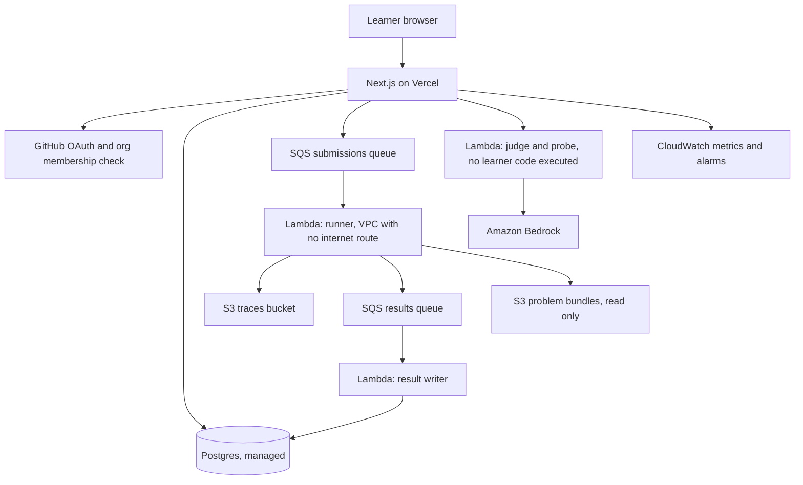

# FDE Prep: deployment and operations

Target scale is one cohort of 150 to 200 learners, peak roughly 30 concurrent submissions in the hour after a session ends. That scale is small enough that the only thing worth optimising is how few components can wake someone at night.

---

## 1. Architecture



Two Lambdas that never share a role. The runner executes learner code and cannot reach a model or the database. The judge calls models and never executes learner code.

---

## 2. Components and choices

| Layer | Choice | Why this one |
|---|---|---|
| Web app | Next.js App Router on Vercel | Preview deployment per branch, no server to patch, rollback is one click. Vercel is already connected on this account. |
| Auth | GitHub OAuth through Auth.js, plus an organisation membership call on sign-in and on session refresh | Learners already hold GitHub accounts inside `FDE-Academy-Hub`, so offboarding is removing them from the organisation and no second user list drifts out of step |
| Database | Managed Postgres, Neon or Supabase, single region | Relational data, small volume, point-in-time restore included, no operator required |
| Queue | Amazon SQS standard, with a dead letter queue after three receives | Submissions survive a runner failure instead of vanishing |
| Runner | Lambda container image, Python 3.12, 1024MB, 60s timeout, VPC with no NAT | Zero idle cost, hard kill on hang, one invocation per submission with no shared state |
| Judge | Separate Lambda with Bedrock permission only | Keeps token spend outside any code path a learner can influence |
| Object storage | S3, one bucket for traces, one for problem bundles | Traces are the only large object and lifecycle rules handle them |
| Observability | CloudWatch metrics, logs and three alarms | Enough for this scale, and nothing new to learn |
| CI | GitHub Actions | Already the delivery platform |

### The AgentCore position

Amazon Bedrock AgentCore reached general availability and bills consumption only, with the harness free and charges accruing per component. Runtime, Browser and Code Interpreter bill on active vCPU-hours and memory GB-hours rather than pre-allocated compute, which suits agent workloads that spend much of their time waiting on input and output.

Where it earns its place in this build:

| AgentCore component | Use here | Verdict |
|---|---|---|
| Browser | The v2 problem family where a learner's agent drives a real browser to fill a form or extract data, inside a sandbox rather than on your own infrastructure | Use it when that family is built |
| Code Interpreter | Executing code an agent generated, inside a running agent session | Not the grading path. Grading 200 submissions a night through session-priced sandboxes costs more than Lambda and gains nothing, since the grading environment is fixed and pre-baked. |
| Runtime, Gateway, Memory | Hosting production agents | Out of scope. This platform is a web application with a test runner, not an agent. |

Re-check the pricing page before committing budget. These rates have moved more than once.

---

## 3. Environments

| Environment | Web | Database | Runner | Purpose |
|---|---|---|---|---|
| `local` | `next dev` | Docker Postgres | Docker container invoked directly, no queue | Development |
| `preview` | Vercel preview per pull request | Neon branch, reset nightly | Shared dev Lambda | Review |
| `prod` | Vercel production | Neon primary with PITR | Prod Lambda | The cohort |

Preview environments must never point at the production database. Enforce it with a startup assertion that refuses to boot when the database host matches production and the Vercel environment is not production.

---

## 4. Infrastructure as code

AWS CDK in TypeScript, in the same repository as the application, under `infra/`. One stack.

Resources: two SQS queues plus two dead letter queues, two Lambda functions, two S3 buckets with lifecycle policies, one VPC with two private subnets and no NAT gateway, VPC endpoints for S3 and SQS, IAM roles, CloudWatch alarms, one ECR repository for the runner image.

The absence of a NAT gateway is deliberate. It removes the largest fixed line on the AWS bill and it removes the runner's route to the internet in one move.

Deploy sequence:

```
1. cdk deploy FdePrepStack          # first time, or on infra change
2. docker build -t runner:<tag> runner/ && push to ECR
3. aws lambda update-function-code --image-uri ...
4. npx prisma migrate deploy        # or your migration tool of choice
5. git push                         # Vercel builds and promotes
```

Steps 2 and 3 run from GitHub Actions on a tag push. Step 5 is automatic. Steps 1 and 4 are manual and rare.

---

## 5. Cost shape

Unit rates change, so verify each line before budgeting. The shape below is what matters.

| Line | Driver | Shape at 200 learners |
|---|---|---|
| Vercel | Flat team plan | Fixed, small, and the same whether 20 or 200 people use it |
| Managed Postgres | Compute hours plus storage | Fixed, small. Data volume here is measured in hundreds of megabytes. |
| Lambda runner | Invocations times duration | Roughly 200 learners times 15 submissions per week times 2 seconds at 1GB. This is the cheapest line on the bill and will stay under pocket change. |
| S3 | Trace volume | 256KB cap per trace, lifecycle to cold storage at 180 days |
| SQS | Message count | Negligible at this volume |
| Bedrock tokens | Probes, judging, live runs | The only line that can surprise you |

### The token arithmetic, done out loud

Token spend has three sources and only the caps control it.

```
live runs      = 200 learners x 10 per day x (prompt + completion per run)
probe calls    = prompt submissions x probes per problem x 2 runs each
judge calls    = design submissions + defence submissions, 1 call each
```

Live runs dominate. At the 10 per day cap, the ceiling is 2,000 model conversations per day across the cohort even if every learner exhausts their allowance, which none will. Lower the cap to 5 if the first week's actuals run high; it is a row in `rate_limit_policy` and needs no deploy.

Probes run twice each for agreement, which doubles that line. It is worth the cost, because a prompt-surgery result that flips between submissions destroys confidence in every other result on the platform.

Set an AWS Budgets alarm on the Bedrock line at a monthly figure you pick, alerting at 50 and 80 percent. Do this before the first learner signs in, not after the first surprise.

---

## 6. Alarms

Three, and no more, because an alarm nobody reads is worse than no alarm.

| Alarm | Condition | Response |
|---|---|---|
| Queue backing up | SQS `ApproximateAgeOfOldestMessage` over 120 seconds for 5 minutes | Check runner error rate, then Lambda concurrency limit |
| Runner failing | Lambda error rate over 5 percent over 15 minutes | Read the last `runner_event` rows, roll back the runner image tag |
| Token spend | AWS Budgets at 80 percent of the monthly figure | Lower the `live_daily` cap in the admin screen |

Route all three to a shared channel, not to one person.

---

## 7. Runbook

Written for the second operator, who is not the person who built this.

### A learner says their submission is stuck

1. Admin, Ops, check queue depth. If it is over 50, the queue is draining and it will clear.
2. If depth is zero, find the submission in Admin, Submissions. A row sitting in `queued` for over five minutes with an empty queue means the message was lost.
3. Use the requeue action on the row. It writes a fresh message and does not consume the learner's cap.

### A learner lost an Extreme attempt to a platform fault

The `error` verdict does not consume an allowance, so this should not happen. If it did, an admin can clear the counter row for that learner, scope and window in the Ops screen. Log the reason; the audit trail is the point.

### Rolling back

The web application rolls back from the Vercel dashboard. The runner rolls back by pointing the Lambda at the previous image tag. Migrations roll forward only; write every migration so the previous application version still runs against the new schema, which means adding columns before using them and dropping them a release later.

### Restoring the database

Point-in-time restore to a new branch, verify against a known submission id, then repoint the application. Practise this once before the cohort starts. A restore procedure that has never been run is not a restore procedure.

### Before each cohort starts

1. Create the cohort row and import the roster.
2. Confirm every learner is in the GitHub organisation. Sign-in failures on day one are almost always this.
3. Set the persona for every enrolment from the baseline diagnostic.
4. Publish the problem set and open one problem at each difficulty yourself, from a learner account.
5. Run a burst test of 200 concurrent submissions against a staging problem.

---

## 8. The operations risk worth naming

This platform has a single operator by default, and that operator also writes the curriculum. The failure mode is not a technical outage; it is a Tuesday evening where submissions stop grading, 180 learners are blocked, and the one person who understands the queue is teaching.

Two controls, both cheap:

1. A second person with AWS console access, the runbook above, and one practice drill before the cohort starts. Restarting a Lambda and requeueing a submission does not require knowing the codebase.
2. A degraded mode toggle in the admin screen that disables Submit and leaves Run working. Learners keep practising against public tests while grading is down, and nobody loses an attempt.

Build the toggle in the first release. It is an afternoon of work and it converts an outage into an inconvenience.
