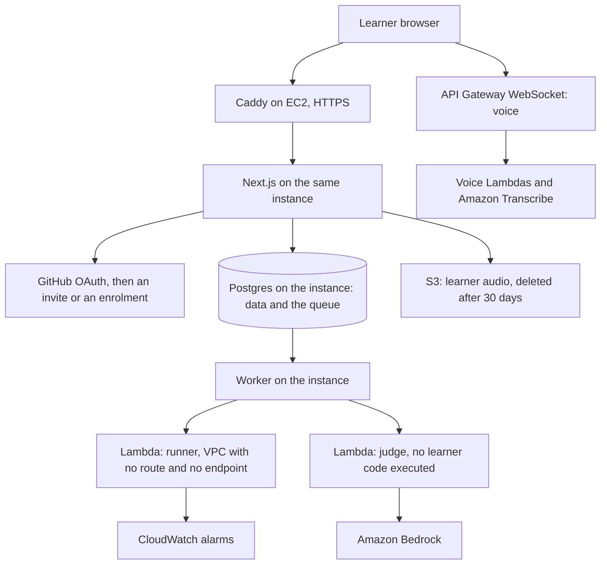

# FDE Prep: deployment and operations

Target scale is one cohort of 150 to 200 learners, peak roughly 30 concurrent submissions in the hour after a session ends. That scale is small enough that the only thing worth optimising is how few components can wake someone at night.

**Amended 30 September 2026 for the controlled beta.** The first deployment is a beta with a small group of students, all on AWS. Three decisions changed this document, and each is marked where it lands: the worker calls the runner and the judge Lambdas directly rather than through SQS; the web application, the worker and Postgres run on one EC2 instance behind Caddy; and invites replace organisation membership as the sign-in wall (`00-PRD.md` section 2). Vercel with managed Postgres remains a valid web tier, and README route A still describes it.

---

## 1. Architecture


```mermaid
graph TD
  L[Learner browser] --> C[Caddy on EC2, HTTPS]
  C --> V[Next.js on the same instance]
  V --> G[GitHub OAuth, then an invite or an enrolment]
  V --> P[(Postgres on the instance: data and the queue)]
  P --> K[Worker on the instance]
  K --> R[Lambda: runner, VPC with no route and no endpoint]
  K --> J[Lambda: judge, no learner code executed]
  J --> B[Amazon Bedrock]
  V --> A[S3: learner audio, deleted after 30 days]
  L --> WS[API Gateway WebSocket: voice]
  WS --> T[Voice Lambdas and Amazon Transcribe]
  R --> CW[CloudWatch alarms]
```

Two Lambdas that never share a role. The runner executes learner code and cannot reach a model, the database or anything else. The judge calls models and never executes learner code. The worker invokes both with a signed Lambda Invoke and writes what comes back, so neither function holds a credential to write a result anywhere. The web host holds no model credential; the judge function does.

The earlier shape put SQS between the application and both Lambdas, with a result-writer Lambda behind a results queue. It was never wired: the application's queue was always a Postgres table, and the handlers always took a submission as their event and returned the result. The Postgres queue keeps what SQS was for, at-least-once delivery with a visibility timeout, the outbox and the lease reaper (`03-RUNNER-AND-GRADING.md` sections 9.2 and 9.3), so the direct call removes a second queue rather than a guarantee.

---

## 2. Components and choices

| Layer | Choice | Why this one |
|---|---|---|
| Web app | Next.js with `next start` on one EC2 instance behind Caddy, for the beta. Vercel remains an option (README route A). | Everything in one AWS account the operator already has. Caddy obtains the certificate itself. `APP_URL` names the public address, because behind any proxy Next.js builds URLs from its own listening address. |
| Auth | GitHub OAuth, then an invite or an existing enrolment. The organisation check is on by default and off for the beta (`GITHUB_ORG_CHECK=off`). | Every tester holds a GitHub account, so there is still no password and no second user list. An invite admits a tester outside the organisation, once. |
| Database | Postgres 16 on the same instance, with a daily snapshot of its volume, for the beta. Managed Postgres with point-in-time restore before the cohort. | Small volume and one operator. The snapshot is the restore path until then. |
| Queue | The Postgres queue behind `web/lib/queue/shim.ts`: outbox, visibility timeout, lease and reaper. | Submissions survive a runner failure instead of vanishing, with nothing extra to deploy or watch. |
| Runner | Lambda container image, Python 3.12, 1024MB, 60s timeout, in a VPC with no NAT and no endpoint, invoked directly by the worker. | Zero idle cost, hard kill on hang, one invocation per submission with no shared state, and nothing reachable from inside. |
| Judge | Separate Lambda with Bedrock permission only, invoked directly by the worker. | Keeps token spend outside any code path a learner can influence, and keeps the model credential off the web host. |
| Object storage | S3, one bucket for learner audio. | Traces come back in the runner's reply and live in Postgres, and the problem travels in the invocation, so neither needs a bucket. |
| Observability | CloudWatch metrics, logs and three alarms | Enough for this scale, and nothing new to learn |
| CI | GitHub Actions | Already the delivery platform |

### The AgentCore position

Amazon Bedrock AgentCore reached general availability and bills consumption only, with the harness free and charges accruing per component. Runtime, Browser and Code Interpreter bill on active vCPU-hours and memory GB-hours rather than pre-allocated compute, which suits agent workloads that spend much of their time waiting on input and output.

Where it earns its place in this build:

| AgentCore component | Use here | Verdict |
|---|---|---|
| Browser | The v2 problem family where a learner's agent drives a real browser to fill a form or extract data, inside a sandbox rather than on your own infrastructure | Use it when that family is built |
| Code Interpreter | Executing code an agent generated, inside a running agent session | Not the grading path. Grading 200 submissions a night through session-priced sandboxes costs more than Lambda and gains nothing, since the grading environment is fixed and pre-baked. |
| Runtime, Gateway, Memory | Hosting production agents | Out of scope. This platform is a web application with a test runner, not an agent. |

Re-check the pricing page before committing budget. These rates have moved more than once.

---

## 3. Environments

| Environment | Web | Database | Runner | Purpose |
|---|---|---|---|---|
| `local` | `next dev` | Docker Postgres | Docker container invoked directly, no queue | Development |
| `beta` | `next start` on EC2 behind Caddy | Postgres on the instance | Lambda, invoked by the worker | The controlled beta, from 30 September 2026 |
| `preview` | Vercel preview per pull request | Neon branch, reset nightly | Shared dev Lambda | Review |
| `prod` | Vercel production | Neon primary with PITR | Prod Lambda | The cohort |

Preview environments must never point at the production database. Enforce it with a startup assertion that refuses to boot when the database host matches production and the Vercel environment is not production.

---

## 4. Infrastructure as code

AWS CDK in TypeScript, in the same repository as the application, under `infra/`. One stack.

Resources, as amended on 30 September 2026: two container-image Lambda functions, one VPC with two isolated subnets and no NAT gateway, no internet gateway and no endpoint, the learner audio bucket with its lifecycle rule, IAM roles for the runner and the judge, a role and instance profile for the web host, three CloudWatch alarms and their SNS topic, and the voice socket once its signing secret exists. No SQS queue, no traces or bundles bucket, and no ECR repository of the stack's own.

The absence of a NAT gateway is deliberate. It removes the largest fixed line on the AWS bill and it removes the runner's route to the internet in one move. With no endpoint either, learner code inside the VPC reaches nothing at all.

`cdk deploy` builds both images from the repository's Dockerfiles and pushes them to the asset repository that `cdk bootstrap` created, so a first deploy never points a function at an image that does not exist yet. The earlier stack created its own repository and, in the same deploy, functions pointing at tags nothing had pushed, and Lambda refuses to create a function from an image that does not exist; a rollback then kept the named repository and blocked every retry. Each build context holds only that image's Dockerfile, requirements and package.

Deploy sequence:

```
1. cdk bootstrap                  once per account and region
2. cdk deploy FdePrepStack        builds and pushes both images, then updates
                                  whatever changed
3. npm run migrate                on the web host
4. npm run import:content         on the web host, after a content change
5. git pull, npm run build and a service restart on the web host
```

A person runs every step. The earlier deploy workflow that pushed image tags from GitHub Actions is retired, since `cdk deploy` now does that job and a second path to the same functions would fight it over which image is live.

---

## 5. Cost shape

Unit rates change, so verify each line before budgeting. The shape below is what matters.

| Line | Driver | Shape at 200 learners |
|---|---|---|
| EC2 instance for the beta, or Vercel later | Instance hours, or a flat team plan | Fixed and small either way |
| Postgres | On the instance for the beta; compute hours plus storage once managed | Fixed, small. Data volume here is measured in hundreds of megabytes. |
| Lambda runner | Invocations times duration | Roughly 200 learners times 15 submissions per week times 2 seconds at 1GB. This is the cheapest line on the bill and will stay under pocket change. |
| S3 | Learner audio | Deleted after 30 days by the bucket's own rule |
| Bedrock tokens | Probes, judging, live runs | The only line that can surprise you |

### The token arithmetic, done out loud

Token spend has three sources and only the caps control it.

```
live runs      = 200 learners x 10 per day x (prompt + completion per run)
probe calls    = prompt submissions x probes per problem x 2 runs each
judge calls    = design submissions + defence submissions, 1 call each
```

Live runs dominate. At the 10 per day cap, the ceiling is 2,000 model conversations per day across the cohort even if every learner exhausts their allowance, which none will. Lower the cap to 5 if the first week's actuals run high; it is a row in `rate_limit_policy` and needs no deploy.

Probes run twice each for agreement, which doubles that line. It is worth the cost, because a prompt-surgery result that flips between submissions destroys confidence in every other result on the platform.

Set an AWS Budgets alert at a monthly figure you pick, filtered on the AWS Marketplace billing entity, alerting at 50 and 80 percent. The model provider bills its charges through AWS Marketplace, so a budget filtered on the Amazon Bedrock service misses them. DEPLOY.md section 8.1 has the steps and the source. Do this before the first learner signs in.

---

## 6. Alarms

Three, and no more, because an alarm nobody reads is worse than no alarm.

| Alarm | Condition | Response |
|---|---|---|
| Runner throttled (was: queue backing up, amended 30 September 2026) | Lambda `Throttles` on the runner above zero in 5 minutes. With no SQS queue there is no queue age; a submission waits when Lambda refuses the worker's call for want of capacity. | Check the account's concurrent executions quota in Service Quotas, then any reserved concurrency on the runner. Queue depth is on the admin Ops screen. |
| Runner failing | Lambda error rate over 5 percent over 15 minutes | Read the last `runner_event` rows, roll back the runner image tag |
| Token spend | The AWS Budgets alert on the AWS Marketplace billing entity reaches 80 percent of the monthly figure | Lower the `live_daily` cap in the admin screen |

Route all three to a shared channel, not to one person.

---

## 7. Runbook

Written for the second operator, who is not the person who built this.

### A learner says their submission is stuck

1. Admin, Ops, check queue depth. If it is over 50, the queue is draining and it will clear.
2. If depth is zero, find the submission in Admin, Submissions. A row sitting in `queued` for over five minutes with an empty queue means the message was lost.
3. Use the requeue action on the row. It writes a fresh message and does not consume the learner's cap.

### A learner lost an Extreme attempt to a platform fault

The `error` verdict does not consume an allowance, so this should not happen. If it did, an admin can clear the counter row for that learner, scope and window in the Ops screen. Log the reason; the audit trail is the point.

### Rolling back

The web application rolls back by checking out the previous commit on the web host, rebuilding and restarting, or from the Vercel dashboard on that route. The runner and the judge roll back by running `cdk deploy` from the previous commit, which rebuilds the previous images from source; each result records the runner image tag that graded it. Migrations roll forward only; write every migration so the previous application version still runs against the new schema, which means adding columns before using them and dropping them a release later.

### Restoring the database

Point-in-time restore to a new branch, verify against a known submission id, then repoint the application. Practise this once before the cohort starts. A restore procedure that has never been run is not a restore procedure.

### Before each cohort starts

1. Create the cohort row and import the roster. For the beta, create the cohort row and send each tester an invite from the Roster screen instead.
2. Confirm every learner is in the GitHub organisation, or, with the organisation check off, holds an unused invite. Sign-in failures on day one are almost always this.
3. Set the persona for every enrolment from the baseline diagnostic.
4. Publish the problem set and open one problem at each difficulty yourself, from a learner account.
5. Run a burst test of 200 concurrent submissions against a staging problem.

---

## 8. The operations risk worth naming

This platform has a single operator by default, and that operator also writes the curriculum. The failure mode is not a technical outage; it is a Tuesday evening where submissions stop grading, 180 learners are blocked, and the one person who understands the queue is teaching.

Two controls, both cheap:

1. A second person with AWS console access, the runbook above, and one practice drill before the cohort starts. Restarting a Lambda and requeueing a submission does not require knowing the codebase.
2. A degraded mode toggle in the admin screen that disables Submit and leaves Run working. Learners keep practising against public tests while grading is down, and nobody loses an attempt.

Build the toggle in the first release. It is an afternoon of work and it converts an outage into an inconvenience.
