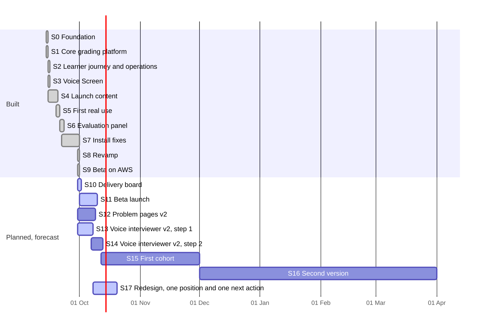

# FDE Prep: delivery at a glance

FDE Prep is where FDE Academy learners practise the work a forward deployed engineer does: building agents that call tools safely, repairing prompts, arguing a design, and answering interview questions out loud. It grades each answer the same way every time and turns the results into a readiness signal a placement team can trust.

This folder is the project's record for anyone who does not read pull requests. Figures marked as facts come from git and GitHub. Figures marked as estimates are judgement, and [estimation.md](estimation.md) explains how they were made.

## Where it stands on 30 September 2026

The platform is built and has not yet been deployed. The beta runs on AWS for invited students, and [README route C](../../README.md#3c-route-c-the-beta-on-aws) is the runbook. Four integrations (the Bedrock judge, Transcribe, Polly and S3) have never made a live call, and proving each one once is the first job of the beta launch.

<!-- generated:numbers -->
| Measure | Value | Source |
|---|---|---|
| Calendar time | 17 days, 14 to 30 Sep 2026 | Git |
| Build stages | 10, from the specification to the beta | This file |
| Pull requests merged | 40, #1 to #40 | GitHub |
| Commits | 285, counting each pull request's own commits | GitHub and git |
| Lines changed | +152,496 and -4,832 | GitHub |
| Test cases declared at the end | 276 Python, 716 web, 26 voice, 37 infrastructure | Git |
| Bugs found and fixed | 22 | This file |
| Delivered size | 360 points | Estimate |
| Human-team equivalent | 203 person-days expected, 174 to 232 at two standard deviations | Estimate |
<!-- /generated:numbers -->

## The build, stage by stage

<!-- generated:timeline -->

<!-- /generated:timeline -->

<!-- generated:stages -->
| Stage | Dates | What it delivered | Pull requests | Points |
|---|---|---|---|---|
| S0 Foundation | 14 Sep 2026 | Ten numbered documents, 2,843 lines, specified the product before any code was written: what a learner does, how grading works, the data model, deployment, the Voice Screen and the design system. | none, direct commits | 19 |
| S1 Core grading platform | 14 Sep 2026 | Learner code runs in a sandbox against a scripted model and is graded the same way every time. | #1 to #5 | 62 |
| S2 Learner journey and operations | 15 Sep 2026 | Learners got persona roadmaps, a progress heatmap a placement team reads, a replay of what their agent actually did and a timed rehearsal, and operators got the admin screens, a switch that pauses grading and the first infrastructure code. | #6 to #7 | 21 |
| S3 Voice Screen | 15 Sep 2026 | Learners can practise interview answers out loud: a consent step and a microphone check lead into live transcription, a cockpit with five instruments and three modes, and a debrief that scores content, structure and pace and reports delivery without scoring it. | #8 to #10 | 29 |
| S4 Launch content | 15 to 19 Sep 2026 | The launch catalogue shipped with 25 problems and 12 voice questions, each solved by its author before release. | #11 to #16 | 30 |
| S5 First real use | 19 to 20 Sep 2026 | The first end-to-end run found four faults in one afternoon, the worst being that there was no authentication at all. | #17 to #22 | 25 |
| S6 Evaluation panel | 21 to 22 Sep 2026 | Three evaluators give one consolidated verdict: deterministic checks, a small local model that compares an answer with graded neighbours, and the model judge. | #23 to #33 | 49 |
| S7 Install fixes | 22 to 30 Sep 2026 | The first people to set it up on their own machines hit four gaps: two missing installs, an undocumented database install on a Mac, and a test suite that deleted the development database of anyone who followed the README. | #34 to #37 | 8 |
| S8 Revamp | 30 Sep 2026 | Every problem got a coached workspace, the catalogue grew from 25 to 92 problems along a four-stage path, and the sandbox stopped holding the scripted model, the trace or any credential. | #38 to #39 | 82 |
| S9 Beta on AWS | 30 Sep 2026 | The worker now calls the runner and judge functions directly, the stack deploys from a clean AWS account, sign-in is by invite, a runbook covers the launch, and what the first beta tester hit is fixed. | #40 | 35 |
<!-- /generated:stages -->

[delivery-history.md](delivery-history.md) has every story in every stage, with the pull request that delivered it.

## What comes next

Four pieces of work are in hand or next, and [roadmap.md](roadmap.md) has all seven planned stages with their estimates:

1. The delivery board you are reading, synced to the GitHub Project.
2. The beta launch on AWS, which needs a person with access to the AWS account.
3. Problem pages a new learner can follow, told as a 30-day storyline, with names in code highlighted.
4. An interview practice that behaves like an interviewer: nine personas, a typed fallback, and follow-ups generated from the learner's own answer.

## Reading the board

The GitHub Project linked to this repository holds one card per stage and one per story. Stages are epics and carry their stories as sub-issues. A card's Stage, Points, Start, Finish and Sprint fields come from [backlog.yaml](backlog.yaml), so a card edited by hand changes back at the next sync. [board-setup.md](board-setup.md) says how the sync runs and which views to use.

| Page | What it answers |
|---|---|
| [delivery-history.md](delivery-history.md) | What each stage delivered, why it mattered, and what it taught. |
| [roadmap.md](roadmap.md) | What comes next, in what order, and why. |
| [estimation.md](estimation.md) | How big each stage was, how the sizes were estimated, and how fast the build moved. |
| [quality.md](quality.md) | How many bugs were found, how, and how the test count grew. |
| [raid-log.md](raid-log.md) | The risks, assumptions, issues and dependencies being watched. |
| [decisions.md](decisions.md) | The decisions that shaped the build, and what each one cost. |
| [board-setup.md](board-setup.md) | How the board is kept in step with this folder. |
