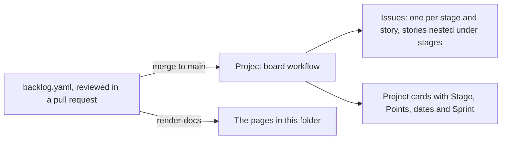

# Keeping the board in step

The GitHub Project is generated from [backlog.yaml](backlog.yaml). This page covers the one-time setup, how a change reaches the board, and the views to create.



## One-time setup

1. Create a token the workflow can use. The workflow's own `GITHUB_TOKEN` cannot reach a Project, so GitHub's documentation offers two routes: a personal access token (classic) with the `project` and `repo` scopes, or a GitHub App with read and write access to organisation projects. For a token, go to GitHub, then Settings, Developer settings, Personal access tokens, Tokens (classic), and generate one with those two scopes.
2. Add it to this repository as a secret named `PROJECT_TOKEN`: Settings, Secrets and variables, Actions, New repository secret.
3. Link the Project to this repository from the repository's Projects tab. With exactly one Project linked, the sync finds it. With more than one, set `project.number` in [backlog.yaml](backlog.yaml).
4. Run the workflow by hand: Actions, Project board, Run workflow. The dry run box starts ticked, so the first run only lists what it would create. Read that list, then run it again with the box cleared. The real first run creates about 120 issues, which notifies everyone watching the repository, and makes about 450 writes paced at one a second, so it takes around ten minutes.

## How a change reaches the board

Change [backlog.yaml](backlog.yaml) in a pull request. CI checks the file and fails if a generated page is stale, so run this before committing:

```bash
python -m tools.project_sync --render-docs
```

When the pull request merges, the workflow syncs the board. A sync that has nothing to change writes nothing, and a card or issue edited by hand changes back to what the file says.

Every pull request should add or close the story it delivers. The sync asks GitHub which pull requests have merged and posts a warning on the workflow run for each one that no story names. It warns instead of failing, because issue and pull request numbers share one sequence and only GitHub knows which numbers are merged pull requests.

## The views to create

GitHub's API can create fields and cards but no views, so these five are made by hand once, in about five minutes. Each view is a new tab on the Project.

| View | Layout | Settings |
|---|---|---|
| Board | Board | Column field Status. Filter `level:Story`. |
| Roadmap | Roadmap | Dates from Start to Finish. Group by Stage. Filter `level:Epic`. |
| By stage | Table | Group by Stage, with the sum of Points shown. Fields Level, Status, Points, Finish, Pull request. |
| Sprints | Table | Group by Sprint, with the sum of Points shown. Filter `level:Story`. |
| Bugs | Table | Filter `type:Bug`. Group by Found by. |

## When the sync fails

| Message | Fix |
|---|---|
| PROJECT_TOKEN is not set | Add the secret from step 2. |
| No Project is linked to this repository | Link one, step 3, or set `project.number`. |
| The Project's Status field has no option named ... | Rename a Status option on the board, or change `project.status` in the file to the names the board uses. |
| The Project already has a field named ... of type ... | A field with that name exists with a different type. Rename or delete it on the board. |
| GitHub answered 403 ... | The token lacks a scope, or the organisation restricts classic tokens. Check both with an organisation owner. |
