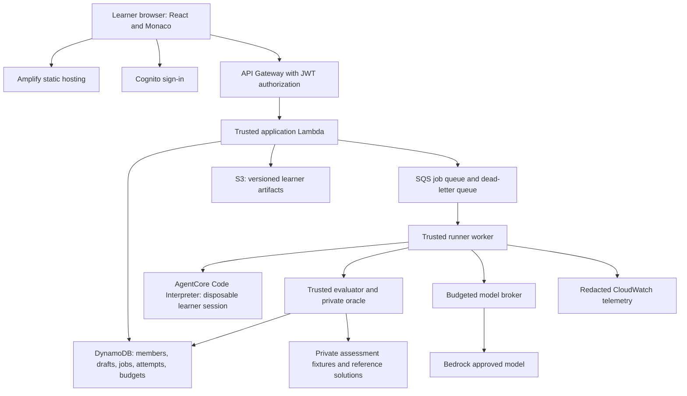

# Engineering specification

## Architecture decision

Use a React/TypeScript single-page application, Monaco editors, a typed API and a queue-based execution service. Host the static UI with AWS Amplify Hosting. Use Cognito for invited learner authentication, API Gateway HTTP API and Lambda for trusted application logic, DynamoDB for operational state, and S3 for versioned artifacts. Use AgentCore Code Interpreter as the managed execution adapter after a short feasibility and security spike. Use Bedrock for centrally brokered model inference.

This is a proposed implementation architecture. No AWS account, service quotas, IAM policy or deployment has been tested in this handoff. AgentCore is not the portal, database, identity directory or a complete grading product. Its Code Interpreter can be called directly without hosting an autonomous agent in Runtime. [AWS direct-use documentation](https://docs.aws.amazon.com/bedrock-agentcore/latest/devguide/code-interpreter-getting-started.html).



There is no arrow from the learner sandbox to private evaluator storage, platform tables or an unrestricted model endpoint. Each trust boundary is tested rather than inferred from service branding.

## Repository contract

```text
apps/web/                   React application, route and state components
services/api/               trusted membership, draft, attempt and admin APIs
services/runner/            queue worker and execution adapter
services/evaluator/         trusted oracle, rubric aggregation and feedback mapper
services/model-broker/      model allowlist, quotas, request validation and usage
packages/contracts/         shared API and problem schemas
packages/ui/                accessible Academy components and design tokens
content/public/             approved learner-facing content only
content/private/            local authoring fixtures; never bundled into frontend
infra/                      CDK TypeScript stacks and environment configuration
tests/integration/          authorization, lifecycle and grading-boundary tests
tests/load/                 200-client cohort load scripts
scripts/                    content validation, import/export and release helpers
```

Store production private packages in separate restricted S3 storage, not alongside a publicly deployed content folder. CI builds the web application from an explicit allowlist and scans its outputs for private fixture markers. Do not rely on a folder name alone as protection.

## Runtime and editor contract

MVP Python-first. Monaco is the editor, not an execution engine. Use `textarea` only in the wireframe. Predefine supported Python version, packages, locale, timezone, file limits and deterministic clocks in a versioned runtime manifest. Inspect the actual AgentCore runtime before selecting that manifest; do not assume the source site's Python 3.12 label applies to AWS.

Offer two runner adapters behind one interface:

```typescript
interface RunnerAdapter {
  start(job: AuthorizedJob): Promise<ExecutionHandle>;
  invoke(handle: ExecutionHandle, input: CaseInput): Promise<RawExecution>;
  cancel(handle: ExecutionHandle): Promise<void>;
  dispose(handle: ExecutionHandle): Promise<void>;
}
```

`AuthorizedJob` is created by the trusted service and contains a server-resolved cohort/member, attempt ID, immutable artifact hash, problem/runtime version, run mode and resource limits. The browser may never supply a sandbox ID, execution role, model ARN or unrestricted storage path.

For ordinary functions, expose a simple `solve(input_json) -> output_json` harness. During authoring, an adapter maps a pedagogical function signature to this envelope. The trusted evaluator sends one case input or a bounded batch and compares the returned value to an oracle outside the sandbox. The candidate can see any input supplied to its process. “Hidden” means not published to the UI and not accompanied by oracle answers; it does not mean unreadable to candidate code executing that case. Never mount the complete hidden suite or its expected outputs in the candidate process.

Reference-solution execution and expected-value generation occur in a trusted environment, isolated from candidate code. Ignore learner-provided pass counts, timing claims or forged result summaries. Parse only bounded schema-valid output; evaluate correctness independently. A learner may print an arbitrary JSON result, but it must still satisfy independently generated cases. Keep privileged secrets out of every candidate environment, including environment variables and SDK metadata credentials.

For interactive agent challenges, implement a **step protocol**: the candidate receives an observation and state, and returns a typed action or final result plus its next serializable state. The trusted worker validates actions, applies the policy, invokes fake or approved tools, records authoritative events and returns the next observation. Bedrock calls pass through the same broker. This avoids giving learner code a provider credential or unrestricted network client. The protocol is an application design to build, not an out-of-the-box AgentCore feature.

A faithful free-form SDK integration or multi-file project requires the later adapter: isolated VPC networking and a run-scoped tool/model proxy, or a suitable managed sandbox with explicitly tested egress restrictions. Do not silently switch Code Interpreter to unrestricted Public mode because an exercise wants `pip install` or a direct SDK call. Prepackage approved dependencies and fixtures where supported; prove packaging behavior in the spike.

## Trusted job lifecycle

1. Authenticate JWT and check active cohort membership. Authorize the exact problem or assessment version and mode.
2. Resolve the latest acknowledged draft or require the submitted hash. Validate file names, byte limits, allowed edit regions and syntax contracts.
3. In one transaction, reserve budget and create the attempt/job with an idempotency key. A conditional write prevents duplicate attempts.
4. Persist an outbox record in the same transaction. A dispatcher delivers to SQS. This closes the failure gap between saving a job and enqueuing it. Re-delivery is expected and deduplicated.
5. Worker claims a job with a lease/fencing token. Confirm it is neither cancelled nor expired before billable work.
6. Start a fresh candidate session, stage only permitted files and case inputs, invoke the candidate and collect bounded outputs. Fresh process/module state per case where the contract requires it.
7. Trusted evaluator computes results and a safe feedback view. Use the server-side tool log for effect/trace grades.
8. Commit a terminal result only when the worker still owns the lease and the artifact/version match. Reconcile reserved versus actual usage.
9. Stop the sandbox in a `finally` block. An independent reaper handles leaked sessions, expired leases and abandoned jobs. Retain session IDs only in protected operations data.

States: `queued -> starting -> running -> evaluating -> passed|failed|needs_review|infrastructure_error|cancelled|timed_out|budget_exceeded`. User cancellation and server deadlines use a compare-and-set transition; late results do not revive cancelled jobs. At-least-once delivery must not create duplicate external effects. A retry receives the same logical idempotency context and a new execution lease.

MVP limits are product policy: source bundle 256 KB; five files; stdout/stderr 64 KB each; one active evaluation per learner plus one pending job; six agent steps by default; two model retries only for eligible transient errors; 60-second short-task execution budget, 180 seconds only for designated integration tasks. The UI's Run and Submit limits can differ. Validate actual provider timeout/cancellation semantics before release.

## API contract

All responses include `requestId`; errors include stable `code`, human-readable `message` and `retryable`. Paginated endpoints use opaque cursors. All IDs are server-owned and resource authorization is checked after resolution.

| Method and route | Request / result | Required rule |
|---|---|---|
| GET `/v1/me` | Memberships, role, persona and preferences | No other learner records |
| GET `/v1/problems` | Filters/cursor → approved public metadata | Never return private package fields |
| GET `/v1/problems/:id/versions/:version` | Brief, files, public tests, permitted hints metadata | Serialize an explicit public projection |
| GET `/v1/roadmaps/:persona` | Versioned milestones and recommendation reasons | Recommendation, not entitlement |
| PUT `/v1/drafts/:problemId` | `baseRevision`, files → revision/hash | Optimistic concurrency; 409 on conflict |
| POST `/v1/runs` | problem version, artifact hash, idempotency key | Public checks only; reserve run allowance |
| POST `/v1/attempts` | Same + assessment ID when relevant → 202 job ID | Immutable snapshot; deadline and assistance enforced |
| GET `/v1/jobs/:id` | Safe state and result link | Owner or scoped instructor only |
| POST `/v1/jobs/:id/cancel` | Cancellation acknowledgment | Owner; idempotent; release unused budget |
| GET `/v1/attempts/:id` | Versioned safe feedback, support used, traces | Assessment feedback respects release schedule |
| POST `/v1/hints/reveal` | problem version, hint index → authored hint | Reject Hard/Extreme instructional hints |
| POST `/v1/reviews/reveal` | Version and attempt → permitted review | Record solution exposure; deny active assessment |
| POST `/v1/assessments/:id/start` | Server start/deadline/accommodations | Idempotent start; cannot reset timer |
| GET `/v1/cohorts/:id/evidence` | Aggregated skill evidence with sample sizes | Scoped instructor/admin |
| POST `/v1/content/validate` | Package version → QA report | Content author; does not publish |
| POST `/v1/content/publish` | Reviewed immutable package version | Publisher role + passed gates |
| PUT `/v1/cohorts/:id/budget` | Allowances and effective time | Admin; audited; no retroactive invoice promise |

Example submission:

```json
{"problemId":"A022","problemVersion":"1.0.0","artifactHash":"sha256:...","draftRevision":8,"mode":"practice","idempotencyKey":"client-generated-uuid"}
```

The server resolves identity and budget; it ignores or rejects caller-supplied ownership fields. A result includes `attemptId`, `artifactHash`, `evaluatorVersion`, `status`, `mandatoryChecks`, `publicCases`, `hiddenFailureCategories`, `assistance`, `modelContext` and `usage`. Private expected outputs never enter this response model.

## Data and access patterns

Use several small DynamoDB tables with explicit access patterns, not a premature generic single-table design.

| Table | Key / indexes | Contents and access pattern |
|---|---|---|
| Memberships | PK cohortId, SK userId; userId index | Active membership, role, persona, pod, revision; list own cohorts or cohort roster |
| Problems | PK problemId, SK version; publication index | Public metadata and private package references; public projection enforced by API |
| Drafts | PK userId#cohortId, SK problemId#variant | Current revision, hash, artifact reference and updated time |
| Attempts | PK userId#cohortId, SK timestamp#attemptId; attemptId index; assignment index | Immutable submission identity, evaluator records and assistance exposure |
| Jobs | PK jobId; status/createdAt index | State, lease, session pointer, deadline and retry metadata |
| Assessments | PK assessmentId; cohort index | Versioned assignment contract, release policy and accommodations |
| AssessmentSessions | PK assessmentId, SK userId | Server start, deadline, submitted version and extension audit |
| Budgets | PK cohortId#period, SK scopeId | Atomic reservations, actual spend estimates and allowance |
| Events | PK cohortId#day, SK timestamp#eventId | Audit and learning events; export to S3 for longer analysis |
| Outbox | PK eventId; delivery-status index | Durable enqueue intent; idempotent dispatcher |

Artifacts in private S3 use generated prefixes such as cohort/user/attempt/version; authorization never trusts a user-supplied prefix. Draft autosaves are debounced and change-based. Store large traces in S3, not in DynamoDB items. Instructor analytics use precomputed aggregates from events rather than scanning every attempt during page load.

## Security boundaries that must be proven

AWS documents that code in AgentCore can read its execution-role credentials through metadata regardless of network mode. Sandbox mode also permits some AWS-service connectivity; it is not an assertion of zero egress. Use no customer execution role when the system interpreter supports the required flow, or a custom role with only the minimum tested permissions and no access to platform data. The privileged orchestrator role is separate. An explicit permission boundary can constrain future role expansion. [Credentials](https://docs.aws.amazon.com/bedrock-agentcore/latest/devguide/security-credentials-management.html) · [Network modes](https://docs.aws.amazon.com/bedrock-agentcore/latest/devguide/code-interpreter-resource-management.html).

Test attempted metadata access, S3 reads/writes, arbitrary HTTP, secret enumeration, cross-session artifacts, fork/process exhaustion, output flooding, import/module tampering and fake grade messages. Do not put hidden expected values in a Python test file imported next to learner code. Session isolation protects users from other sessions; it does not protect evaluator files from code in the same session.

Model access is mediated by a trusted broker with allowed model IDs, explicit token ceilings, run-scoped request validation and atomic per-run/per-user/per-cohort reservations. The platform checks permissions and side effects with code; a prompt is not an authorization boundary. No provider secrets in client bundles. Escape learner HTML, markdown and terminal control sequences. Preview uses a separate origin plus sandbox and CSP, with no parent app cookies.

Use synthetic fixtures. Limit logs to metadata, error categories and explicitly redacted snippets. Keep a documented retention/deletion policy; suggested starting values: application logs 14 days, raw run artifacts 90 days, cohort evidence until 90 days after programme completion, subject to Academy policy. Deletion removes derived exports and caches too; document backup expiry separately. These are proposed retention defaults, not verified compliance requirements.

## Content and UI design tokens

Proposed dark palette: background `#0b0d10`, surface `#12151a`, raised `#191e25`, border `#2a313b`, primary text `#f1f4f8`, secondary text `#aeb7c4`, action accent `#a6efc9`. Color is paired with text labels. Use 14–16 px body, 28–32 px page heading, 13–14 px code, 8 px spacing base and 10–14 px panel corners. Self-host licensed Geist and Geist Mono font files in production. The wireframe falls back to local system fonts if online font loading is unavailable.

Use semantic table headers, labeled controls, visible focus, keyboard-reachable editor tools and screen-reader announcements for job state. At narrow widths, show Brief / Editor / Results as full-width tabs rather than compressed columns. Support external keyboards and 200% zoom. Do not treat full coding on a small phone as the main cohort workflow; reading and progress must still work.
